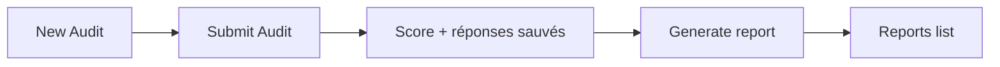
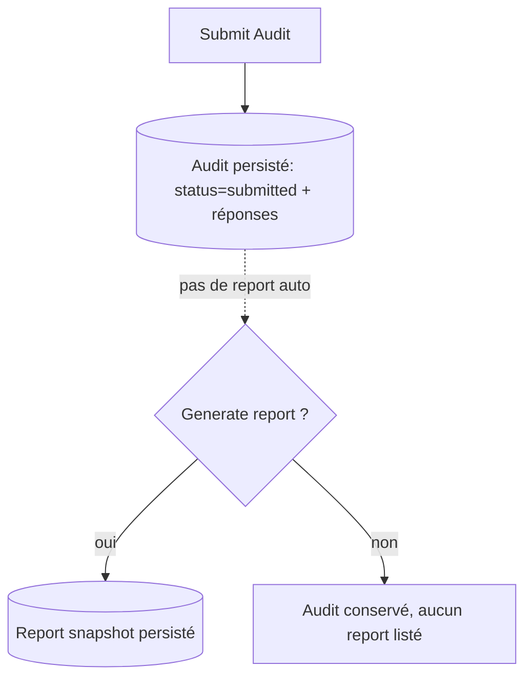
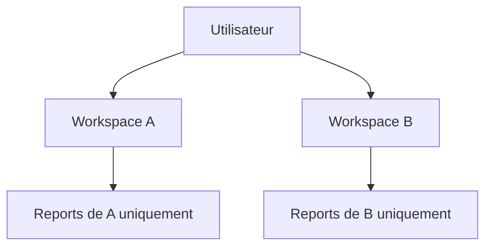
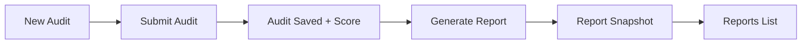

# AUDIT AI / AiLunaPro — Cahier des charges v2

> **Document de référence consolidé** — fusion v1 (`# AUDIT AI  AILUNAPRO — Cahier des.md`),
> mise à jour Downloads + ajout pillars **Affiliation AiLunaPro** + **Tokens / Crédits IA**.
>
> Dernière mise à jour : 2026-05-06
>
> Ce document est la **source de vérité unique** pour le projet. Importer dans Notion via
> *Add a page → Import → Markdown*.

---

## Résumé final — la vision en une ligne

> **Audit AI / AiLunaPro = SaaS hybride combinant audit IA, conformité EU AI Act, détection
> Shadow AI, registre IA, recommandation d'agents IA, AiLunaPro All-in-One prioritaire,
> programme d'affiliation, installation, maintenance, AI Assurance, tokens / crédits IA,
> billing Stripe multi-currency, invoices, et portail client.**

---

## Sommaire

1. [Vision produit](#1-vision-produit)
2. [Les 3 piliers](#2-les-3-piliers)
3. [Pourquoi les entreprises passent à l'IA](#3-pourquoi-les-entreprises-passent-à-lia)
4. [Position commerciale : AiLunaPro priority](#4-position-commerciale)
5. [Modèle économique étendu](#5-modèle-économique-étendu)
6. [Catalogue Stripe complet](#6-catalogue-stripe)
7. [Tokens / crédits IA](#7-tokens-crédits-ia)
8. [Programme d'affiliation AiLunaPro](#8-programme-affiliation)
9. [Modules fonctionnels](#9-modules-fonctionnels)
10. [Architecture technique](#10-architecture-technique)
11. [État d'avancement](#11-état-davancement)
12. [Roadmap par phases](#12-roadmap)
13. [Sécurité & conformité technique](#13-sécurité)
14. [User stories](#14-user-stories)
15. [KPIs & critères de succès](#15-kpis)
16. [Glossaire](#16-glossaire)

---

## 1. Vision produit

### Ancienne vision
SaaS d'audit IA + conformité réglementaire + registre + scoring.

### Nouvelle vision (v2)
Plateforme **hybride 6-en-1** :

1. Outil d'audit IA structuré ;
2. Outil de conformité **EU AI Act** ;
3. Outil de **conseil automatisé** ;
4. **Moteur de recommandation** d'agents IA ;
5. Plateforme de **vente + maintenance + assurance** d'agents IA ;
6. Système d'**abonnement et facturation Stripe** multi-currency, multi-produits, avec
   **tokens IA** et **affiliation**.

### Différenciateur stratégique
Transformer une **contrainte légale coûteuse** (EU AI Act, deadline 2 août 2026) en
**avantage concurrentiel défendable** + **levier de monétisation** via AiLunaPro et
le programme d'affiliation.

---

## 2. Les 3 piliers

### Pilier A — Audit & Compliance Core

Cœur réglementaire :

- Cadrage audit (objectifs, parties prenantes, CSE) ;
- Inventaire IA officiel + Shadow AI ;
- Registre des systèmes IA (officiel obligatoire) ;
- Classification **EU AI Act** : Inacceptable / Haut Risque / Limité / Minimal ;
- **FRIA** (Fundamental Rights Impact Assessment, Article 27) ;
- **Article 4** / littératie IA + 7 règles d'or + attestations ;
- Gouvernance + éthique + sécurité ;
- Outils support : DLP / CASB / AI-SPM ;
- Rapports **COMEX** (radar maturité, matrice risques) ;
- Roadmap 90 jours ;
- Monitoring **dérive** (data drift, concept drift, F1 ≥ 0.95, drift < 2%) ;
- **Audit trail** automatisé ;
- Grille éthique **43 critères** (DNS).

### Pilier B — AI Transformation & Agent Offers

Recommandation et vente :

- Diagnostic business + AI maturity score ;
- Identification des tâches automatisables ;
- **Moteur de recommandation** (segmentation CA / taille / secteur / maturité) ;
- **AiLunaPro All-in-One recommandé en priorité** quand match ;
- Alternatives externes seulement si gap ;
- Calcul **ROI** automatique ;
- Installation agent IA (one-shot) ;
- Maintenance mensuelle ;
- **AI Assurance** ;
- **Tokens / crédits IA** ;
- Génération **proposition commerciale PDF**.

### Pilier C — Growth & Distribution (NOUVEAU v2)

Acquisition + monétisation passive :

- Programme d'**affiliation AiLunaPro existant** : intégrer codes de parrainage existants ;
- Tracking commissions (Stripe → cohorte attribution) ;
- Lead magnets viraux : Diagnostic Express public, ROI Calculator public ;
- Pricing Table publique (sans login) avec UTM tracking ;
- Tokens IA monétisés (consommables, recharges, top-ups).

---

## 3. Pourquoi les entreprises passent à l'IA

| Motivation | Bénéfice mesurable |
|---|---|
| Gagner du temps | Tâche 8h → 5min (automatisation) |
| Réduire coûts | Économie main-d'œuvre répétitive |
| Améliorer qualité | Réduction taux erreur 30% |
| Réduire erreurs | Détection anomalies, doublons, calculs |
| Productivité | Plus de dossiers / mêmes ressources |
| Relation client | Réponse 24/7, satisfaction, NPS > 60 |
| Exploitation données | Prédiction, anomalies, tendances |
| Décisions | Meilleur pilotage commercial |
| Rentabilité | ROI médian +159,8% sur 24 mois |

### Tâches automatisables (catalogue)

- Saisie de données ;
- Traitement de factures ;
- Relances clients ;
- Réponses e-mails automatiques ;
- Prise de rendez-vous ;
- Tri de CV ;
- Génération de rapports ;
- Résumé d'appels / réunions ;
- Classement de documents ;
- Support client simple ;
- Analyse de données ;
- Génération de devis ;
- Contrôle documentaire ;
- Suivi commercial ;
- Conformité documentaire.

**Objectif** : libérer les humains pour stratégie, vente, créativité, analyse, décision.

---

## 4. Position commerciale

### Règle produit
**AiLunaPro first, but not blindly.**

### Algorithme de recommandation

```
function recommend(profile):
  matches = aiLunaProAgents.filter(agent => agent.fits(profile))
  if matches.length > 0:
    return [
      { rank: 1, source: 'AiLunaPro', items: matches, badge: 'Recommended All-in-One' }
    ]
  else:
    return [
      { rank: 1, source: 'External', items: marketAlternatives.filter(...) },
      { note: 'AiLunaPro ne couvre pas encore ce besoin' }
    ]
```

### Output requis

- Pourquoi AiLunaPro est recommandé ;
- Problème résolu ;
- Gains attendus + ROI estimé ;
- Intégrations nécessaires ;
- Offre correspondante ;
- Quand une alternative externe est préférable.

### Affichage UI
Badge violet "**Recommended All-in-One**" sur les cartes AiLunaPro.
Section séparée "Alternatives marché" en dessous, plus discrète.

---

## 5. Modèle économique étendu

| # | Offre | Type Stripe | Récurrence |
|---|---|---|---|
| 1 | **Audit IA** (Express / Complet / Registre) | One-shot | × |
| 2 | **Abonnement SaaS** (Free / Starter / Pro / Enterprise) | Subscription | mensuel / annuel |
| 3 | **Installation agent IA** (Simple / Connecté CRM / Métier perso) | One-shot | × |
| 4 | **Maintenance** (Basic / Pro / Enterprise) | Subscription | mensuel |
| 5 | **AI Assurance** (Essential / Advanced / Enterprise) | Subscription add-on | mensuel |
| 6 | **Monitoring annuel** | Subscription | annuel |
| 7 | **Tokens IA** (recharge crédits) | One-shot top-up | × |
| 8 | **Pack Tokens** (subscription with monthly allocation) | Subscription metered | mensuel |

**Total Stripe products** : 8 catégories × 3 niveaux ≈ **24 produits**, tous multi-currency
(USD, EUR, GBP, CAD, AUD).

### Bundles commerciaux

- **Starter Pack** : Abonnement Starter + Installation Simple + Maintenance Basic
- **Growth Pack** : Pro + Install Connecté + Maintenance Pro + 5000 tokens/mois
- **Enterprise Pack** : Enterprise + Install Métier + Maintenance Enterprise + AI Assurance Advanced + 50000 tokens/mois
- **Compliance Pack** : Audit Complet + Registre + Article 4 Training + Monitoring annuel

---

## 6. Catalogue Stripe

### Naming convention produits

```
ailunapro_<category>_<tier>
ailunapro_audit_express
ailunapro_audit_complete
ailunapro_audit_registry
ailunapro_saas_free
ailunapro_saas_starter
ailunapro_saas_professional
ailunapro_saas_enterprise
ailunapro_install_simple
ailunapro_install_crm
ailunapro_install_custom
ailunapro_maintenance_basic
ailunapro_maintenance_pro
ailunapro_maintenance_enterprise
ailunapro_assurance_essential
ailunapro_assurance_advanced
ailunapro_assurance_enterprise
ailunapro_monitoring_annual
ailunapro_tokens_topup_5k
ailunapro_tokens_topup_25k
ailunapro_tokens_topup_100k
ailunapro_tokens_subscription_basic   (5k/mois)
ailunapro_tokens_subscription_pro     (25k/mois)
ailunapro_tokens_subscription_max     (100k/mois)
```

Chaque produit a un `prod_USl...` ID Stripe + 1-N prices (per currency × interval).

Mapping côté code : étendre `worker/src/lib/billing-admin-shared.ts` avec `PRODUCT_CATALOG`
typé. Frontend lit dynamiquement via `GET /api/billing/admin/products`.

---

## 7. Tokens / crédits IA

### Concept
Unité de consommation IA. 1 token ≈ 1 unit d'API call agent IA. Modèles consommateurs :

- Génération texte ;
- Analyse document ;
- Résumé ;
- Recommandation ;
- Audit automatique.

### Modes d'achat

**Top-up one-shot** :
| Pack | Prix USD | Tokens | Prix/token |
|---|---|---|---|
| Starter | $9.99 | 5 000 | $0.002 |
| Pro | $39.99 | 25 000 | $0.0016 |
| Max | $129.99 | 100 000 | $0.0013 |

**Subscription mensuel** (allocation auto + roll-over 1 mois) :
| Plan | Prix USD/mo | Tokens/mo |
|---|---|---|
| Basic | $9 | 5 000 |
| Pro | $35 | 25 000 |
| Max | $99 | 100 000 |

**Inclus dans plans SaaS** :
| Plan SaaS | Tokens/mo inclus |
|---|---|
| Free | 100 |
| Starter | 1 000 |
| Professional | 10 000 |
| Enterprise | 100 000 |

### Architecture technique

**Firestore** : `organizations/{orgId}/tokens/current`
```ts
{
  balance:           number,   // tokens disponibles
  monthlyAllocation: number,   // tokens du plan SaaS + subscription tokens
  consumed:          number,   // total mois en cours
  rollover:          number,   // tokens reportés du mois précédent (max 1 mois)
  lastReset:         ISOString, // début du cycle
  updatedAt:         ISOString,
}
```

**Sub-collection consommation** : `organizations/{orgId}/tokens/current/usage/{eventId}`
```ts
{
  eventId:    string,    // unique
  module:     'audit' | 'recommendation' | 'roi' | 'agent_call' | ...,
  tokens:     number,
  metadata:   object,    // ex: agentId, requestId
  at:         ISOString,
}
```

**Worker routes** :
- `GET /api/tokens/balance?orgId=...` → balance + allocation + consumed
- `POST /api/tokens/consume` (interne, idempotent) → décrémente balance, log usage
- `POST /api/tokens/topup` → Stripe Checkout one-shot, webhook ajoute tokens
- `GET /api/tokens/usage?orgId=...&from=...&to=...` → historique pour graphique

**Throttle** : si `balance ≤ 0` → 402 Payment Required + suggestion top-up dans UI.

**Stripe metered billing** (option avancée) : facturer overflow au-dessus de l'allocation
au tarif `$0.001/token`. Utiliser `stripe.billing.meterEvents.create()`.

---

## 8. Programme affiliation

### Référence existante
AiLunaPro a déjà un programme d'affiliation actif. Audit AI doit **intégrer** ce programme,
pas le recréer.

### Intégration

1. **Code de parrainage** : chaque user owner peut générer son code via Settings → Affiliation.
   Format : `AILUNA-{ORG_SLUG}-{RANDOM_4}` (ex: `AILUNA-ACME-XK7P`).

2. **Lien d'inscription** : `https://audit.ailunapro.com/signup?ref=AILUNA-ACME-XK7P`
   - UTM auto-injecté
   - Stocké dans cookie 90 jours
   - Lu au signup → `users/{uid}.referredBy = code`

3. **Attribution commission** :
   - Webhook `customer.subscription.created` → si `referredBy` présent → écrit dans
     `affiliations/{code}/conversions/{subId}`
   - Commission : 20% du MRR du parrainé (12 mois) par défaut, configurable via Settings
   - Stripe Connect (futur) ou paiement manuel mensuel via export CSV

### Firestore data model

```
affiliations/{code}
  ownerUid:       string
  orgId:          string
  rate:           number (0.20 par défaut)
  active:         boolean
  createdAt:      ISOString

affiliations/{code}/conversions/{subId}
  referredOrgId:  string
  subscriptionId: string
  mrrUsd:         number
  startedAt:      ISOString
  status:         'active' | 'churned'

affiliations/{code}/payouts/{payoutId}
  amount:         number
  currency:       string
  paidAt:         ISOString
  reference:      string
```

### Worker routes

- `GET /api/affiliation/code?orgId=...` → code existant ou générer
- `GET /api/affiliation/conversions?orgId=...` → liste des filleuls
- `GET /api/affiliation/earnings?orgId=...` → calcul MRR cumul + commissions dues
- `POST /api/affiliation/payout` (admin uniquement) → marquer payout effectué

### UI

- **Settings → Affiliation** : code, lien copy-to-clipboard, dashboard earnings,
  liste conversions, historique payouts.
- **Public landing** : `https://audit.ailunapro.com/?ref={code}` capture `?ref=` automatiquement.

---

## 9. Modules fonctionnels

### Modules existants à conserver
Dashboard · Audits · Reports · AI Registry · Team · Settings · Billing · Invoices ·
Stripe Checkout · Portal.

### Modules à ajouter (par priorité)

#### 9.1 Diagnostic Express *(P1 — lead magnet public)*
Questionnaire 10 min, public (sans login).
- Score maturité IA + risques principaux ;
- Recommandations immédiates ;
- AiLunaPro priority badge ;
- Email capture → signup pré-rempli.

> **Note UX (post-J2)** — Si l'utilisateur clique « Sign in » depuis une page
> publique, l'app redirige actuellement vers la landing authentifiée par défaut.
> Préserver la page publique d'origine après login = amélioration UX post-J2.

#### 9.2 AI ROI & Automation Calculator *(P1 — viral)*
Standalone public.
- Inputs : tâche, fréquence, durée actuelle, taux horaire ;
- Outputs : temps gagné/mois, coût économisé, ROI, agent IA recommandé.

> **Note UX (post-J2)** — Idem §9.1 : « Sign in » depuis la page publique ne
> préserve pas la destination d'origine. Amélioration UX post-J2.

#### 9.3 AI Agent Recommendation Engine *(P1)*
- Inputs : CA annuel, secteur, taille équipe, tâches chronophages, outils existants, budget ;
- Sorties : top 3 agents avec AiLunaPro #1 si match, alternatives sinon, ROI, devis.

#### 9.4 Shadow AI Survey *(P2)*
- Sondage anonyme partageable par lien public ;
- Cartographie usages non-déclarés ;
- Statut approuvé / non approuvé + niveau de risque ;
- Plan d'encadrement.

#### 9.5 EU AI Act Classification Engine *(P1)*
- Questionnaire auto-classification 4 niveaux ;
- Justification + obligations + recommandations.

#### 9.6 FRIA Module *(P2)*
- Article 27 — droits fondamentaux ;
- Vie privée / non-discrimination / transparence / recours ;
- Export rapport.

#### 9.7 Article 4 Training *(P2)*
- Guide IA responsable + 7 règles d'or ;
- Attestation lecture + signature électronique ;
- Tracking employés formés ;
- Export preuve conformité.

#### 9.8 Installation & Maintenance Module *(P1 — revenue)*
- Devis installation 3 niveaux ;
- Abonnement maintenance ;
- AI Assurance bundle ;
- Génération proposition PDF ;
- Suivi installation.

#### 9.9 AI Assurance *(P2)*
- État santé agent IA ;
- Score qualité réponse ;
- Incidents + sauvegardes + recommandations ;
- Rapport mensuel.

#### 9.10 Tokens IA Module *(P1)*
- Balance + allocation + consommation ;
- Top-up + subscription tokens ;
- Graphique usage ;
- Throttle 402 + CTA top-up.

#### 9.11 Affiliation Module *(P1)*
- Code parrainage + lien ;
- Dashboard earnings ;
- Conversions + payouts.

#### 9.12 COMEX Report Generator *(P2)*
- Format radar maturité ;
- Matrice risques priorisés ;
- Cartographie usages + Shadow AI ;
- Plan d'action 90 jours ;
- Export PDF.

#### 9.13 Drift Monitoring *(P3)*
- Métriques F1, data drift, concept drift, équité ;
- Alertes seuil ;
- Audit trail enrichi.

#### 9.14 UX requirements — Audit & Reports *(P2 — UX robustness)*
Exigences UX transverses pour le wizard d'audit et les rapports (non bloquantes
pour le smoke, mais officielles) :

1. **Auto-scroll en haut au changement de section** — naviguer vers une nouvelle
   section (Next / Previous) doit réinitialiser la vue en haut du formulaire.
   Rationale : l'utilisateur doit toujours voir le titre + contexte de la section.
2. **Raccourci « ↑ Back to top »** — les formulaires d'audit et les rapports peuvent
   être longs. Ajouter un contrôle flottant qui apparaît après défilement, pour
   revenir instantanément en haut.
3. **Auto-save de la progression audit / rapport** — sauvegarde progressive
   (debounce sur changement) des réponses d'audit et de l'état du rapport.
   « Save & Continue » explicite reste, mais l'auto-save prévient toute perte de
   données au refresh, à la navigation, ou à la fermeture d'onglet.

> **Statut : post-J2 UX polish.** Ces 3 items ne sont PAS des bloquants de smoke
> test. Ils sont planifiés en tâche dédiée après J2. L'auto-save (3) est de
> niveau feature (debounce + persistance brouillon + tests), pas simple polish.

#### 9.15 Product Health Dashboard *(post-J2 — observabilité produit)*
Panneau interne (owners/admins) de visibilité produit/funnel. Motivé par
l'incident Turnstile : besoin de détecter tôt les échecs UX/funnel silencieux.

**Objectif**
- Surveiller la santé des lead magnets (Diagnostic, ROI Calculator).
- Détecter les funnels cassés tôt (captcha, login redirect, submit échoué).
- Éviter les pannes prod silencieuses.

**Sources de données**
- **PostHog** = source primaire analytics produit/UX.
- Compteurs backend (Firestore / Worker) = confirmation d'état critique.
- Google Analytics **exclu** du product health (marketing uniquement).

**KPIs minimum (funnel)**
- Diagnostic vu / soumis / échoué ;
- ROI calculator vu / soumis ;
- Login cliqué depuis pages publiques ;
- Signup complété ;
- Workspace créé ;
- Audits démarrés / soumis ;
- Reports générés ;
- Agents vus / recommandés.

Caractéristiques : orienté produit & UX, distinct du marketing (GA4), interne.

**Revenue / subscriber health** *(recommandation)*

| KPI | Quand | Où | Note |
|---|---|---|---|
| Abonnements actifs par plan | **J2** | In-app admin | Donnée déjà présente (subscriptions/current) |
| Token usage vs limite plan | **J2** | In-app admin | Déjà calculé (tokens/current) |
| Paiements échoués (dunning) | **J2** | In-app bannière + admin | `invoice.payment_failed` déjà reçu par webhook |
| MRR / ARR évolution | post-J2 | **Stripe Dashboard / Sigma** | Ne PAS recoder ; Stripe est la source de vérité |
| Churn / cohortes | post-J2 | Stripe + PostHog | Nécessite historique ; analytics, pas in-app |
| Early warning (downgrade, low usage) | post-J2 | PostHog + worker | Pipeline dérivé, après baseline analytics |

**Principe de séparation**
- *In-app (owners/admins)* : état courant — plan, usage tokens, statut paiement,
  bannière dunning. Sûr, donnée déjà disponible.
- *Stripe / admin tooling* : analytics revenu (MRR/ARR, churn, cohortes). Utiliser
  Stripe Dashboard/Sigma — ne pas reconstruire. Éviter d'exposer le revenu agrégé
  in-app.

> **Statut : post-J2.** Le dashboard complet est post-J2. Les 3 KPIs revenue
> marqués « J2 » s'appuient sur des données déjà persistées — surfaçables sans
> nouvelle infra si souhaité, mais hors scope du smoke J2 actuel.

4. **Export rapport — PDF réel** *(post-J2 feature)*. Le bouton « Export »
   produit actuellement un JSON (libellé honnête « Export (JSON) »). Le rendu PDF
   n'est pas implémenté. Tâche post-J2 : ajouter un renderer (jsPDF/react-pdf
   client, ou worker). Ne PAS simuler un PDF.

5. **Historique des audits soumis** *(post-J2)*. Les audits soumis SONT persistés
   en Firestore (`organizations/{orgId}/audits/{id}`, `fsSubmitAudit` →
   status `submitted` + snapshot réponses) — **aucune perte au niveau DB**.
   Manque uniquement une surface UI : soit une vue « Historique audits », soit
   une création automatique de report snapshot au Submit. Décision : documenter
   maintenant, implémenter post-J2 (modifie le flux audit → hors scope J2).

6. **Qualité des champs « Describe… » (free-text)** *(post-J2)*. Les zones de
   texte libre acceptent n'importe quelle saisie (gibberish) sans validation.
   Elles N'AFFECTENT PAS le score numérique (scoring = réponses à choix), mais
   nuisent à la crédibilité du rapport. À ajouter : longueur min, guidage,
   détection gibberish basique, prompting utilisateur.

7. **Copie obsolète Reports** *(post-J2 — cosmétique)*. Le footer de la page
   Reports affiche encore « Reports are stored locally for now » alors que les
   rapports persistent en Firestore (`fsCreateReport`). Corriger la copie.
   Rappel : les rapports sont **par workspace** — la liste montre uniquement les
   rapports du workspace actif (pas de perte si on change d'org).

#### 9.16 Help Center — expansion *(post-J2 — documentation utilisateur)*

**Help v1 (Option 2, ≤5 sections).** Structure fondation, étendue ensuite en
Q&A complet (Option 1). Approche visuelle : **Mermaid** (texte, versionné, rendu
in-Help) > screenshots ; screenshots annotés **uniquement** pour UI stable
(workspace switcher) ; callouts = note boxes, pas d'images. Éviter le PNG-heavy
qui pourrit aux changements UI.

**Section 1 — Getting Started**
Ce qu'est AiLunaPro + problème résolu. Diagramme :


**Section 2 — Audit vs Report**
Cycle de vie. Callout (note box) :
> **Submitting saves your audit + score.** A **Report is a snapshot**, created
> only when you click **Generate report**.

Note : auto-report / historique audits = amélioration post-J2 (§9.14 #5).

**Section 3 — Reports & Workspaces**
Scoping par workspace (rapports NON globaux).

- 1 screenshot annoté : le **workspace switcher** (sidebar).
- Callout : **le filtre de date du dashboard n'affecte PAS la liste Reports.**

**Section 4 — How to fill the audit properly**
Bonnes pratiques de saisie. Callout :
> Les champs **« Describe… » = narratif contextuel**. Le **score vient des
> questions structurées** (choix), pas du texte libre. Saisir des infos réelles
> et lisibles → audit crédible.

**Section 5 — FAQ**
- « Pourquoi je ne vois pas mes anciens rapports ? » → ils sont dans un **autre
  workspace** (rapports scopés par workspace).
- « Pourquoi Reports est vide ? » → cliquer **Generate report** depuis un audit
  soumis ; un audit soumis seul ne crée pas de report.
- « Le texte aléatoire affecte-t-il le score ? » → **Non** (score = questions
  structurées), mais nuit à la crédibilité.
- « Qu'est-ce qui est sauvé, et quand ? » → Submit = audit + score ;
  Generate report = snapshot report.

**Référence — Luna AI Assistant** *(post-J2, phase « Agents / Remediation »)*
À documenter quand introduit :
- Luna = assistant **contextuel**, apparaît **après un audit/report**, pas un
  chat générique.
- Rôle : expliquer les findings, générer plans de remédiation/action, guider les
  prochaines étapes.
- Appartient à la phase post-J2 « Agents / Remediation » (après launch).

**Design & lisibilité (Help)** — confort de lecture sur sessions longues, sans
fatigue. Référence de style : la page « Getting Started » actuelle (sections
claires, étapes numérotées, espacement généreux).

- *Typographie / layout* :
  - Largeur de ligne confortable : contenu en colonne **max ~680–720px**
    (≈ 65–75 caractères/ligne) ; jamais pleine largeur écran.
  - Hiérarchie de titres claire **H1 / H2 / H3**, espacement vertical cohérent.
  - Taille de police lisible (**corps ≈ 15–16px**), **line-height ≈ 1.6**.
  - Espacement vertical ample entre sections (≥ 24–32px).
- *Clarté visuelle* :
  - **Callout boxes** typées : `info` (neutre), `note` (rappel), `warning`
    (erreur fréquente) — réutiliser les tokens couleur existants
    (`--green-soft-bg`, `--yellow-soft-bg`, `--brand-tint-bg`).
  - Paragraphes courts + listes à puces ; pas de murs de texte.
- *Responsive / accessible* :
  - Lisible sur petits écrans ; la colonne s'adapte (pas de colonnes serrées).
  - Contraste élevé, couleurs calmes (pas de fatigue visuelle) ; respecter le
    thème clair/sombre existant.
- *Aides visuelles* : Mermaid pour les flux ; screenshots annotés uniquement UI
  stable ; les visuels soutiennent la compréhension sans surcharger.

**Exemple design-ready (barre de qualité)** — la Section 2 « Audit vs Report »
rédigée au niveau attendu pour les 5 sections (titres clairs, paragraphes
courts, callouts, takeaway, Mermaid). À reproduire pour les autres sections :

> ### Audit vs Report — understand the difference
>
> **In short**
> - An **Audit** captures your answers and computes your score.
> - A **Report** is a **snapshot** of an audit, created intentionally to be shared or archived.
>
> **What is an Audit?**
> - Your answers to structured questions
> - Your compliance/maturity score
> - A dynamic analysis that can evolve with scoring rules
>
> ✅ Clicking **Submit Audit** saves your answers and score.
>
> 💡 *An audit remains editable until you generate a report.*
>
> **What is a Report?**
> - A **frozen snapshot** at a specific point in time
> - Created **only** when clicking **Generate report**
> - Stable even if you run new audits later
>
> ✅ Reports are exportable, shareable, and listed under **Reports** for the active workspace.
>
> **Key takeaway**
> - ✅ **Submit Audit** → saves audit + score
> - ✅ **Generate report** → creates a snapshot visible in *Reports*
>
> **Where are reports stored?**
> - Reports are **per workspace**.
> - Switching workspace changes the visible reports.
> - The dashboard date filter **does not affect** the Reports list.
>
> **Coming post-J2**
> - Optional auto-report on submit
> - Audit history view distinct from reports



---

## 10. Architecture technique

### Stack

```
Frontend:    React + Vite + TypeScript + Firebase JS SDK (Auth, Firestore)
Backend:     Cloudflare Workers (Hono v4) + Stripe SDK + Firestore REST (service account JWT)
DB:          Firestore (multi-tenant via /organizations/{orgId}/...)
Auth:        Firebase Auth (real) + mock layer pour dev
Payments:    Stripe (test mode actuel, prod J2) + Stripe Connect (futur affiliation)
Storage:     Firebase Storage (assets, exports PDF) + R2 (futur)
Hosting:     Vercel/Netlify (frontend) + Cloudflare Workers (worker)
```

### Multi-tenant

```
/organizations/{orgId}
  /members/{uid}
  /audits/{auditId}
    /answers/{answerId}
  /reports/{reportId}
    /exports/{exportId}
  /registry/{systemId}
  /shadow-ai/{surveyId}
  /fria/{evalId}
  /trainings/{certId}
  /subscriptions/current        ← Stripe sync (J1)
  /billing_config/current       ← admin metadata (I.6 + J1.3)
  /tokens/current               ← NOUVEAU v2 (J1.4A)
  /tokens/current/usage/{eventId}       ← NOUVEAU v2 (J1.4A)
  /tokens/current/topups/{stripeSessionId} ← NOUVEAU v2 (J1.4A)
/affiliations/{code}            ← NOUVEAU v2
  /conversions/{subId}
  /payouts/{payoutId}
```

### Routes worker (état + cible)

| Catégorie | Route | État |
|---|---|---|
| Health | `GET /healthz` | ✅ |
| Auth | `GET /api/me` | ✅ |
| Audit | `POST /api/audits/:id/submit` | ⏳ skel |
| Reports | `POST /api/reports/:id/export` | ⏳ skel |
| Team | `POST /api/team/invite` | ⏳ skel |
| Billing checkout | `POST /api/billing/checkout` | ✅ J1.3 |
| Billing portal | `POST /api/billing/portal` | ✅ J1 |
| Billing sync | `POST /api/billing/sync-session` | ✅ J1.2 |
| Billing invoices | `GET /api/billing/invoices` | ✅ J1.2 |
| Stripe webhook | `POST /api/stripe/webhook` | ✅ J1 |
| Admin status | `GET /api/billing/admin/status` | ✅ J1.3A |
| Admin products | `GET /api/billing/admin/products` | ✅ J1.3A |
| Admin prices | `POST /api/billing/admin/prices` | ✅ J1.3A |
| Admin currency | `GET /api/billing/admin/exchange-rates` `POST /currency-settings` | ✅ J1.3A |
| Admin promos | `GET/POST /api/billing/admin/promotion-codes` | ⏳ J1.3B |
| Admin payment | `GET/POST /api/billing/admin/payment-settings` | ⏳ J1.3B |
| Tokens balance | `GET /api/tokens/balance` | ❌ |
| Tokens consume | `POST /api/tokens/consume` | ❌ |
| Tokens top-up | `POST /api/tokens/topup` | ❌ |
| Tokens usage | `GET /api/tokens/usage` | ❌ |
| Affiliation code | `GET /api/affiliation/code` | ❌ |
| Affiliation stats | `GET /api/affiliation/conversions` `GET /earnings` | ❌ |
| Affiliation payout | `POST /api/affiliation/payout` | ❌ |
| Diagnostic public | `POST /api/diagnostic/express` | ❌ |
| ROI calc public | `POST /api/roi/calculate` | ❌ |
| Recommendation | `POST /api/recommendation/agents` | ❌ |
| Shadow AI survey | `GET/POST /api/shadow-ai/survey` | ❌ |
| EU AI Act classify | `POST /api/eu-ai-act/classify` | ❌ |
| FRIA | `POST /api/fria/evaluate` | ❌ |

---

## 11. État d'avancement

### Phases commitées

| Phase | Commit | Contenu |
|---|---|---|
| A | `ff7fcb6` | Dashboard import |
| B | `857728d` | API contracts |
| C | `d46df31` | Tests + validators |
| D | `3c71dae` `7a4e472` | Hardening |
| E | `1c065f5` | Dual-mode |
| E2 | `f4b2b06` | Firestore rules |
| F.1 | `0c8b58b` | Registry |
| F.2 | `e82e856` | Audits |
| F.3 | `d6b0da0` | Reports |
| Auth reset | `245b493` | Forgot password |
| G | `8e7f6e6` | Worker skeleton |
| Perf | `89f6c91` | Lazy-load |
| H | `83231f7` | Settings |
| I | `2daee3f` | Billing UI mock |
| I.5 | `918b96f` | Diagnostic Stripe read-only |
| I.6 | `7814ff0` | Metadata editor |
| J1 | `489bfe7` | Real Stripe checkout + portal + webhook + invoices + sync |
| J1.3 | `63072f2` | Admin Stripe billing complete |
| J1.3C-G | `93ca242` | RBAC + invites + UI action wiring |
| J1.4A | `de4c9ee` | Tokens IA MVP |
| J1.4A-Hardening | `02fdeef` | env-aware Stripe guard + structured errors |
| J1.4A-NumericFix | `e8cab29` `9a775b2` `6177eaf` | integerValue Number coercion + repair UI + banner cleanup |
| K0 | `7a8310c` `767e6a2` `2f8fdaa` `49cd314` | Agent Catalog data model + seed + read-only catalog (orgId fix + EN seed cleanup) |
| K1A | `34c1fba` | Diagnostic Express public MVP — 8-question form + server-side scoring + Turnstile + static recommendations |
| Inspection script | `988cfa6` | read-only project audit script (10 categories, no auto-fix) |
| Sidebar prefs | `d43f79e` | sidebar Language/Currency selectors with PreferencesContext |
| K2A | `dd15460` | ROI Calculator public MVP — 4-input form + server-authoritative formula + Turnstile + static workflow→agent recommendation |
| H0 | `fa9a7b6` | Help Center MVP — auth-only #/help with 10 user-facing English sections, sticky TOC, ?section= query routing |
| K3A | `543f960` | Server-side recommendation engine — POST /api/recommend (auth + role-gated), rule-based weighted scoring, top-3 + reasons, RecommendPanel on /agents |
| J1-Hardening | `a0cc8c8` | Stripe subscription sync hardening: shared product→plan mapping, APP_BASE_URL redirect URLs, subscription allocation sync in webhook + sync-session fallback, inspection checks |

### Phases manquantes

- **K1B** : Diagnostic Express anti-abuse hardening (KV rate-limit, email-domain blocklist) *(différé — activer si abus mesuré)*
- **K2B** : ROI Calculator multi-workflow + real agent pricing *(différé — backfiller `pricing.monthlyPrice` quand Stripe products agents arrivent)*
- **K3B** : migrate K1A Diagnostic to K3 backend *(différé — remplacer recommandations statiques par appel /api/recommend)*
- **K3C** : migrate K2A ROI Calculator to K3 backend *(différé — remplacer recommandations statiques par appel /api/recommend)*
- **H1** : Help Center search + feedback *(différé — client-side / KV-indexed search, helpfulness ratings)*
- **K4** : EU AI Act classifier + Registre enrichi
- **L1-L2** : Installation + Maintenance + Insurance + Devis PDF
- **M1-M3** : Shadow AI Survey + FRIA + Article 4 Training
- **N1** : COMEX Report
- **P** : Affiliation module *(NOUVEAU v2)*
- **J2** : Production deploy + Worker secret provisioning (FIREBASE_SERVICE_ACCOUNT_JSON, STRIPE_SECRET_KEY, STRIPE_WEBHOOK_SECRET, TURNSTILE_SECRET_KEY) + monitoring + i18n

### K0 Agent Catalog — détail (commit `7a8310c` + `767e6a2`)

**Collection Firestore** : `/agents/{agentId}` (top-level, single global catalog)

**Slugs canoniques (10 agents seed)** :
1. `support-agent`
2. `sales-agent`
3. `finance-agent`
4. `hr-agent`
5. `compliance-agent`
6. `marketing-agent`
7. `reporting-agent`
8. `audit-agent`
9. `document-agent`
10. `admin-agent`

**Règles Firestore** :
```
match /agents/{agentId} {
  allow read:  if false;
  allow write: if false;
}
```
Worker est la seule surface de lecture (RBAC `requireRole(['owner','admin','billing','member'])`). Client n'a pas accès au catalogue.

**Routes Worker** :
- `GET  /api/agents?orgId=...`
- `GET  /api/agents/lookup?orgId=...&id=...`
- `POST /api/agents/admin/seed?orgId=...` (owner + `TOKEN_DEBUG=true`)
- `POST /api/agents/admin/upsert` (owner)
- `POST /api/agents/admin/archive` (owner)

**Procédure de seed (production-safe)** :
1. `wrangler secret put TOKEN_DEBUG` → `true` (ou `wrangler.toml [env.production.vars] TOKEN_DEBUG = "true"` temporaire)
2. Restart worker
3. `curl -X POST "https://<worker-domain>/api/agents/admin/seed?orgId=<ORG_ID>" -H "Authorization: Bearer <ID_TOKEN>"`
4. Vérifier réponse : `{ ok: true, created: [10 slugs], updated: [], skipped: [], errors: [] }`
5. **Immédiatement** revert `TOKEN_DEBUG=false` + restart worker
6. Route est idempotente (`firestoreCreateIfNotExists`) — re-run safe.

**Hors scope K0** :
- ❌ K2 ROI Calculator
- ❌ K3 Recommendation engine
- ❌ Catalogue public/unauth
- ❌ Stripe products par agent
- ❌ Token consumption (`agent.call`) câblage
- ❌ Workflow installation
- ❌ Reviews/ratings
- ❌ Per-org overrides

### K1A Diagnostic Express — détail (commit `34c1fba`)

**Route publique** : `#/diagnostic` — chromeless, **no auth required**.

**Worker route** : `POST /api/public/diagnostic` (no `requireAuth`).

**Lead capture** :
- `email` required
- `companyName` optional (max 120 chars)
- `consent` required (GDPR-aligned wording, exact text in DiagnosticPage.tsx)

**8 canonical question IDs** (`worker/src/data/diagnostic-questions.ts`, mirrored in `src/data/`) :
1. `ai_usage` (weight 1)
2. `process_automation` (weight 1)
3. `data_readiness` (weight 1)
4. `compliance_awareness` (weight 1)
5. `shadow_ai` (weight 1)
6. `business_impact` (weight 1)
7. `team_skills` (weight 1)
8. `implementation_priority` (weight 0 — never affects score, used only for recommendation override)

**Score formula** :
```
score = Math.round(weightedScore / maxScore * 100)
maxScore = 7 × 3 = 21    // 7 weighted questions × max option score 3
```

**Buckets** :
- `low`    = 0–39
- `medium` = 40–69
- `high`   = 70–100

**Bucket → recommended agents (max 3)** :
- `low`    → `admin-agent`, `audit-agent`, `support-agent`
- `medium` → `audit-agent`, `document-agent`, `reporting-agent`
- `high`   → `compliance-agent`, `reporting-agent`, `finance-agent`

**Priority override mapping** (`implementation_priority` value → agent slug, prepend if absent, dedupe, trim 3) :
- `improve_sales`     → `sales-agent`
- `support_customers` → `support-agent`
- `compliance`        → `compliance-agent`
- `documents`         → `document-agent`
- `save_time`         → `admin-agent`

**Persistence** :
- Collection : `/public_diagnostics/{id}`
- Règles Firestore :
  ```
  match /public_diagnostics/{id} {
    allow read:  if false;
    allow write: if false;
  }
  ```
  Worker (service account) est le seul writer, et le seul reader prévu (admin
  read routes pas encore exposées).

**Rétention** :
- `expiresAt = createdAt + 90 days` (champ ISO stocké)
- TTL effectif activé via **Firebase Console → Firestore → TTL → field `expiresAt`** sur `public_diagnostics`. Suppression automatique sous 24h après expiration. Pas de cron Worker en K1A.

**Anti-abus** :
- Cloudflare Turnstile (widget frontend + verify côté Worker)
- Production : `TURNSTILE_SECRET_KEY` requis. Token absent ou invalide → 4xx.
- Dev/staging : bypass quand secret unset OU token absent. Jamais en production.
- Pas de rate-limit KV en K1A (différé K1B).

**Production env requis** :
- Worker secret : `TURNSTILE_SECRET_KEY`
- Frontend env : `VITE_TURNSTILE_SITE_KEY`
- Worker `APP_ENV=production`

**Hors scope K1A** :
- ❌ K1B (rate-limit KV / IP-based)
- ❌ K3 Recommendation Engine (recommandations statiques en K1A)
- ❌ PDF email report
- ❌ Admin diagnostic dashboard
- ❌ i18n (English only en K1A)
- ❌ Stripe attribution
- ❌ Token consumption
- ❌ Création de compte automatique depuis diagnostic
- ❌ Per-org overrides

### K2A ROI Calculator — détail (commit `dd15460`)

**Route publique** : `#/roi-calculator` — chromeless, **no auth required**.

**Worker route** : `POST /api/public/roi-calculation` (no `requireAuth`).

**4 inputs** :
- `teamSize` : integer 1–10000 — validé et persisté, **NON utilisé** dans la formule K2A (réservé pour segmentation K2B)
- `monthlyHoursOnRepetitiveWork` : 0–10000
- `averageHourlyCost` : 1–1000 USD
- `targetWorkflow` : enum 9 valeurs (`support`, `sales`, `finance`, `documents`, `reporting`, `admin`, `compliance`, `marketing`, `hr`)

**Lead capture** :
- `email` required
- `companyName` optional (max 120 chars)
- `consent` required (texte GDPR identique à K1A avec substitution "ROI estimate")

**Formule (server-authoritative)** :
```
estimatedTimeSavedHoursPerMonth = round1(monthlyHoursOnRepetitiveWork × SAVINGS_RATE[targetWorkflow])
estimatedMonthlyCostSaved       = round0(estimatedTimeSavedHoursPerMonth × averageHourlyCost)
estimatedYearlyCostSaved        = estimatedMonthlyCostSaved × 12
estimatedPaybackMonths          = monthlyCost > 0 ? round1(99 / monthlyCost) : null
```

**Savings rates par workflow** :

| Workflow | Rate |
|----------|------|
| support | 0.40 |
| sales | 0.30 |
| finance | 0.50 |
| documents | 0.55 |
| reporting | 0.45 |
| admin | 0.50 |
| compliance | 0.35 |
| marketing | 0.40 |
| hr | 0.40 |

**Workflow → recommended agents (max 2 par workflow)** :

| Workflow | Primary | Secondary |
|----------|---------|-----------|
| support | support-agent | admin-agent |
| sales | sales-agent | marketing-agent |
| finance | finance-agent | reporting-agent |
| documents | document-agent | admin-agent |
| reporting | reporting-agent | audit-agent |
| admin | admin-agent | document-agent |
| compliance | compliance-agent | audit-agent |
| marketing | marketing-agent | sales-agent |
| hr | hr-agent | document-agent |

**Placeholder agent cost** : `AGENT_DEFAULT_MONTHLY_USD = 99` (utilisé pour le calcul de payback jusqu'à ce que `pricing.monthlyPrice` soit backfillé sur chaque agent quand les Stripe products agents arrivent).

**Currency** : USD only en K2A. Multi-currency = J2/i18n.

**Disclaimer affiché côté UI** :
- "This is an estimate based on the information you provided and conservative automation assumptions. Actual savings may vary."
- "Payback is estimated using a placeholder agent cost of $99/month until agent pricing is finalized."

**Persistence** :
- Collection : `/public_roi_calculations/{id}`
- Règles Firestore :
  ```
  match /public_roi_calculations/{id} {
    allow read:  if false;
    allow write: if false;
  }
  ```
  Worker (service account) est le seul writer.

**Rétention** :
- `expiresAt = createdAt + 90 days` (champ ISO stocké)
- TTL effectif : Firebase Console → Firestore → TTL → field `expiresAt` sur `public_roi_calculations`. Suppression auto sous 24h après expiration. Pas de cron Worker en K2A.

**Anti-abus** :
- Cloudflare Turnstile uniquement (réutilise helper K1A `verifyTurnstile`)
- Pas de rate-limit KV en K2A (différé K1B/K2B si abus mesuré)

**Production env** :
- Aucun nouveau env var. K2A réutilise K1A :
  - Worker secret `TURNSTILE_SECRET_KEY`
  - Frontend env `VITE_TURNSTILE_SITE_KEY`

**Code reuse** depuis K1A (zero duplication) :
- `validateLead` (worker/src/lib/diagnostic-shared.ts)
- `expiresAtFromNow` (idem)
- `verifyTurnstile` (worker/src/lib/turnstile.ts)
- `TurnstileWidget` (src/components/diagnostic/)

**Hors scope K2A** :
- ❌ K3 Recommendation Engine
- ❌ K1B (rate-limit KV)
- ❌ K2B (multi-workflow weighted average + real agent pricing)
- ❌ PDF email report
- ❌ Admin dashboard
- ❌ i18n
- ❌ Multi-currency billing
- ❌ Stripe attribution
- ❌ Token consumption
- ❌ Création de compte depuis le calculator
- ❌ Modifications Tokens / Billing / Team / K0 / K1A (uniquement réutilisation imports K1A)

### Sidebar Language + Currency selectors — détail (commit `d43f79e`)

Compact two-row widget dans le bas de la sidebar gauche, visible pour
tous les rôles authentifiés (owner / admin / billing / member / client).
Caché sur les routes chromeless (login, signup, accept-invite,
diagnostic, roi-calculator).

**Source of truth** : `src/context/PreferencesContext.tsx`. Les
selecteurs Sidebar et Settings consomment le même hook → sync
instantanée.

**Language** : enum `en | fr | es | de | it | pt`. Sidebar affiche
labels courts (EN/FR/...). Settings affiche labels natifs
(English / Français / Español / Deutsch / Italiano / Português).
**Préférence uniquement** — l'app reste rendue en anglais jusqu'à
l'arrivée de l'i18n complet (J2).

**Currency** : enum `usd | eur | gbp | cad | aud`. Affiche labels
natifs (USD $ / EUR € / ...). **Préférence d'affichage uniquement**
— ne change PAS :
- la devise Stripe Checkout (détectée serveur-side par checkout)
- le prix des token packs (USD only jusqu'à J2 multi-currency packs)
- la devise des subscriptions actives

**Persistence** : localStorage (`ailunapro-lang`, `ailunapro-display-currency`).

### Tokens — précision modèle économique

Les abonnements SaaS (Free / Starter / Professional / Enterprise)
**incluent une allocation mensuelle de tokens**. Les top-ups sont
optionnels :

- L'utilisateur achète un pack top-up uniquement quand son balance
  est trop bas ou que sa consommation dépasse l'allocation mensuelle.
- Les tokens top-up s'**ajoutent** au balance et ne **remplacent
  pas** l'abonnement.
- Les tokens top-up **n'expirent jamais** (contrairement à l'allocation
  mensuelle qui est rollover-cappée à 1× allocation au cycle reset).
- Les packs top-up sont billed en USD only jusqu'à J2 multi-currency
  packs.

### H0 Help Center — détail (commit `fa9a7b6`)

**Route** : `#/help` — **auth-only**, dashboard shell (non-chromeless).

**Visibilité** : tous les rôles authentifiés (`owner`, `admin`,
`billing`, `member`, `client`). Caché sur les routes chromeless /
public / auth (`login`, `signup`, `accept-invite`, `diagnostic`,
`roi-calculator`).

**Contenu** : statique anglais hardcodé dans
`src/data/help/sections.tsx`. 10 sections :

| Section id | Titre |
|-----------|-------|
| `getting-started` | Getting Started |
| `agents` | AI Agents |
| `tokens` | Tokens |
| `billing` | Billing |
| `diagnostic` | Diagnostic Express |
| `roi-calculator` | ROI Calculator |
| `team` | Team and Roles |
| `settings` | Settings |
| `troubleshooting` | Troubleshooting |
| `faq` | FAQ |

**Layout** :
- Desktop (≥ 900 px) : TOC sticky 240 px à gauche + main content
  scrollable.
- Mobile (< 900 px) : TOC dans `<details>` repliable au top, main
  prend toute la largeur.

**Routing** :
- `#/help` → défaut sur `getting-started`.
- `#/help?section=<id>` → scroll vers section au mount.
- Click TOC → `history.replaceState` met à jour l'URL + smooth-scroll.
- Section id invalide → fallback `getting-started`.
- IntersectionObserver suit la section active pendant le scroll
  (suspendu 600 ms après scroll programmatique).

**Règles de contenu user-facing** (audit du contenu commit) :
- Pas de noms d'env vars (`TOKEN_DEBUG`, etc.).
- Pas de commandes `curl` / Stripe CLI / wrangler.
- Pas de wording dev-internal type "worker not running".
- Pas de mentions du script d'inspection.
- Wording sécurité concrète : "authenticated access, role-based
  permissions, Firestore security rules, server-side writes for
  sensitive operations".
- Tokens business model expliqué :
  abonnement = allocation mensuelle ;
  top-ups optionnels et additifs ;
  top-up tokens never expire ;
  packs USD only.
- Billing clarity : "Billing and token packs are currently in USD.
  The sidebar currency selector is a display preference only. It
  does not change Stripe checkout currency or token pack pricing yet."
- Settings : sélecteurs language/currency = préférences uniquement
  jusqu'à i18n / multi-currency billing complets.
- Section ROI : documente `#/roi-calculator` comme disponible avec
  disclaimer estimate + note placeholder $99/month agent cost.
- Email `service@ailunapro.com` autorisé en commentaire de code
  uniquement (placeholder), **jamais** user-visible. Footer Help
  affiche : "Need more help? Contact your workspace owner or
  AiLunaPro support."

**Hors scope H0** :
- ❌ Chatbot
- ❌ Search (différé H1)
- ❌ External CMS
- ❌ Markdown loader
- ❌ i18n
- ❌ User feedback / view tracking / analytics
- ❌ Inline images / videos
- ❌ Public unauth Help
- ❌ Per-org overrides
- ❌ Modifications product logic (billing / token / agents /
  diagnostic / team / ROI)

### K3A Recommendation Engine — détail (commit `543f960`)

**Worker route** : `POST /api/recommend`

**Auth** :
- `requireAuth() + requireRole(['owner','admin','billing','member'])`
- Client → 403, unauth → 401

**Pure compute** :
- pas de Firestore writes
- pas de persistence
- pas d'API tierce
- pas de LLM
- pas de vector similarity

Lecture des agents actifs depuis `/agents` via service account
(read-only).

**Profile schema (tous les champs optionnels)** :
- `industry?` — string max 40, lowercase + trim
- `companySize?` — `solo | sme | enterprise`
- `targetWorkflow?` — 9 valeurs K2A (`support`, `sales`, `finance`,
  `documents`, `reporting`, `admin`, `compliance`, `marketing`,
  `hr`)
- `subscriptionPlan?` — `free | starter | professional | enterprise`
- `currentMaturity?` — `low | medium | high`
- `integrations?` — `string[]` normalized lowercase + trim + dedupe,
  max 10 entries, max 40 chars each

Profile complètement vide → `400 INVALID_PROFILE` avec message
"Add at least one preference to personalize recommendations."

**Erreurs par champ** :
- `INVALID_INDUSTRY`
- `INVALID_COMPANY_SIZE`
- `INVALID_WORKFLOW`
- `INVALID_PLAN`
- `INVALID_MATURITY`
- `INVALID_INTEGRATIONS`

**Scoring rules** (additif, n'applique chaque règle que si le champ
profile correspondant est présent — sauf source qui s'applique
toujours) :

| Règle | Poids |
|------|------|
| `industry` match (`agent.fits.industries.includes(industry)`) | +30 |
| `industry` fallback `'all'` (`agent.fits.industries.includes('all')`) | +30 |
| `companySize` match | +20 |
| Integration per hit | +5, capped at 4 hits (+20 max) |
| Plan fit (`agent.minPlan ≤ subscriptionPlan`) | +10 |
| Plan exceed (`agent.minPlan > subscriptionPlan`) | -20 (pas de reason text) |
| Workflow match (agent === `WORKFLOW_TO_PRIMARY_AGENT[targetWorkflow]`) | +25 |
| Maturity match (agent ∈ `MATURITY_TO_AGENTS[currentMaturity]`) | +15 |
| Source `'ailunapro'` | +10 |

Filter : `status === 'active'` (filter, pas score). `score = clamp(rawScore, 0, 100)`.

**Sort order** :
1. score desc
2. source `'ailunapro'` first (tie-breaker)
3. name asc (tie-breaker final)

**Output** : top 3 recommendations
```json
{
  "rankings": [
    { "agentId": "support-agent", "score": 80, "reasons": [...] },
    ...
  ]
}
```

**Reasons catalog (anglais, server-generated, no exaggerated claims)** :
- "Fits your industry"
- "Suitable across industries"
- "Recommended for solo teams"
- "Recommended for SME teams"
- "Recommended for enterprise teams"
- "Compatible with selected integrations"
- "Available within your plan"
- "Matches your selected workflow"
- "Fits your current AI maturity stage"
- "AiLunaPro first-party agent"

Pas de "perfect fit", "guaranteed ROI", "best possible".

**Config locale (zero cross-coupling)** :
- `WORKFLOW_TO_PRIMARY_AGENT` copié localement dans
  `worker/src/data/recommendation-config.ts` (pas d'import K2A
  `roi-config`)
- `MATURITY_TO_AGENTS` copié localement (pas d'import K1A
  `diagnostic-shared`)
- `PLAN_ORDER` copié localement (`free=0 < starter=1 <
  professional=2 < enterprise=3`)

**Frontend integration** :
- `RecommendPanel` collapsible card en haut de `/agents`
- 6 inputs : industry / companySize / targetWorkflow /
  subscriptionPlan / currentMaturity / integrations (comma-separated)
- Bouton **Recommend agents** désactivé tant qu'aucun champ rempli
- Texte d'aide : "Add at least one preference to personalize
  recommendations."
- Bouton **Clear recommendations** visible uniquement quand des
  résultats existent
- Mode recommendation :
  - section "Top recommendations" → top-3 cards avec rank pill
    `#1` / `#2` / `#3` violet, score chip, "Why?" disclosure
    listant les reasons
  - section "Other agents" → reste du catalogue
  - filtres industry / integration désactivés avec hint :
    "Clear recommendations to use filters."
- Mode default `/agents` (sans recommendation) inchangé

**Pas de nouveau env var.** Pas de nouvelle entrée Route union.
Pas de page dédiée `#/recommend`.

**Hors scope K3A** :
- ❌ K3B (migrate K1A Diagnostic to K3 backend)
- ❌ K3C (migrate K2A ROI Calculator to K3 backend)
- ❌ Recommendation publique / unauth
- ❌ LLM-based scoring
- ❌ Vector embedding similarity
- ❌ Persistence Firestore
- ❌ Analytics dashboard
- ❌ Page dédiée `#/recommend`
- ❌ A/B testing / per-org weight tuning
- ❌ i18n
- ❌ Multi-currency UX
- ❌ Modifications billing / token / team / diagnostic / ROI / Help
  / sidebar prefs / agents catalog data

### K1A / K2A — note de migration

K1A Diagnostic Express continue d'utiliser **`recommendationsForBucket()`
+ priority override** statiques (ne change pas avec K3A). Migration
vers `/api/recommend` = phase **K3B**, différée.

K2A ROI Calculator continue d'utiliser **`WORKFLOW_TO_AGENTS`** map
statique (ne change pas avec K3A). Migration vers `/api/recommend`
= phase **K3C**, différée.

K3A introduit l'endpoint `/api/recommend` indépendamment, sans
toucher aux flows publics K1A/K2A. Quand K3B/K3C arriveront, ils
remplaceront les recommandations statiques par un appel au moteur
K3, en gardant les mêmes contrats UI.

---

### J1 — Stripe Subscription Sync Hardening (commit `a0cc8c8`)

> **Important**: J1 hardens local-dev Stripe test-mode behavior.
> Production secret provisioning and deployment are deferred to J2.

**Goal**

- Harden local-dev Stripe test-mode subscription sync.
- Ensure subscription plan changes update `organizations/{orgId}/subscriptions/current`.
- Ensure monthly token allocation syncs safely on plan changes.
- Ensure Stripe redirect URLs use `APP_BASE_URL` (not hardcoded localhost).
- Keep token top-ups, product pricing, and frontend untouched.

**Files touched (6)**

- `worker/src/lib/billing-admin-shared.ts`
- `worker/src/routes/stripe.ts`
- `worker/src/routes/billing-sync.ts`
- `worker/src/routes/billing-checkout.ts`
- `worker/src/routes/billing-portal.ts`
- `scripts/inspect-project.mjs`

**Key changes**

1. **Shared plan mapping helpers** (single source of truth in `billing-admin-shared.ts`):
   - `PlanLabel` type (`Free | Starter | Professional | Enterprise`)
   - `PRODUCT_TO_PLAN_LABEL` map
   - `planLabelFromProductId(productId)` — capitalized plan label, defaults to `Starter` for unknown paid products
   - `extractProductIdFromSubscription(sub)` — handles string ref + expanded Product object

2. **Removed local duplicated `PRODUCT_TO_PLAN` / `planFromProduct` / `extractProductId`** from:
   - `worker/src/routes/stripe.ts`
   - `worker/src/routes/billing-sync.ts`

   Both routes now import shared helpers. Eliminates drift risk across capitalization and product-ID maintenance.

3. **`APP_BASE_URL`-driven redirect URLs** replace hardcoded `http://localhost:5173`:
   - `billing-checkout.ts`: `success_url` + `cancel_url` use `env.APP_BASE_URL ?? 'http://localhost:5173'`
   - `billing-portal.ts`: `return_url` uses same fallback pattern

4. **`syncBalanceAllocation` added defensively**:
   - In `stripe.ts` `checkout.session.completed` subscription branch (after Firestore write + metadata update). Guards against missed or out-of-order `customer.subscription.created` events.
   - In `billing-sync.ts` after Firestore write. Ensures the frontend fallback path (`/api/billing/sync-session`) leaves `tokens/current` in the same state as the webhook path.
   - Both calls wrapped in non-fatal try/catch — sync flow never aborts on token-side failure.

5. **Inspection script** (`scripts/inspect-project.mjs`) — 9 new J1 checks under category `billing/J1`:
   - shared helpers exported from `billing-admin-shared.ts`
   - no hardcoded localhost redirect URLs in `billing-checkout.ts` / `billing-portal.ts` (fallback pattern `?? 'http://localhost:5173'` is allowed)
   - `stripe.ts` imports shared helpers
   - `stripe.ts` has no local `PRODUCT_TO_PLAN` duplicate
   - `billing-sync.ts` imports shared helpers
   - `billing-sync.ts` has no local `PRODUCT_TO_PLAN` duplicate
   - `stripe.ts` checkout.completed subscription branch calls `syncBalanceAllocation`
   - `billing-sync.ts` calls `syncBalanceAllocation`

**Subscription sync behavior matrix**

| Scenario | Stripe event | Result |
|---|---|---|
| New subscription checkout | `checkout.session.completed` + `customer.subscription.created` | `subscriptions/current` written; plan label resolved from product; `tokens/current.monthlyAllocation` synced to plan |
| Upgrade (e.g. Starter → Professional) | `customer.subscription.updated` | Plan + `monthlyAllocation` updated; balance preserved (no wipe) |
| Downgrade (e.g. Professional → Starter) | `customer.subscription.updated` | Plan + `monthlyAllocation` decreased; balance preserved until next cycle reset |
| Cancel at period end | `customer.subscription.updated` (cancel_at_period_end=true) | `cancelAtPeriodEnd=true`; plan unchanged |
| Immediate cancellation | `customer.subscription.deleted` | `plan='Free'`, `status='canceled'`, allocation→100; balance preserved (merge) |
| `invoice.payment_failed` | `invoice.payment_failed` | Logged only (no Firestore write — deferred) |
| Webhook replay (subscription event) | duplicate `customer.subscription.*` | Idempotent rewrite of `subscriptions/current`; allocation re-synced same value |
| Webhook replay (top-up) | duplicate `checkout.session.completed` (tokens_topup) | No double credit (`firestoreCreateIfNotExists` guard keyed on `session.id`) |
| Sync-session fallback | frontend POST after Stripe redirect | Same Firestore writes + allocation sync as webhook path |

**Token allocation rules**

- Subscription plan controls `monthlyAllocation`.
- Plan changes update `monthlyAllocation` only — no rewrite of `balance`, `consumed`, `rollover`, or `topupTotal`.
- Balance is preserved across plan changes (intentional — user keeps current credits until next cycle reset).
- Top-ups are additive and never wiped by subscription sync (`firestoreSet` merge, only `monthlyAllocation` + `updatedAt` touched).
- `topupTotal`, `consumed`, and `rollover` are not reset by plan sync.
- Cycle reset / rollover remains handled by `ensureTokenCycleFresh` (existing token cycle logic, unchanged).
- Token top-up checkout path (`POST /api/tokens/topup`) remains idempotent and unchanged.

**Out of scope / deferred**

- `invoice.payment_failed` Firestore write (still log-only)
- `invoice.paid` handler (not added — subscription status=active already covers state)
- Persistent webhook event log (still in-memory ring in `billing-config.ts`)
- `event.created` ordering guard (last-write-wins acceptable for J1)
- Production secret provisioning (J2)
- Production deploy (J2)
- New Stripe products / prices
- Multi-currency billing changes
- i18n
- Token consumption wiring into modules
- Auto-recharge
- Metered billing
- Pricing changes
- K3B (Diagnostic recommendation migration)
- K3C (ROI recommendation migration)
- Plan capitalization migration (mixed casing tolerated via `allocationForPlan` lowercase normalization)
- Frontend changes
- Firestore rules

**Local-dev environment (`worker/.dev.vars` + `wrangler.toml`)**

| Var | Purpose |
|---|---|
| `STRIPE_SECRET_KEY` | Stripe test-mode key (sk_test_...) |
| `STRIPE_WEBHOOK_SECRET` | `whsec_...` printed by `stripe listen` |
| `FIREBASE_SERVICE_ACCOUNT_JSON` | full JSON for `audit-ai-cc9e2` |
| `FIREBASE_PROJECT_ID` | `audit-ai-cc9e2` (wrangler.toml `[vars]`) |
| `APP_BASE_URL` | `http://localhost:5173` |
| `APP_ENV` | `development` |
| `STRIPE_TOKEN_PRICE_STARTER` | price_... (5,000-token pack) |
| `STRIPE_TOKEN_PRICE_PRO` | price_... (25,000-token pack) |
| `STRIPE_TOKEN_PRICE_MAX` | price_... (100,000-token pack) |

**Production readiness blocker**

J2 must provision Worker secrets via `wrangler secret put ... --env production`:

- `FIREBASE_SERVICE_ACCOUNT_JSON`
- `STRIPE_SECRET_KEY` (live or production-test, decided at J2)
- `STRIPE_WEBHOOK_SECRET` (production endpoint)
- `TURNSTILE_SECRET_KEY` (if public forms deployed)

Plus `wrangler.toml [env.production]` activation with production `FIREBASE_PROJECT_ID`, `ALLOWED_ORIGINS`, `APP_BASE_URL`, `APP_ENV=production`. **Production deploy is not part of J1.**

**Validation matrix recap (17 runtime checks, all PASS)**

1. Subscription checkout Starter → `plan='Starter'`, allocation=1000
2. Subscription checkout Professional → `plan='Professional'`, allocation=10000
3. Subscription checkout Enterprise → `plan='Enterprise'`, allocation=100000
4. Customer Portal return URL honors `APP_BASE_URL`
5. Upgrade Starter → Professional → allocation→10000, balance preserved
6. Downgrade Professional → Starter → allocation→1000, balance preserved
7. Cancel at period end → `cancelAtPeriodEnd=true`, plan unchanged
8. Immediate cancel → `plan='Free'`, allocation=100, balance preserved
9. Sync-session fallback → same outcome as webhook
10. Token top-up `starter` pack → +5,000 exactly, `topupTotal+=5000`
11. Token top-up webhook replay → no double credit (idempotency holds)
12. Subscription webhook replay → idempotent rewrite, allocation re-synced
13. `invoice.payment_failed` simulation → logged only (no Firestore write)
14. TokenBadge UI → reflects new balance, no NaN
15. BillingPage UI → reflects plan + status correctly
16. `/agents` `/diagnostic` `/roi-calculator` `/help` → unchanged behavior
17. `node scripts/inspect-project.mjs --smoke-api` → 0 FAIL

---

## 12. Roadmap

### Sprint 1 (1-2 semaines) — Stabilisation J1 + J1.3B

1. Deploy Firestore rules (debloquant) ;
2. Test E2E J1.3A ;
3. Commits séparés J1 → J1.1 → J1.2 → J1.3A ;
4. Implémenter J1.3B (promo + payment settings + portal panel) ;
5. Test E2E full billing.

### Sprint 2 (2 semaines) — Lead magnets + Recommendation

6. **K1** Diagnostic Express public ;
7. **K2** ROI Calculator public ;
8. **K3** AI Agent Recommendation Engine ;
9. AiLunaPro priority constant + badge UI partout ;
10. Catalogue Stripe étendu (24 produits).

### Sprint 3 (2 semaines) — Compliance core

11. **K4** EU AI Act Classifier ;
12. Registre IA enrichi (FRIA fields, base légale, mitigation, supervision, score) ;
13. Bundles commerciaux ;
14. Génération proposition PDF.

### Sprint 4 (2 semaines) — Revenue expansion

15. **L1** Installation Module + Stripe one-shot products ;
16. Maintenance subscription ;
17. **L2** AI Assurance + Stripe add-on ;
18. Module commercial unifié.

### Sprint 5 (2 semaines) — Tokens IA

19. **O1** Tokens Firestore data model + balance ;
20. Worker routes consume / topup / usage ;
21. Stripe metered billing setup ;
22. UI tokens dashboard + throttle 402 ;
23. Inclusion tokens dans plans SaaS.

### Sprint 6 (1-2 semaines) — Affiliation

24. **P1** Programme affiliation : code generation + Firestore data model ;
25. Worker routes affiliation ;
26. UI Settings → Affiliation (dashboard earnings) ;
27. Webhook attribution commissions ;
28. Public landing `?ref=` capture.

### Sprint 7 (2 semaines) — Compliance avancée

29. **M1** Shadow AI Survey ;
30. **M2** FRIA Module ;
31. **M3** Article 4 Training + Attestation.

### Sprint 8 (1 semaine) — Reporting & finalisation

32. **N1** COMEX Report Generator ;
33. Export PDF réel (jspdf worker) ;
34. Drift monitoring (option) ;
35. Audit trail enrichi.

### Sprint 9 (2 semaines) — Production

36. **J2** Wrangler deploy production ;
37. KV idempotency webhook ;
38. Sentry / monitoring ;
39. Email Cloud Functions (cancel, payment failed, renewal) ;
40. Rate limit Hono ;
41. CSP strict ;
42. Custom domain `api.ailunapro.com`.

### Sprint 10 (2 semaines) — i18n + multi-seat

43. i18n FR / EN / DE / ES ;
44. Multi-seat billing (quantity) ;
45. Stripe Tax integration ;
46. Refund/dispute UI.

---

## 13. Sécurité

### Règles immuables

- ❌ **Jamais** de `sk_live_` en `.dev.vars` (guard 403 actif via `assertStripeKeyAllowed` — APP_ENV doit être `production` pour autoriser `sk_live_`) ;
- ✅ `APP_ENV` en production via Cloudflare secret ou `[env.production.vars]` uniquement, **jamais** dans le `[vars]` global de `wrangler.toml` ;
- ✅ Firestore rules deploy : `npx firebase deploy --only firestore:rules --project audit-ai-cc9e2` (vérification manuelle dans Firebase Console après chaque deploy) ;
- ❌ **Jamais** de secrets dans le frontend ;
- ❌ **Jamais** de secrets dans Firestore (`stripSecrets` defense-in-depth) ;
- ❌ **Jamais** de `auto-fallback` silencieux sur monnaie/produit ;
- ✅ Owner-only sur toutes les routes admin (`requireOwner`) ;
- ✅ Webhook Stripe signature verification (`constructEventAsync`) ;
- ✅ Idempotency webhook events (Firestore `processed_events/{id}` à venir) ;
- ✅ Audit log toutes actions admin (à venir) ;
- ✅ Rate limit Hono sur routes admin (à venir) ;
- ✅ CSP strict (à venir).

### Conformité métier

- **EU AI Act** Article 4 — littératie IA documentée ;
- **EU AI Act** Article 27 — FRIA pour systèmes Haut Risque ;
- **EU AI Act** Articles 53/55 — clauses GPAI providers ;
- **RGPD** — DPIA pour traitements personnels ;
- **Souveraineté** — option SecNumCloud (futur) ;
- **Sanctions risque** — alerter user si système classé Inacceptable.

---

## 14. User stories

### Côté entreprise cliente

- **US-01** En tant qu'entreprise, je veux réaliser un diagnostic IA rapide (10 min) pour
  savoir quelles tâches je peux automatiser.
- **US-02** Je veux recevoir une recommandation d'agents IA adaptée à mon CA et mes besoins.
- **US-03** Je veux voir en priorité les solutions AiLunaPro avant les outils externes.
- **US-04** Je veux connaître le ROI estimé d'un agent IA avant l'installation.
- **US-05** Je veux souscrire à une maintenance mensuelle.
- **US-06** Je veux une AI Assurance pour réduire les risques.
- **US-07** Je veux acheter des tokens IA pour utiliser les agents.
- **US-08** Je veux suivre ma consommation tokens et recharger automatiquement.
- **US-09** Je veux parrainer d'autres entreprises et toucher des commissions.
- **US-10** Je veux générer un Registre IA conforme EU AI Act.
- **US-11** Je veux classer mes systèmes par niveau de risque.
- **US-12** Je veux faire un sondage Shadow AI anonyme dans mon entreprise.
- **US-13** Je veux former mes équipes Article 4 + attestation signée.
- **US-14** Je veux exporter un rapport COMEX en PDF.

### Côté administrateur

- **US-A1** Configurer prix par devise (J1.3A ✅).
- **US-A2** Activer/désactiver devises supportées (J1.3A ✅).
- **US-A3** Créer codes promo (J1.3B).
- **US-A4** Configurer méthodes de paiement (J1.3B).
- **US-A5** Suivre santé Stripe + dernier webhook (J1.3A ✅).
- **US-A6** Gérer le catalogue de produits IA (créer / désactiver).
- **US-A7** Voir le dashboard affiliation global + payouts.

### Côté plateforme (auto)

- **US-P1** Tracker `?ref=` cookie 90 jours.
- **US-P2** Attribuer commissions au signup → subscription.
- **US-P3** Décrémenter tokens balance sur chaque appel agent.
- **US-P4** Throttle 402 quand balance ≤ 0.
- **US-P5** Persister `subscription.currency` au webhook.

---

## 15. KPIs

### Performance technique

| Métrique | Cible |
|---|---|
| Worker latence p95 | < 200 ms |
| Firestore read p95 | < 100 ms |
| Stripe API p95 | < 500 ms |
| Frontend TTI | < 2.5 s |
| Uptime | 99.9% |

### Performance audit IA

| Métrique | Cible |
|---|---|
| F1-score modèles | > 0.95 |
| Latence inférence | < 25 ms |
| Drift (concept) | < 2% |
| Score équité | > 0.95 |
| Taux explicabilité | 100% |

### Business

| Métrique | Cible |
|---|---|
| ROI projets clients | > 300% |
| Taux automatisation processus | > 75% |
| Contribution IA au CA client | > 20% |
| Adoption utilisateurs | > 80% |
| Investissement formation | > 25% budget IA |

### Plateforme

| Métrique | Cible |
|---|---|
| MRR croissance | +15% mensuel |
| Conversion Free → Paid | > 5% |
| Churn mensuel | < 3% |
| Affiliation : conversions/affilié | > 2 |
| Tokens auto-recharge | > 60% utilisateurs payants |

---

## 16. Glossaire

| Terme | Définition |
|---|---|
| **EU AI Act** | Règlement européen sur l'IA (2024). Deadline mise en conformité 2 août 2026 |
| **Shadow AI** | Outil d'IA utilisé en entreprise sans approbation officielle (≈ 49% des outils IA) |
| **Registre IA** | Document officiel listant tous les systèmes IA d'une organisation |
| **FRIA** | Fundamental Rights Impact Assessment — Article 27 EU AI Act |
| **CASB** | Cloud Access Security Broker |
| **DLP** | Data Loss Prevention |
| **AI-SPM** | AI Security Posture Management |
| **CSE** | Comité Scientifique et Éthique |
| **XAI** | Explainable AI |
| **GPAI** | General Purpose AI (modèles fondation type GPT, Claude) |
| **Article 4** | Obligation EU AI Act de littératie IA pour les équipes |
| **Garantie Humaine** | Human-in-the-Loop sur décisions IA |
| **Drift** | Dégradation performance modèle après déploiement |
| **Token IA** | Unité de consommation IA dans la plateforme |
| **All-in-One** | Solution unique couvrant plusieurs cas d'usage (AiLunaPro) |
| **Affiliation** | Programme de parrainage commission % du MRR du parrainé |

---

## Annexe A — Decisions log

| Date | Decision | Rationale |
|---|---|---|
| 2026-04-27 | Architecture: CF Workers + Hono | Edge runtime, no Node.js |
| 2026-04-27 | Pas firebase-admin sur worker | Incompatible CF runtime — REST + JWT à la place |
| 2026-05-01 | Stripe v22 (`2026-04-22.dahlia`) | Latest stable, `current_period_*` sur SubscriptionItem |
| 2026-05-01 | `127.0.0.1` au lieu de `localhost` | IPv6/IPv4 ambiguity Windows |
| 2026-05-02 | Vite proxy `/api` → worker | Évite CORS preflight + IPv6 issue |
| 2026-05-03 | Custom 4-col pricing grid | Stripe Pricing Table trop rigide pour multi-currency + Free |
| 2026-05-04 | Multi-currency = real Stripe Prices | FX live = display only, jamais billing |
| 2026-05-05 | Pas de fallback silencieux currency | 400 explicite si user choisit currency sans price |
| 2026-05-06 | Tokens IA + Affiliation = nouveaux piliers v2 | Demande utilisateur, élargit modèle économique |
| 2026-05-21 | Workspace persistence: allSettled boot loader + atomic arrayUnion + UUID orgId + org-doc-first | Promise.all rejected whole org list on 1 flaky read; selector filtered orgs by active-org members; collision/lost-update on rapid creates |
| 2026-05-21 | List reads (audits/exports) → allSettled | 1 failed sub-read ne doit pas effacer toute la liste (même classe de bug) |
| 2026-05-21 | UX hardening Audit/Reports (auto-scroll top, back-to-top, auto-save) | Robustesse UX, prévention perte de données — voir §9.14 |
| 2026-05-21 | Pattern boot/list reads = Promise.allSettled (jamais Promise.all) | 1 read échoué ne doit jamais effacer toute une liste (orgs, audits, exports) — pattern officiel |
| 2026-05-21 | Selector workspace = rend la liste `orgs` complète, sans filtrer par `members` | `members` ne contient que l'org active → filtrage réduisait la liste à 1 |
| 2026-05-21 | Billing & Tokens validés end-to-end (J2) | Portal, checkout abonnement, top-up tokens, webhook, idempotence, sync solde — confirmés en prod test mode |
| 2026-05-21 | UX items §9.14 = post-J2, non bloquants smoke | Décision explicite : stabilité d'abord, polish ensuite |
| 2026-05-24 | Turnstile prod : site key corrigé (était la secret key dans .env.production) | Widget émettait token vide → submit échouait ; site key `0x4AAAAAADRzlGMiVrub0924`. ⚠️ secret exposé dans bundle public → rotation requise |
| 2026-05-24 | Login redirect depuis pages publiques = post-J2 | Ne préserve pas la page d'origine après login ; documenté §9.1/9.2, non bloquant J2 |
| 2026-05-24 | Product Health Dashboard = post-J2 (PostHog primaire) | Détecter funnels cassés tôt ; revenue analytics restent dans Stripe/Sigma, pas recodés in-app — voir §9.15 |
| 2026-05-24 | Settings→Billing admin masqué en prod (operator-only) | Config Stripe (products/prices/promo/keys) = opérateur plateforme, pas chaque owner tenant. Caché en prod via import.meta.env.PROD ; opérateur gère via Stripe Dashboard. Billing tenant (#/billing) inchangé |
| 2026-05-24 | RBAC invite default = member (vérifié, non-bug) | InviteModal default 'member' ; owner assignable uniquement par owner. Claim "default owner" = mauvaise lecture (dropdown = ligne du owner lui-même) |
| 2026-05-24 | Invite = lien only (pas de ghost account) ; email auto = post-J2 | Invite crée doc pending + lien ; user accepte via "Sign in to accept" (pas de compte auto). Email auto (Resend/SendGrid + worker) = post-J2 |
| 2026-05-24 | "Last owner" guidance UX = post-J2 | Message correct mais peu guidé ; amélioration copy/inline post-J2 |
| 2026-05-24 | Auto-create report au Submit Audit = post-J2 | Évite perception "audit perdu" ; voir §9.14 #5 |
| 2026-05-24 | Validation qualité free-text "Describe…" = post-J2 | Gibberish accepté ; n'affecte pas le score (choix), mais crédibilité — §9.14 #6 |
| 2026-05-24 | Reports = par workspace (pas de perte) ; footer "stored locally" obsolète | Vérifié : rapports persistent en Firestore, liste scoped au workspace actif — §9.14 #7 |
| 2026-05-24 | Post-J2 inspection: 4 must-fix corrigés (e6c081f) | Team role/remove→worker API, topup idempotent, rate-limit public, email PII hors logs |
| 2026-05-24 | Turnstile secret rotué + worker redéployé | Secret exposé dans bundle public corrigé/rotué ; vérifié sans régression |
| 2026-05-21 | Report persist: strip undefined avant setDoc | `weakestSection: undefined` rejeté par Firestore → report jamais sauvé (erreur avalée) |
| 2026-05-21 | Export rapport relibellé « Export (JSON) » | Le rendu PDF n'existe pas (mock) ; libellé honnête. PDF réel = feature post-J2 |
| 2026-05-21 | Audits soumis persistés en DB (fsSubmitAudit) | Pas de perte DB ; surface UI historique OU auto-report = post-J2 |

---

## Annexe B — Outils & références

- **EU AI Act** — https://artificialintelligenceact.eu/
- **Bpifrance IA Booster** — https://www.bpifrance.fr/nos-actualites/ia-booster
- **DNS Grille 43 critères** — Délégation au Numérique en Santé
- **Stripe API** — https://stripe.com/docs/api
- **Cloudflare Workers** — https://developers.cloudflare.com/workers/
- **Firebase** — https://firebase.google.com/docs
- **Open Exchange Rates** — https://open.er-api.com (FX display)

---

## Annexe C — Templates check-listes

### Audit Express 90 jours

- **J1-30** Inventaire (officiel + Shadow AI sondage anonyme)
- **J31-60** Documentation (Registre IA + classification + FRIA)
- **J61-90** Formation Article 4 + attestations + monitoring

### Registre IA — colonnes minimales

| # | Colonne | Type |
|---|---|---|
| 1 | Outil IA | string |
| 2 | Département | string |
| 3 | Finalité | text |
| 4 | Données traitées | enum |
| 5 | Statut approbation | bool |
| 6 | Niveau de risque EU AI Act | enum |
| 7 | Base légale | enum |
| 8 | Mesures de mitigation | text |
| 9 | Supervision humaine | text |
| 10 | Score conformité | number |

### 7 Règles d'Or (Article 4)

1. Confidentialité ;
2. Vigilance (vérifier hallucinations) ;
3. Transparence ;
4. Conformité (outils approuvés) ;
5. Garantie Humaine ;
6. Sécurité (signaler incidents) ;
7. Permissions (Copilot/Gemini scopes).

---

**Fin du cahier des charges v2.**

*Document maintenu en parallèle de l'implémentation. Toute décision architecturale ou
business doit être ajoutée à l'Annexe A — Decisions log.*
