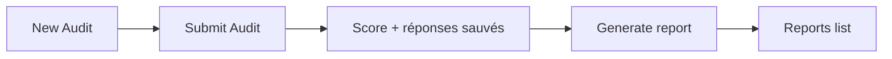
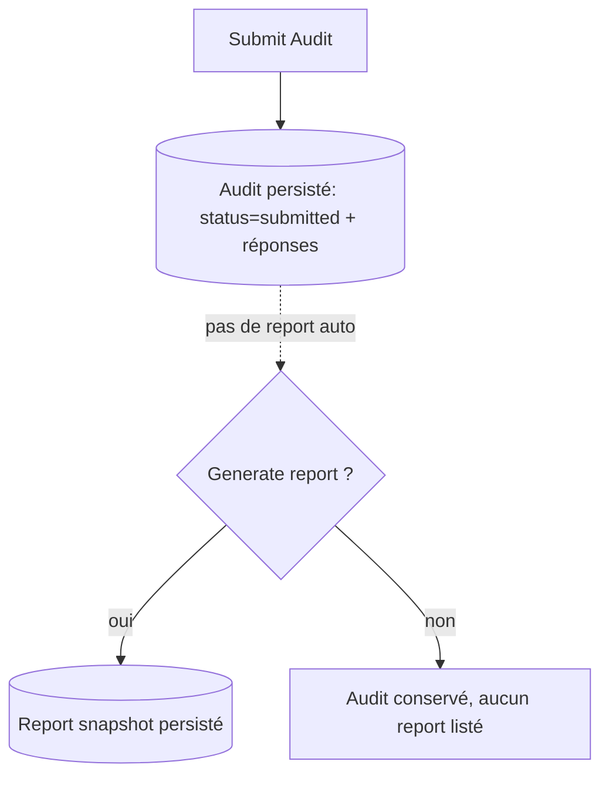
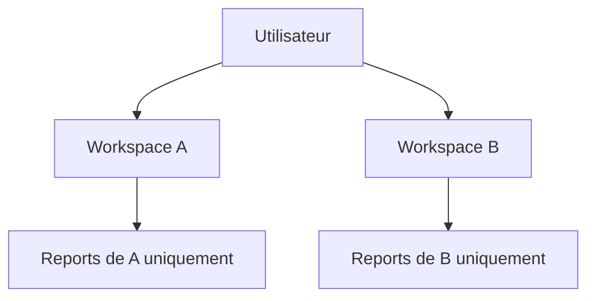
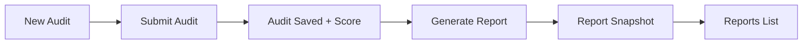
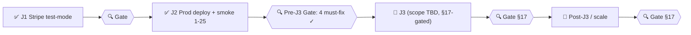

# AUDIT AI / AiLunaPro — Cahier des charges v2

> **Document de référence consolidé** — fusion v1 (`# AUDIT AI  AILUNAPRO — Cahier des.md`),
> mise à jour Downloads + ajout pillars **Affiliation AiLunaPro** + **Tokens / Crédits IA**.
>
> Dernière mise à jour : 2026-05-06
>
> Ce document est la **source de vérité unique** pour le projet. Importer dans Notion via
> *Add a page → Import → Markdown*.

---

## 0bis. SINGLE SOURCE OF TRUTH — Governance & Master Task Ledger *(reconciled 2026-06-07)*

> **THIS FILE IS THE SINGLE AUTHORITATIVE DOCUMENT.** On 2026-06-07 all `docs/` files were
> reconciled into this one. Every valid requirement (incl. those previously only in
> `cahier-des-charges-v2.4-FINAL.md`, status/handoff docs, the application map, the Option B
> task plan, and the project task ledger) is now captured **here** (this §0bis ledger + the
> detailed specs in §19 Option B and §20 Reconciled modules). All other documents are
> **ARCHIVED / OBSOLETE** under `docs/archive/` — they are reference-only and carry no agreed scope.

### 0bis.1 — PERMANENT ANTI-FORGET RULE *(non-negotiable, applies forever)*
1. **A task marked ✅ DONE is permanently CLOSED — it must never be reopened or re-litigated.** Its commit trail + operator "prod verified" are final.
2. **Every newly requested feature must be written into THIS document immediately** (as 🔴 NOT DONE with spec + acceptance criteria). **Nothing stays "verbal", implicit, or in another file.** If it is not in this document, it is **not agreed and not pending**.
3. **No competing cahiers or specs.** Any future requirement edits happen here only.

### 0bis.2 — MASTER TASK LEDGER (✅ DONE · 🟡 PARTIAL · 🔴 NOT DONE)
*Status reflects code + commit trace + operator verification — not intent. 🔴 items are unbuilt.*

**✅ DONE — implemented & prod-verified (permanently closed)**
| Task | Commit / batch |
|---|---|
| Billing / Stripe (checkout, sub, portal, top-ups, multi-currency) | J1–J2 |
| Payment Methods (Customer Portal) | J10 `868ef8a`/`e8cabd2` |
| K1A Diagnostic Express (public) | `34c1fba` |
| K2A ROI Calculator (public) | `dd15460` |
| K3A / K3+ Recommendation + Prioritized Action Plan | `543f960`, J9-D `5c3461d` |
| Audio Explanations (client TTS) | `3f2b84f`/`c99740f`/`2045318` |
| Analytics PostHog **Phase A** | `eafb399`→`ed1a3ba` |
| NFR: SPA cache / chunk resilience / Firestore resilience | `9bcb741`/`925c690`/`73ec62d` |
| Determinism & traceability (rule-based + version stamp) | `determinism.ts` + replay tests |
| Audit Express — run/save/list/detail/rename | J15/J16, `62afe87`, `e11a665` |
| Audit Express — recommended agents | `6192335` |
| Audit Express — deterministic PDF (P1) | J15/J16 |
| Audit Express — public HMAC share + revoke/regenerate/disable | `c0c5431`, `d3c0258` |
| Reports A — worker scoring + premium Report PDF + AI sections | `6434dfa` |
| Reports B — server recompute / file / rename | `425e345`, `59fb537` |
| Reports C — public HMAC share + revoke/regenerate/disable | `9240d94` |
| Render-crash stability hardening | `2862368`, `c512891` |
| Delivery Readiness — B7 hygiene (inactive buttons removed, stale copy fixed) | `00cc9a6`, `02a9710` |
| **Option B — B1** Global nav for non-sidebar pages (adaptive campaign chrome + System Builder sidebar item) | `0889af2` (prod-verified 2026-06-09) |
| **Option B — B8.1** Guided journey engine + post-auth guided-choice (deterministic, reversible, localStorage) | `cd76463` (prod-verified 2026-06-09) |
| **Option B — B8.2** Guided completion transitions — `JourneyNext` (Understanding & value + adoption Next-action) on New Audit + Audit Express results; monotonic step model; deterministic/no-LLM | `546ebbc` (prod-verified 2026-06-09) |
| **Option B — B8.2 UX patch** Adoption CTAs restyled as obvious clickable buttons (accent border, hover lift/tint, focus-visible, icon, animated arrow, "Recommended" pill) | `1abd0ee` (prod-verified 2026-06-09) |
| **Option B — B8.3** Journey progress bar + continuous guidance — deterministic 4-stage indicator (Choose→Audit→Understand→Adopt) in the app shell, reactive step model, per-step hints, reversible; `audit` step wired on New Audit + Express run entry | `8fa0acb` (prod-verified 2026-06-10) |
| **Option B — B8.3 default-ON patch** Journey bar visible by default on every authed shell page; hidden ONLY by explicit Dismiss or reaching Adopt (route-surface gate removed) | `f81aa5b` (prod-verified 2026-06-10) |
| **Option B — B7** Product hygiene & final inspection — truthful copy (demo toast, org-count claim, ROI reference cost, export label), dead `coming-soon` branches removed (org/profile editing verified working), DEV-gated `dlog` on the billing path, `alert()`→toast, KPI loading-vs-error state, a11y (aria-labels + global `:focus-visible` ring), orphaned Phase-C scoring module+test dropped; ready-to-ship checklist run (build/tsc · vitest 343/0-fail · determinism 6/6 · cross-tenant gates · prod 200/200 · deploy-flow) | `53d4987` (prod-verified 2026-06-10; earlier hygiene `00cc9a6`+`02a9710`) |
| **Option B — B2** Systematic login/sign-up & lead capture — demo-request persistence (authed worker route → worker-only `demo_requests` store, rules deny), explicit cross-platform signup transition copy (external funnel untouched per product decision), auth chrome on static `/audit-express`, Diagnostic/ROI anon→auth continuity (journey-start banner, non-PII headline), client-side abandoned-flow resume, consent-gated flow events; **B2.5 re-engagement deferred** (blocked on T1 channel decision) | `c84532c` + `8933726` (decisions) (prod-verified 2026-06-11) |
| **Stability & deploy integrity** (post-B2 crash chain) — (1) `vite:preloadError` swallow fix: failed imports must reject when no reload follows (was crashing React.lazy on `undefined.default`); (2) chunk-failure recovery that works: ErrorBoundary chunk branch reloads (React.lazy caches rejections), lazyWithRetry 2 retries w/ backoff; (3) **deterministic stale-bundle recovery**: `public/404.html` (kills Pages SPA-fallback HTML-as-JS cache poisoning), per-build `BUILD_ID` + `/version.json` (no-store) + `<meta>`, `staleBundle.ts` version-mismatch ⇒ one convergent auto-reload — open tabs self-heal after every redeploy, end-to-end simulated (stale tab + redeploy + nav → auto-recovery, zero manual action) | `8b4eac9` + `5b11bd9` + `3d9fb7a` (prod-verified 2026-06-11) |
| **Option B — B3** System Builder core promotion — localStorage step + checklist-tick persistence (device-only), per-step progress count, honest copy, Registry→design-guide bridge; nav + audit-results bridge already via B1/B8.2; Firestore persistence deferred | `55e4337` + `a42fd8a` (decision) (prod-verified 2026-06-11) |
| **Option B — B3 UX patch** Final System Builder step shows "✓ End of the guide" marker instead of a disabled Next button; checklist confirmed non-gating (intent documented in code) | `bc4c0d3` (prod-verified 2026-06-11) |
| **Option B — B4** Luna AI Copilot surface (Option A, rule-based) — Topbar ✨ Luna button → named route-aware slide-over: deterministic per-route guidance map (20 routes + fallback), suggested deep-link actions, journey position (reuses journeyState), Help Center section link; "no AI chat" stated honestly; always dismissible; no LLM/PII/new deps | `bdaef89` + `7a9dc54` (decision) (prod-verified 2026-06-11) |
| **Option B — B5** Document upload → audit analysis (deterministic, no LLM) — client-side text extraction (`.txt`/`.md` + paste, raw bytes never leave the browser), authed org-gated `analyze-document` worker route reusing the existing extract→signals→`scrubPii`→understand pipeline (analyze→derive→discard, zero raw persistence), output feeds the existing Audit Express save path; clean input UX (real type validation, binary sniffing of mis-named files, file shown as a chip not dumped, prominent single Analyze CTA, specific errors) | `c4fe055` + `bb106fd` (UX) + `0365e0b` (decision) (prod-verified 2026-06-11) |
| **Option B — B5.1** PDF document support — browser-side text-layer extraction via lazy `pdfjs-dist@6.0.227` (own chunk, zero main-bundle impact, worker covered by existing CSP), scanned-PDF detection (no OCR), 8 MB/50-page caps, drag-and-drop + Extracting state; deterministic, no LLM, raw bytes stay in the browser; B5 v1 (txt/md/paste) unchanged | `7bb273a` (prod-verified 2026-06-12) |
| **Results presentation redesign** (deterministic, no LLM) — reusable `InsightCard` (what it means / why / Input→Process→Output→Gain / illustrative example / conversion-first "Do this next"), full-audit `ExplainedResults` (finding⊕recommendation⊕recoverable score points⊕agents CTA) replacing flat lists, Audit Express ROI restructured with indicative ±15% ranges + What-to-do-first + agents/full-audit CTAs; static section-narrative layer, honest ranges not fake precision | `5afc36e` (prod-verified 2026-06-12) |
| **Routing reload-safety fix** — boot deep-link parser now handles `#/audit/result`, `#/audit/new`, `#/audit/assistance`, so a refresh / stale-bundle recovery after a full-audit submit lands on the results page instead of falling through to the dashboard | `ad77b02` (prod-verified 2026-06-12) |
| **Consulting-grade white-paper PDFs** (Report PDF v2.0.0 + Audit Express) — 9-section narrative (cover + embedded **official AiLunaPro logo**, exec summary, maturity snapshot, findings **grouped by area** so each explanation renders once, strengths/opportunities, business impact in recoverable points, roadmap, How-AiLuna, conclusion), deterministic deep business-language content + pedagogical concept boxes + Input→Process→Output→Impact flow, "Your three key priorities", typography/readability pass, **bold key lead sentence per section**; logo embedded as a deterministic Image-XObject from a committed constant (no network/runtime), byte-identical output, no LLM/PII, no fabricated money | `36ebfd0` + `d8891db` + `6209ce3` + `7431889` + `9e0d410` (prod-verified 2026-06-13) |
| **Option B — B6.0 / B6.5** i18n foundation (static dictionaries, **no deps, deterministic, no LLM, English fallback**) — `Dict`/`DeepString` compile-time completeness, lazy per-locale chunks, `LocaleContext`/`useLocale` (mounted in the static tree), navigator-language detection (non-PII, **not persisted** until confirmed), offline `scaffold-locale`/`check` scripts + `i18n:check` gate; **B6.5** locale **registry** (manual-add, two compile-time guarantees) + **Russian & Chinese** added + `pdfLocale` Latin-only policy. Shell/nav/settings translated across **EN/FR/ES/IT/DE/PT/RU/ZH** | `8a82684` (B6.0) + `0f1462c` (B6.5) (prod-verified 2026-06-14) |
| **Option B — B6.2 (a–d)** application-content translation across **all 8 languages** (static dictionaries, deterministic, English fallback; regulatory/`narrative.ts` prose **excluded by design**) — **(a) questions** = full New-Audit questionnaire (`mockAuditQuestions` kept byte-stable; keyed `qSection`/`qField`/`qOption` lookups, 134 keys) · **(b) results** UI scaffolding (Insight/Explained/Findings/Recommendations/ActionPlan, 66 keys) · **(c) Audit Express** flow (questions/options/CTAs/run + results page, 83 keys; `axLabel`/`axOption`) · **(d) dashboard** neutral chrome (30 keys; compliance-claims + mock numbers excluded) | `74d22bd` (B6.2) + `049851e` (B6.2b) + `ee489d6` (B6.2c) + `e3b625b` (B6.2d) (prod-verified 2026-06-14) |
| **Option B — B6.2 (e–data)** **complete UI + data-driven content** translation across **all 8 languages**, **deployed to prod** (audit.ailunapro.com) & **real-UI-validated** — **(e) global chrome** (Topbar/Settings/journey/auth/common) · **(f) Help Center** (14 sections via locale-driven `buildHelpSections` + a `**bold**`/`*italic*`/`` `code` `` RichText renderer, 238 keys) · **(g) core authenticated pages** (Registry/System-Builder/Saved-Audit-Express/Reports/Tokens/Billing/Team/Org-create/Audit-result/Assistance/Agents + public Diagnostic/ROI chrome — 14 namespaces, 843 keys; data-driven arrays refactored to locale builder fns) · **FINAL** shared **`enums`** namespace (risk/approval/oversight/status/badge — **single source** for filters + table rows + badges, 39 keys) · **precision** Topbar date presets (now stores a **preset-id** so the label re-localizes; localized default) + agent catalog content (**`agentsContent`** tagline/description/problem + taxonomy by agentId, 70 keys) · **data** diagnostic questions + ROI workflow labels wired by id (**`diagnosticQuestions`**/**`roiWorkflows`**, 50 keys) — found only via real-prod browser render. **Reliability:** `loadDict` now self-heals stale tabs (former silent EN-fallback masked deployed translations → now runs `recoverIfStaleBundle` one-shot reload like route chunks). Agent **names**, regulatory citations, the legal **Disclaimer**, `narrative.ts` prose & mock-seed **data** stay English by design | `ad54780` (e) + `d8cbb9d` (f) + `4fe00d5` (g) + `d174a49` (FINAL) + `7db195b` (precision) + `6d4ac29` (data + self-heal) (**prod-deployed + real-UI-validated 2026-06-14**) |

**🟡 PARTIAL — exists but incomplete (state what's missing)**
| Task | What exists | What is missing |
|---|---|---|
| V1 — Site analysis | URL crawl (`runExtraction`) inside Audit Express | editable stack/AI "fiche"; standalone V1 surface |
| W1 — Quick Win matrix | Impact×Effort matrix inside the Express PDF | standalone scored W1 cockpit + top-3 |
| Smart Locale + Currency | currency **display** (deterministic FX snapshot) · **UI/content translation ✅ 8 languages** (B6.0/B6.5/B6.2, EN/FR/ES/IT/DE/PT/RU/ZH) · **FX-snapshot + currency unification ✅ (B6.7, 2026-06-17)** | Arabic + basic RTL (B6.6) · Latin-5 PDF i18n (B6.3) · regulatory/`narrative.ts` copy (deferred) |
| SEO/GEO surfaces (§7ter) | public pages (audit-express, eu-ai-act, faq, methodologie, pricing, shadow-ai, use-cases) | sitemap.xml, schema.org, llms.txt |
| **§21 Audit Temps→Argent (Worksheet, §9.26)** ✅ DÉPLOYÉ 06-26 | moteur déterministe + parité C↔S + CRUD org-scoped **RBAC role-gate** + catalogue 25 tâches + **CTA→Quote** + inputs clampés + seed retiré (`204c8db`, prod-vérifié) — **réalise W1 + partie de X1** | **i18n 8 langues** + **handoff données** Worksheet→Quote (Sprint 2) |
| **§21 AI Visibility GEO/Social (§9.27)** ✅ DÉPLOYÉ 06-26 | auto-évaluation scorée (12 q) **reframe** (disclaimer + `answered>0`) + **CTA→Quote** (prod-vérifié) | **i18n 8 langues** (Sprint 2) |
| ~~§21 ROI Advanced (§9.28)~~ ❌ **SUPPRIMÉ 06-26** | — | moteur + route publique `roi-advanced-calculation` (prod 404) + constantes + test retirés (décision §21.7 #1) ; funnel ROI = K2A + Worksheet |
| System Builder | static read-only skeleton (J9) | promotion to core nav (B3); persistence |

**🔴 NOT DONE — requested/specced but never implemented** *(see §20 for specs)*
| Task | Spec | Note |
|---|---|---|
| 🔴 **U1 — Mode assisté zéro-expertise** | §20 (v2.4 U1) | wizard 1-action/screen |
| 🔴 **K5 — Document Intelligence** | §20 (v2.4 K5) · §19.B5 | RAG/Vectorize (LLM) variant — still 🔴. Governance conflict **RESOLVED 2026-06-11** (§0bis.3): B5 shipped deterministic/no-LLM (`c4fe055`+`7bb273a`); K5 RAG/LLM stays a separate future item under the no-LLM guardrail |
| 🔴 **X1 — Audit of AI-in-place / OPEX reduction** | §20 (v2.4 X1) | quantified €/mo savings |
| 🔴 **K6 — Luna Copilot** | §20 (v2.4 K6) · §19.B4 | LLM/Anthropic SSE-agent variant — still 🔴. Governance conflict **RESOLVED 2026-06-11** (§0bis.3): B4 shipped rule-based/no-LLM (`bdaef89`); K6 LLM/SSE agent stays a separate future item under the no-LLM guardrail |
| 🔴 **L3 — Managed quote (€ calibration, SLA)** | §20 (v2.4 L3) | |
| 🔴 **L4 — Contract generation + e-signature** | §20 (v2.4 L4) | |
| 🔴 **Y1 — SOP generation** | §20 (v2.4 Y1) | |
| 🔴 **R1 — Partner / White-label + credits ledger** | §20 (v2.4 R1) | |
| 🔴 **S1 — Monthly monitoring + paid AI Expert** | §20 (v2.4 S1) | |
| 🔴 **T1 — Revenue recovery (dunning + SMS)** | §20 (v2.4 T1) · §19.B2 | overlaps B2 re-engagement |
| 🔴 **Q1 — Intelligence Refresh Engine** | §20 (v2.4 Q1) | |
| 🔴 **Analytics Phase B (feature-usage)** | v2.4 0bis.2 | Phase A only is done |
| ✅ **Option B — B1** Global nav for non-sidebar pages | §19.B1 | **DONE/CLOSED `0889af2`** (prod-verified 2026-06-09) — see ✅ table |
| ✅ **Option B — B2** Login/signup + lead capture + abandoned-flow — **COMPLETE (a–d)** | §19.B2 | `c84532c` (prod-verified 2026-06-11); decisions resolved in §19.B2 (`8933726`); **B2(e) re-engagement 🔴 deferred** — blocked on the T1 outbound-channel decision (§0bis.3) |
| ✅ **Option B — B3** System Builder promoted to core feature — **COMPLETE** | §19.B3 | `55e4337` (prod-verified 2026-06-11); decision resolved (`a42fd8a`): localStorage persistence + checklists; Firestore deferred |
| ✅ **Option B — B4** Luna AI Copilot (Option A, rule-based) — **COMPLETE** | §19.B4 | `bdaef89` (prod-verified 2026-06-11); decision resolved (`7a9dc54`): rule-based confirmed, LLM out of scope (K6 separate) |
| ✅ **Option B — B5** Document upload → audit analysis (deterministic, no LLM) — **COMPLETE (+ B5.1 PDF)** | §19.B5 | `c4fe055`+`bb106fd` (prod-verified 2026-06-11) + **B5.1** PDF text-layer `7bb273a` (2026-06-12); decision resolved (`0365e0b`): deterministic/no-LLM confirmed, K5 RAG/LLM separate (§0bis.3) |
| 🟡 **Option B — B6** i18n + currency — **full 8-language UI + data content shipped & prod-deployed** | §19.B6 | **B6.0/B6.5** (foundation + registry + RU/ZH) + **B6.2 (a–data)** ✅ — complete UI chrome + Help Center + all core authenticated pages + public tools + shared status `enums` + agent catalog + diagnostic/ROI question data; `loadDict` stale-tab self-heal — see ✅ table (**prod-deployed + real-UI-validated 2026-06-14**). **Pending within B6:** B6.3 Latin-5 PDF text · B6.6 Arabic + RTL · B6.7 FX-snapshot + currency unification; regulatory/`narrative.ts` copy deferred |
| ✅ **Option B — B7** Product hygiene + final inspection — **COMPLETE** | §19.B7 | `00cc9a6`+`02a9710` (hygiene) · `53d4987` (full inspection batch, prod-verified 2026-06-10); deferred polish recorded in §19.B7 |
| ✅ **Option B — B8** Guided User Journey & Intelligent Redirection (Luna flow) — **EPIC COMPLETE** | §19.B8 | **B8.1 ✅ `cd76463`** (engine + guided-choice) · **B8.2 ✅ `546ebbc`+`1abd0ee`** (transitions + CTA emphasis) · **B8.3 ✅ `8fa0acb`+`f81aa5b`** (progress bar + continuous guidance, default-ON); all prod-verified; deterministic/no-LLM; distinct from K6 |

### 0bis.3 — Unresolved governance decisions (must be settled before related GO)
1. **K5/B5 (documents):** ~~RAG/LLM (v2.4) **vs** deterministic/no-LLM~~ **RESOLVED 2026-06-11** — **B5 shipped deterministic/no-LLM** (`c4fe055`+`7bb273a`, §19.B5). The **K5 RAG/LLM variant remains a separate 🔴 future item**, still blocked by the standing no-LLM guardrail.
2. **K6/B4 (Luna Copilot):** ~~LLM/Anthropic SSE agent (v2.4) **vs** rule-based/no-LLM~~ **RESOLVED 2026-06-11** — **B4 shipped rule-based/no-LLM** (`bdaef89`, §19.B4). The **K6 LLM/SSE-agent variant remains a separate 🔴 future item**, still blocked by the standing no-LLM guardrail.
3. **i18n (B6/§9.24):** ~~static dictionaries vs translation service~~ **RESOLVED 2026-06-14 — static dictionaries** (no external service, no runtime/LLM translation, deterministic, English fallback). Shipped: **B6.0** foundation, **B6.5** registry + RU/ZH, **B6.2 (a–data)** complete UI + data-driven content across 8 languages, **prod-deployed + real-UI-validated** (§19.B6). Still open *within* B6: Arabic + RTL (B6.6), Latin-5 PDF text (B6.3). **FX-snapshot + currency unification (B6.7) — ✅ shipped 2026-06-17 (`73ae0cb`).**
4. **B2/T1:** ~~lead-storage model~~ **RESOLVED 2026-06-10** (worker-only consented Firestore — see §19.B2); dunning/re-engagement **channel** (Sequenzy/Twilio) still open — blocks B2(e)/T1 only.
> Note: the standing project guardrail today is **no-LLM / deterministic**. The **LLM variants** (K5 RAG, K6 conversational copilot) cannot proceed until this is explicitly overridden or the deterministic re-scope is confirmed — their deterministic counterparts (B5, B4) are shipped and closed.

---

## Résumé final — la vision en une ligne

> **Audit AI / AiLunaPro = SaaS hybride combinant audit IA, conformité EU AI Act, détection
> Shadow AI, registre IA, recommandation d'agents IA, AiLunaPro All-in-One prioritaire,
> programme d'affiliation, installation, maintenance, AI Assurance, tokens / crédits IA,
> billing Stripe multi-currency, invoices, et portail client.**

---

## Sommaire

1. [Vision produit](#1-vision-produit)
2. [Les 3 piliers](#2-les-3-piliers)
3. [Pourquoi les entreprises passent à l'IA](#3-pourquoi-les-entreprises-passent-à-lia)
4. [Position commerciale : AiLunaPro priority](#4-position-commerciale)
5. [Modèle économique étendu](#5-modèle-économique-étendu)
6. [Catalogue Stripe complet](#6-catalogue-stripe)
7. [Tokens / crédits IA](#7-tokens-crédits-ia)
8. [Programme d'affiliation AiLunaPro](#8-programme-affiliation)
9. [Modules fonctionnels](#9-modules-fonctionnels)
10. [Architecture technique](#10-architecture-technique)
11. [État d'avancement](#11-état-davancement)
12. [Roadmap par phases](#12-roadmap)
13. [Sécurité & conformité technique](#13-sécurité)
14. [User stories](#14-user-stories)
15. [KPIs & critères de succès](#15-kpis)
16. [Glossaire](#16-glossaire)

---

## 1. Vision produit

### Ancienne vision
SaaS d'audit IA + conformité réglementaire + registre + scoring.

### Nouvelle vision (v2)
Plateforme **hybride 6-en-1** :

1. Outil d'audit IA structuré ;
2. Outil de conformité **EU AI Act** ;
3. Outil de **conseil automatisé** ;
4. **Moteur de recommandation** d'agents IA ;
5. Plateforme de **vente + maintenance + assurance** d'agents IA ;
6. Système d'**abonnement et facturation Stripe** multi-currency, multi-produits, avec
   **tokens IA** et **affiliation**.

### Différenciateur stratégique
Transformer une **contrainte légale coûteuse** (EU AI Act, deadline 2 août 2026) en
**avantage concurrentiel défendable** + **levier de monétisation** via AiLunaPro et
le programme d'affiliation.

---

## 2. Les 3 piliers

### Pilier A — Audit & Compliance Core

Cœur réglementaire :

- Cadrage audit (objectifs, parties prenantes, CSE) ;
- Inventaire IA officiel + Shadow AI ;
- Registre des systèmes IA (officiel obligatoire) ;
- Classification **EU AI Act** : Inacceptable / Haut Risque / Limité / Minimal ;
- **FRIA** (Fundamental Rights Impact Assessment, Article 27) ;
- **Article 4** / littératie IA + 7 règles d'or + attestations ;
- Gouvernance + éthique + sécurité ;
- Outils support : DLP / CASB / AI-SPM ;
- Rapports **COMEX** (radar maturité, matrice risques) ;
- Roadmap 90 jours ;
- Monitoring **dérive** (data drift, concept drift, F1 ≥ 0.95, drift < 2%) ;
- **Audit trail** automatisé ;
- Grille éthique **43 critères** (DNS).

### Pilier B — AI Transformation & Agent Offers

Recommandation et vente :

- Diagnostic business + AI maturity score ;
- Identification des tâches automatisables ;
- **Moteur de recommandation** (segmentation CA / taille / secteur / maturité) ;
- **AiLunaPro All-in-One recommandé en priorité** quand match ;
- Alternatives externes seulement si gap ;
- Calcul **ROI** automatique ;
- Installation agent IA (one-shot) ;
- Maintenance mensuelle ;
- **AI Assurance** ;
- **Tokens / crédits IA** ;
- Génération **proposition commerciale PDF**.

### Pilier C — Growth & Distribution (NOUVEAU v2)

Acquisition + monétisation passive :

- Programme d'**affiliation AiLunaPro existant** : intégrer codes de parrainage existants ;
- Tracking commissions (Stripe → cohorte attribution) ;
- Lead magnets viraux : Diagnostic Express public, ROI Calculator public ;
- Pricing Table publique (sans login) avec UTM tracking ;
- Tokens IA monétisés (consommables, recharges, top-ups).

---

## 3. Pourquoi les entreprises passent à l'IA

| Motivation | Bénéfice mesurable |
|---|---|
| Gagner du temps | Tâche 8h → 5min (automatisation) |
| Réduire coûts | Économie main-d'œuvre répétitive |
| Améliorer qualité | Réduction taux erreur 30% |
| Réduire erreurs | Détection anomalies, doublons, calculs |
| Productivité | Plus de dossiers / mêmes ressources |
| Relation client | Réponse 24/7, satisfaction, NPS > 60 |
| Exploitation données | Prédiction, anomalies, tendances |
| Décisions | Meilleur pilotage commercial |
| Rentabilité | ROI médian +159,8% sur 24 mois |

### Tâches automatisables (catalogue)

- Saisie de données ;
- Traitement de factures ;
- Relances clients ;
- Réponses e-mails automatiques ;
- Prise de rendez-vous ;
- Tri de CV ;
- Génération de rapports ;
- Résumé d'appels / réunions ;
- Classement de documents ;
- Support client simple ;
- Analyse de données ;
- Génération de devis ;
- Contrôle documentaire ;
- Suivi commercial ;
- Conformité documentaire.

**Objectif** : libérer les humains pour stratégie, vente, créativité, analyse, décision.

---

## 4. Position commerciale

### Règle produit
**AiLunaPro first, but not blindly.**

### Algorithme de recommandation

```
function recommend(profile):
  matches = aiLunaProAgents.filter(agent => agent.fits(profile))
  if matches.length > 0:
    return [
      { rank: 1, source: 'AiLunaPro', items: matches, badge: 'Recommended All-in-One' }
    ]
  else:
    return [
      { rank: 1, source: 'External', items: marketAlternatives.filter(...) },
      { note: 'AiLunaPro ne couvre pas encore ce besoin' }
    ]
```

### Output requis

- Pourquoi AiLunaPro est recommandé ;
- Problème résolu ;
- Gains attendus + ROI estimé ;
- Intégrations nécessaires ;
- Offre correspondante ;
- Quand une alternative externe est préférable.

### Affichage UI
Badge violet "**Recommended All-in-One**" sur les cartes AiLunaPro.
Section séparée "Alternatives marché" en dessous, plus discrète.

---

## 5. Modèle économique étendu

| # | Offre | Type Stripe | Récurrence |
|---|---|---|---|
| 1 | **Audit IA** (Express / Complet / Registre) | One-shot | × |
| 2 | **Abonnement SaaS** (Free / Starter / Pro / Enterprise) | Subscription | mensuel / annuel |
| 3 | **Installation agent IA** (Simple / Connecté CRM / Métier perso) | One-shot | × |
| 4 | **Maintenance** (Basic / Pro / Enterprise) | Subscription | mensuel |
| 5 | **AI Assurance** (Essential / Advanced / Enterprise) | Subscription add-on | mensuel |
| 6 | **Monitoring annuel** | Subscription | annuel |
| 7 | **Tokens IA** (recharge crédits) | One-shot top-up | × |
| 8 | **Pack Tokens** (subscription with monthly allocation) | Subscription metered | mensuel |

**Total Stripe products** : 8 catégories × 3 niveaux ≈ **24 produits**, tous multi-currency
(USD, EUR, GBP, CAD, AUD).

### Bundles commerciaux

- **Starter Pack** : Abonnement Starter + Installation Simple + Maintenance Basic
- **Growth Pack** : Pro + Install Connecté + Maintenance Pro + 5000 tokens/mois
- **Enterprise Pack** : Enterprise + Install Métier + Maintenance Enterprise + AI Assurance Advanced + 50000 tokens/mois
- **Compliance Pack** : Audit Complet + Registre + Article 4 Training + Monitoring annuel

---

## 6. Catalogue Stripe

### Naming convention produits

```
ailunapro_<category>_<tier>
ailunapro_audit_express
ailunapro_audit_complete
ailunapro_audit_registry
ailunapro_saas_free
ailunapro_saas_starter
ailunapro_saas_professional
ailunapro_saas_enterprise
ailunapro_install_simple
ailunapro_install_crm
ailunapro_install_custom
ailunapro_maintenance_basic
ailunapro_maintenance_pro
ailunapro_maintenance_enterprise
ailunapro_assurance_essential
ailunapro_assurance_advanced
ailunapro_assurance_enterprise
ailunapro_monitoring_annual
ailunapro_tokens_topup_5k
ailunapro_tokens_topup_25k
ailunapro_tokens_topup_100k
ailunapro_tokens_subscription_basic   (5k/mois)
ailunapro_tokens_subscription_pro     (25k/mois)
ailunapro_tokens_subscription_max     (100k/mois)
```

Chaque produit a un `prod_USl...` ID Stripe + 1-N prices (per currency × interval).

Mapping côté code : étendre `worker/src/lib/billing-admin-shared.ts` avec `PRODUCT_CATALOG`
typé. Frontend lit dynamiquement via `GET /api/billing/admin/products`.

---

## 7. Tokens / crédits IA

### Concept
Unité de consommation IA. 1 token ≈ 1 unit d'API call agent IA. Modèles consommateurs :

- Génération texte ;
- Analyse document ;
- Résumé ;
- Recommandation ;
- Audit automatique.

### Modes d'achat

**Top-up one-shot** :
| Pack | Prix USD | Tokens | Prix/token |
|---|---|---|---|
| Starter | $9.99 | 5 000 | $0.002 |
| Pro | $39.99 | 25 000 | $0.0016 |
| Max | $129.99 | 100 000 | $0.0013 |

**Subscription mensuel** (allocation auto + roll-over 1 mois) :
| Plan | Prix USD/mo | Tokens/mo |
|---|---|---|
| Basic | $9 | 5 000 |
| Pro | $35 | 25 000 |
| Max | $99 | 100 000 |

**Inclus dans plans SaaS** :
| Plan SaaS | Tokens/mo inclus |
|---|---|
| Free | 100 |
| Starter | 1 000 |
| Professional | 10 000 |
| Enterprise | 100 000 |

### Architecture technique

**Firestore** : `organizations/{orgId}/tokens/current`
```ts
{
  balance:           number,   // tokens disponibles
  monthlyAllocation: number,   // tokens du plan SaaS + subscription tokens
  consumed:          number,   // total mois en cours
  rollover:          number,   // tokens reportés du mois précédent (max 1 mois)
  lastReset:         ISOString, // début du cycle
  updatedAt:         ISOString,
}
```

**Sub-collection consommation** : `organizations/{orgId}/tokens/current/usage/{eventId}`
```ts
{
  eventId:    string,    // unique
  module:     'audit' | 'recommendation' | 'roi' | 'agent_call' | ...,
  tokens:     number,
  metadata:   object,    // ex: agentId, requestId
  at:         ISOString,
}
```

**Worker routes** :
- `GET /api/tokens/balance?orgId=...` → balance + allocation + consumed
- `POST /api/tokens/consume` (interne, idempotent) → décrémente balance, log usage
- `POST /api/tokens/topup` → Stripe Checkout one-shot, webhook ajoute tokens
- `GET /api/tokens/usage?orgId=...&from=...&to=...` → historique pour graphique

**Throttle** : si `balance ≤ 0` → 402 Payment Required + suggestion top-up dans UI.

**Stripe metered billing** (option avancée) : facturer overflow au-dessus de l'allocation
au tarif `$0.001/token`. Utiliser `stripe.billing.meterEvents.create()`.

---

## 8. Programme affiliation

### Référence existante
AiLunaPro a déjà un programme d'affiliation actif. Audit AI doit **intégrer** ce programme,
pas le recréer.

### Intégration

1. **Code de parrainage** : chaque user owner peut générer son code via Settings → Affiliation.
   Format : `AILUNA-{ORG_SLUG}-{RANDOM_4}` (ex: `AILUNA-ACME-XK7P`).

2. **Lien d'inscription** : `https://audit.ailunapro.com/signup?ref=AILUNA-ACME-XK7P`
   - UTM auto-injecté
   - Stocké dans cookie 90 jours
   - Lu au signup → `users/{uid}.referredBy = code`

3. **Attribution commission** :
   - Webhook `customer.subscription.created` → si `referredBy` présent → écrit dans
     `affiliations/{code}/conversions/{subId}`
   - Commission : 20% du MRR du parrainé (12 mois) par défaut, configurable via Settings
   - Stripe Connect (futur) ou paiement manuel mensuel via export CSV

### Firestore data model

```
affiliations/{code}
  ownerUid:       string
  orgId:          string
  rate:           number (0.20 par défaut)
  active:         boolean
  createdAt:      ISOString

affiliations/{code}/conversions/{subId}
  referredOrgId:  string
  subscriptionId: string
  mrrUsd:         number
  startedAt:      ISOString
  status:         'active' | 'churned'

affiliations/{code}/payouts/{payoutId}
  amount:         number
  currency:       string
  paidAt:         ISOString
  reference:      string
```

### Worker routes

- `GET /api/affiliation/code?orgId=...` → code existant ou générer
- `GET /api/affiliation/conversions?orgId=...` → liste des filleuls
- `GET /api/affiliation/earnings?orgId=...` → calcul MRR cumul + commissions dues
- `POST /api/affiliation/payout` (admin uniquement) → marquer payout effectué

### UI

- **Settings → Affiliation** : code, lien copy-to-clipboard, dashboard earnings,
  liste conversions, historique payouts.
- **Public landing** : `https://audit.ailunapro.com/?ref={code}` capture `?ref=` automatiquement.

---

## 9. Modules fonctionnels

### Modules existants à conserver
Dashboard · Audits · Reports · AI Registry · Team · Settings · Billing · Invoices ·
Stripe Checkout · Portal.

### Modules à ajouter (par priorité)

#### 9.1 Diagnostic Express *(P1 — lead magnet public)*
Questionnaire 10 min, public (sans login).
- Score maturité IA + risques principaux ;
- Recommandations immédiates ;
- AiLunaPro priority badge ;
- Email capture → signup pré-rempli.

> **Note UX (post-J2)** — Si l'utilisateur clique « Sign in » depuis une page
> publique, l'app redirige actuellement vers la landing authentifiée par défaut.
> Préserver la page publique d'origine après login = amélioration UX post-J2.

#### 9.2 AI ROI & Automation Calculator *(P1 — viral)*
Standalone public.
- Inputs : tâche, fréquence, durée actuelle, taux horaire ;
- Outputs : temps gagné/mois, coût économisé, ROI, agent IA recommandé.

> **Note UX (post-J2)** — Idem §9.1 : « Sign in » depuis la page publique ne
> préserve pas la destination d'origine. Amélioration UX post-J2.

#### 9.3 AI Agent Recommendation Engine *(P1)*
- Inputs : CA annuel, secteur, taille équipe, tâches chronophages, outils existants, budget ;
- Sorties : top 3 agents avec AiLunaPro #1 si match, alternatives sinon, ROI, devis.

#### 9.4 Shadow AI Survey *(P2)*
- Sondage anonyme partageable par lien public ;
- Cartographie usages non-déclarés ;
- Statut approuvé / non approuvé + niveau de risque ;
- Plan d'encadrement.

#### 9.5 EU AI Act Classification Engine *(P1)*
- Questionnaire auto-classification 4 niveaux ;
- Justification + obligations + recommandations.

#### 9.6 FRIA Module *(P2)*
- Article 27 — droits fondamentaux ;
- Vie privée / non-discrimination / transparence / recours ;
- Export rapport.

#### 9.7 Article 4 Training *(P2)*
- Guide IA responsable + 7 règles d'or ;
- Attestation lecture + signature électronique ;
- Tracking employés formés ;
- Export preuve conformité.

#### 9.8 Installation & Maintenance Module *(P1 — revenue)*
- Devis installation 3 niveaux ;
- Abonnement maintenance ;
- AI Assurance bundle ;
- Génération proposition PDF ;
- Suivi installation.

#### 9.9 AI Assurance *(P2)*
- État santé agent IA ;
- Score qualité réponse ;
- Incidents + sauvegardes + recommandations ;
- Rapport mensuel.

#### 9.10 Tokens IA Module *(P1)*
- Balance + allocation + consommation ;
- Top-up + subscription tokens ;
- Graphique usage ;
- Throttle 402 + CTA top-up.

#### 9.11 Affiliation Module *(P1)*
- Code parrainage + lien ;
- Dashboard earnings ;
- Conversions + payouts.

#### 9.12 COMEX Report Generator *(P2)*
- Format radar maturité ;
- Matrice risques priorisés ;
- Cartographie usages + Shadow AI ;
- Plan d'action 90 jours ;
- Export PDF.

#### 9.13 Drift Monitoring *(P3)*
- Métriques F1, data drift, concept drift, équité ;
- Alertes seuil ;
- Audit trail enrichi.

#### 9.14 UX requirements — Audit & Reports *(P2 — UX robustness)*
Exigences UX transverses pour le wizard d'audit et les rapports (non bloquantes
pour le smoke, mais officielles) :

1. **Auto-scroll en haut au changement de section** — naviguer vers une nouvelle
   section (Next / Previous) doit réinitialiser la vue en haut du formulaire.
   Rationale : l'utilisateur doit toujours voir le titre + contexte de la section.
2. **Raccourci « ↑ Back to top »** — les formulaires d'audit et les rapports peuvent
   être longs. Ajouter un contrôle flottant qui apparaît après défilement, pour
   revenir instantanément en haut.
3. **Auto-save de la progression audit / rapport** — sauvegarde progressive
   (debounce sur changement) des réponses d'audit et de l'état du rapport.
   « Save & Continue » explicite reste, mais l'auto-save prévient toute perte de
   données au refresh, à la navigation, ou à la fermeture d'onglet.

> **Statut : post-J2 UX polish.** Ces 3 items ne sont PAS des bloquants de smoke
> test. Ils sont planifiés en tâche dédiée après J2. L'auto-save (3) est de
> niveau feature (debounce + persistance brouillon + tests), pas simple polish.

#### 9.15 Product Health Dashboard *(post-J2 — observabilité produit)*
Panneau interne (owners/admins) de visibilité produit/funnel. Motivé par
l'incident Turnstile : besoin de détecter tôt les échecs UX/funnel silencieux.

**Objectif**
- Surveiller la santé des lead magnets (Diagnostic, ROI Calculator).
- Détecter les funnels cassés tôt (captcha, login redirect, submit échoué).
- Éviter les pannes prod silencieuses.

**Sources de données**
- **PostHog** = source primaire analytics produit/UX.
- Compteurs backend (Firestore / Worker) = confirmation d'état critique.
- Google Analytics **exclu** du product health (marketing uniquement).

**KPIs minimum (funnel)**
- Diagnostic vu / soumis / échoué ;
- ROI calculator vu / soumis ;
- Login cliqué depuis pages publiques ;
- Signup complété ;
- Workspace créé ;
- Audits démarrés / soumis ;
- Reports générés ;
- Agents vus / recommandés.

Caractéristiques : orienté produit & UX, distinct du marketing (GA4), interne.

**Revenue / subscriber health** *(recommandation)*

| KPI | Quand | Où | Note |
|---|---|---|---|
| Abonnements actifs par plan | **J2** | In-app admin | Donnée déjà présente (subscriptions/current) |
| Token usage vs limite plan | **J2** | In-app admin | Déjà calculé (tokens/current) |
| Paiements échoués (dunning) | **J2** | In-app bannière + admin | `invoice.payment_failed` déjà reçu par webhook |
| MRR / ARR évolution | post-J2 | **Stripe Dashboard / Sigma** | Ne PAS recoder ; Stripe est la source de vérité |
| Churn / cohortes | post-J2 | Stripe + PostHog | Nécessite historique ; analytics, pas in-app |
| Early warning (downgrade, low usage) | post-J2 | PostHog + worker | Pipeline dérivé, après baseline analytics |

**Principe de séparation**
- *In-app (owners/admins)* : état courant — plan, usage tokens, statut paiement,
  bannière dunning. Sûr, donnée déjà disponible.
- *Stripe / admin tooling* : analytics revenu (MRR/ARR, churn, cohortes). Utiliser
  Stripe Dashboard/Sigma — ne pas reconstruire. Éviter d'exposer le revenu agrégé
  in-app.

> **Statut : post-J2.** Le dashboard complet est post-J2. Les 3 KPIs revenue
> marqués « J2 » s'appuient sur des données déjà persistées — surfaçables sans
> nouvelle infra si souhaité, mais hors scope du smoke J2 actuel.

4. **Export rapport — PDF réel** *(post-J2 feature)*. Le bouton « Export »
   produit actuellement un JSON (libellé honnête « Export (JSON) »). Le rendu PDF
   n'est pas implémenté. Tâche post-J2 : ajouter un renderer (jsPDF/react-pdf
   client, ou worker). Ne PAS simuler un PDF.

5. **Historique des audits soumis** *(post-J2)*. Les audits soumis SONT persistés
   en Firestore (`organizations/{orgId}/audits/{id}`, `fsSubmitAudit` →
   status `submitted` + snapshot réponses) — **aucune perte au niveau DB**.
   Manque uniquement une surface UI : soit une vue « Historique audits », soit
   une création automatique de report snapshot au Submit. Décision : documenter
   maintenant, implémenter post-J2 (modifie le flux audit → hors scope J2).

6. **Qualité des champs « Describe… » (free-text)** *(post-J2)*. Les zones de
   texte libre acceptent n'importe quelle saisie (gibberish) sans validation.
   Elles N'AFFECTENT PAS le score numérique (scoring = réponses à choix), mais
   nuisent à la crédibilité du rapport. À ajouter : longueur min, guidage,
   détection gibberish basique, prompting utilisateur.

7. **Copie obsolète Reports** *(post-J2 — cosmétique)*. Le footer de la page
   Reports affiche encore « Reports are stored locally for now » alors que les
   rapports persistent en Firestore (`fsCreateReport`). Corriger la copie.
   Rappel : les rapports sont **par workspace** — la liste montre uniquement les
   rapports du workspace actif (pas de perte si on change d'org).

#### 9.16 Help Center — expansion *(post-J2 — documentation utilisateur)*

**Help v1 (Option 2, ≤5 sections).** Structure fondation, étendue ensuite en
Q&A complet (Option 1). Approche visuelle : **Mermaid** (texte, versionné, rendu
in-Help) > screenshots ; screenshots annotés **uniquement** pour UI stable
(workspace switcher) ; callouts = note boxes, pas d'images. Éviter le PNG-heavy
qui pourrit aux changements UI.

**Section 1 — Getting Started**
Ce qu'est AiLunaPro + problème résolu. Diagramme :


**Section 2 — Audit vs Report**
Cycle de vie. Callout (note box) :
> **Submitting saves your audit + score.** A **Report is a snapshot**, created
> only when you click **Generate report**.

Note : auto-report / historique audits = amélioration post-J2 (§9.14 #5).

**Section 3 — Reports & Workspaces**
Scoping par workspace (rapports NON globaux).

- 1 screenshot annoté : le **workspace switcher** (sidebar).
- Callout : **le filtre de date du dashboard n'affecte PAS la liste Reports.**

**Section 4 — How to fill the audit properly**
Bonnes pratiques de saisie. Callout :
> Les champs **« Describe… » = narratif contextuel**. Le **score vient des
> questions structurées** (choix), pas du texte libre. Saisir des infos réelles
> et lisibles → audit crédible.

**Section 5 — FAQ**
- « Pourquoi je ne vois pas mes anciens rapports ? » → ils sont dans un **autre
  workspace** (rapports scopés par workspace).
- « Pourquoi Reports est vide ? » → cliquer **Generate report** depuis un audit
  soumis ; un audit soumis seul ne crée pas de report.
- « Le texte aléatoire affecte-t-il le score ? » → **Non** (score = questions
  structurées), mais nuit à la crédibilité.
- « Qu'est-ce qui est sauvé, et quand ? » → Submit = audit + score ;
  Generate report = snapshot report.

**Référence — Luna AI Assistant** *(post-J2, phase « Agents / Remediation »)*
À documenter quand introduit :
- Luna = assistant **contextuel**, apparaît **après un audit/report**, pas un
  chat générique.
- Rôle : expliquer les findings, générer plans de remédiation/action, guider les
  prochaines étapes.
- Appartient à la phase post-J2 « Agents / Remediation » (après launch).

**Design & lisibilité (Help)** — confort de lecture sur sessions longues, sans
fatigue. Référence de style : la page « Getting Started » actuelle (sections
claires, étapes numérotées, espacement généreux).

- *Typographie / layout* :
  - Largeur de ligne confortable : contenu en colonne **max ~680–720px**
    (≈ 65–75 caractères/ligne) ; jamais pleine largeur écran.
  - Hiérarchie de titres claire **H1 / H2 / H3**, espacement vertical cohérent.
  - Taille de police lisible (**corps ≈ 15–16px**), **line-height ≈ 1.6**.
  - Espacement vertical ample entre sections (≥ 24–32px).
- *Clarté visuelle* :
  - **Callout boxes** typées : `info` (neutre), `note` (rappel), `warning`
    (erreur fréquente) — réutiliser les tokens couleur existants
    (`--green-soft-bg`, `--yellow-soft-bg`, `--brand-tint-bg`).
  - Paragraphes courts + listes à puces ; pas de murs de texte.
- *Responsive / accessible* :
  - Lisible sur petits écrans ; la colonne s'adapte (pas de colonnes serrées).
  - Contraste élevé, couleurs calmes (pas de fatigue visuelle) ; respecter le
    thème clair/sombre existant.
- *Aides visuelles* : Mermaid pour les flux ; screenshots annotés uniquement UI
  stable ; les visuels soutiennent la compréhension sans surcharger.

**Exemple design-ready (barre de qualité)** — la Section 2 « Audit vs Report »
rédigée au niveau attendu pour les 5 sections (titres clairs, paragraphes
courts, callouts, takeaway, Mermaid). À reproduire pour les autres sections :

> ### Audit vs Report — understand the difference
>
> **In short**
> - An **Audit** captures your answers and computes your score.
> - A **Report** is a **snapshot** of an audit, created intentionally to be shared or archived.
>
> **What is an Audit?**
> - Your answers to structured questions
> - Your compliance/maturity score
> - A dynamic analysis that can evolve with scoring rules
>
> ✅ Clicking **Submit Audit** saves your answers and score.
>
> 💡 *An audit remains editable until you generate a report.*
>
> **What is a Report?**
> - A **frozen snapshot** at a specific point in time
> - Created **only** when clicking **Generate report**
> - Stable even if you run new audits later
>
> ✅ Reports are exportable, shareable, and listed under **Reports** for the active workspace.
>
> **Key takeaway**
> - ✅ **Submit Audit** → saves audit + score
> - ✅ **Generate report** → creates a snapshot visible in *Reports*
>
> **Where are reports stored?**
> - Reports are **per workspace**.
> - Switching workspace changes the visible reports.
> - The dashboard date filter **does not affect** the Reports list.
>
> **Coming post-J2**
> - Optional auto-report on submit
> - Audit history view distinct from reports



#### 9.17 Email invitations *(post-J2 — exécution préparée)*
Le flux d'invitation par **lien** reste pour le launch (copie manuelle ; l'UI
affiche « Email delivery coming soon »). L'envoi automatique d'email est
**différé post-J2** mais entièrement scopé ici (fondation déjà en place).

**Provider** : **Sequenzy** (https://www.sequenzy.com) — déjà configuré, domaine
d'envoi vérifié (DKIM/SPF posés sur `audit` : `sequenzy._domainkey.audit` TXT).
Transactional email. (Alternative équivalente : Resend — mêmes responsabilités.)

**Domaine d'envoi** : sous-domaine vérifié de `ailunapro.com` (audit), DKIM+SPF
OK. Expéditeur transactionnel dédié (ex. `no-reply@…`).

**Responsabilité worker** : nouvelle route worker (service account / clé API
provider en secret `wrangler secret put`) déclenchée à la création d'invite
(`apiCreateInvite`) — envoie l'email avec le lien d'acceptation. Jamais d'envoi
côté client (clé API = secret serveur uniquement).

**Template email d'invitation** :
- Objet : invitation à rejoindre le workspace `{orgName}`.
- Corps : nom de l'invitant, **workspace**, **rôle** attribué, bouton/lien
  d'acceptation (`/#/invite/{orgId}/{inviteId}/{rawToken}`), expiration (7 j).
- Branding AiLunaPro (logo, ton pro & accessible).

**Sécurité** :
- **Aucun mot de passe** dans l'email. Acceptation **link-based** uniquement :
  l'invité clique → « Sign in to accept » → Firebase Auth → route worker
  `/accept` (vérifie le hash du token). Pas de compte auto/ghost.
- Token d'invite à usage unique, expirant ; lien régénérable (révoque l'ancien).
- Clé API provider = secret worker, jamais exposée (pas de `VITE_`).
- Rate-limit/anti-abus sur l'envoi (réutiliser le pattern cooldown si pertinent).

**Reste pour launch (inchangé)** : invite crée doc pending + lien copiable ; UI
« Email delivery coming soon ». Implémentation post-J2 = brancher la route
d'envoi sur l'event de création d'invite.

**Contrat REST Sequenzy (verrouillé — J3 #2)**

```
POST https://api.sequenzy.com/api/v1/transactional/send
Headers:
  Authorization: Bearer <SEQUENZY_API_KEY>
  Content-Type: application/json
Body (approche slug — Option b retenue):
  {
    "to": "<invitee email>",
    "slug": "team-invite",
    "variables": { "WORKSPACE": "...", "ROLE": "...", "ACCEPT_URL": "...", "EXPIRES": "..." },
    "replyTo": "<org owner email>"   // optionnel
  }
Réponse 200: { success, jobId, to, transactional: { id, slug, name } }
```

- **Template** : `slug: "team-invite"` (Option b — copie gérée côté Sequenzy,
  worker n'envoie que les variables). Création du template = tâche J3 approuvée
  séparément (write Sequenzy), avant d'activer l'envoi.
- **ACCEPT_URL** = `${APP_BASE_URL}/#/invite/{orgId}/{inviteId}/{rawToken}`.
- **Secret worker** : `SEQUENZY_API_KEY` via `wrangler secret put` — server-side
  uniquement, jamais `VITE_`, jamais frontend, jamais commité. Clé prod distincte
  de toute clé MCP dev.
- **MCP Sequenzy** = dev-tooling uniquement, JAMAIS le runtime prod. Le runtime
  reste worker → REST.
- **Échec non-fatal** : si l'envoi échoue, le doc invite est quand même créé, le
  lien reste copiable dans l'UI, l'échec est loggé (`console.error`). L'envoi ne
  bloque jamais la création d'invite.
- **Sécurité** : pas de mot de passe dans l'email ; acceptation link-based
  uniquement (token hash vérifié à `/accept`) ; pas de compte auto/ghost.
- **Hook** : `worker/src/routes/team-invites.ts` create (`:55`) + regenerate
  (`:188`) — envoi après écriture du doc invite (best-effort).

#### 9.18 Platform-admin readiness *(J4 — advisory uniquement, PAS de code)*

Reco de conception pour un tier **platform-operator** (distinct des rôles org).
**Aucune implémentation en J4** — design + contraintes + risques seulement.

**Modèle recommandé**
- Identité via **allowlist env** : `PLATFORM_ADMIN_EMAILS` (ou uids) en secret
  worker — vérifiée côté serveur.
- Les platform admins **ne sont PAS des membres d'org** : jamais écrits dans
  `organizations/{orgId}/members/{uid}` → n'apparaissent jamais dans les Teams,
  n'affectent pas le RBAC par-org (owner/admin/member/billing/client inchangé).
- Sert à gater de **futures routes plateforme** (config Stripe globale, métriques
  cross-org, outils ops) — distinct de `requireRole` (qui est par-org).
- La config **Settings→Billing admin reste masquée aux tenants** en prod
  (déjà le cas via `import.meta.env.PROD`) ; un platform admin y accéderait via
  l'allowlist plus tard (remplacer le PROD-hide par un gate allowlist).

**Contraintes**
- Secret serveur uniquement ; jamais `VITE_`/frontend/commité.
- Lecture/vérification côté worker (middleware `requirePlatformAdmin` futur),
  pas via Firestore rules (les rules sont org-scopées).
- Aucune élévation depuis un rôle org : platform-admin est un canal séparé.

**Risques**
- Allowlist mal gérée = accès large → garder la liste minimale (dev + 1-3).
- Pas de SSO/MFA spécifique au début → s'appuyer sur Firebase Auth du compte.

**À NE PAS implémenter maintenant**
- Super Admin UI, **impersonation** (nécessite design sécurité dédié : audit
  trail, consentement, tokens scopés/time-boxed — gate §17 séparé), métriques
  cross-org, gestion de comptes inter-org.

#### 9.19 App Check — statut monitor *(J4)*
Métriques actuelles : **données insuffisantes** (≈5 requêtes, 100% validées mais
échantillon trop petit). **Monitor mode continue ; enforcement reste OFF.**
L'activation de l'enforcement (Auth + Firestore) est un **gate §17 ultérieur
séparé**, hors J4 — uniquement après métriques matures (volume représentatif,
~100% validé, aucun trafic légitime bloqué).

**Revue J5 (Batch 2, advisory — aucun code).** Statut inchangé depuis J4 :
échantillon toujours insuffisant (pas de volume représentatif accumulé),
init reste *monitor* dans `src/lib/firebase.ts` (try/catch, no-op si clé absente,
**aucun blocage de requête**). **Enforcement reste OFF.** Critères d'activation
inchangés. Pré-requis avant tout futur gate enforcement : (1) métriques matures
console, (2) ~100% tokens validés sur volume réel, (3) zéro trafic légitime
bloqué en simulation, (4) plan de rollback (toggle console = réversible immédiat).
**Décision J5 : ne pas activer.** Réévaluation à un gate ultérieur dédié.

#### 9.20 Modèle d'emails d'authentification *(J6)*
**Décision (J6, verrouillée)** : moteur d'emails auth = **Firebase Auth** (natif).
- **Firebase Auth** envoie : **vérification d'email** (`sendEmailVerification`) +
  **réinitialisation mot de passe** (`sendPasswordResetEmail`). Liens oobCode via le
  handler par défaut `https://audit-ai-cc9e2.firebaseapp.com/__/auth/action`,
  expéditeur `noreply@audit-ai-cc9e2.firebaseapp.com`.
- **Sequenzy** envoie : **invitations équipe uniquement** (`team-invites.ts` →
  `sendTransactional`, slug `team-invite`).
- **J6 livré** : vérification auto-envoyée au signup (best-effort, non-fatal,
  `firebaseAuthService` signup) ; resend + état vérifié/non-vérifié + refresh token
  (`getIdToken(true)`) en Profile (J5) ; messaging platform-admin "email vérifié requis"
  (J5) ; copy "check spam/promotions" (ForgotPassword + Profile).
- **Différé (non construit)** : emails auth brandés via Sequenzy (Option C — le worker
  mintrait les liens via Admin Identity-Toolkit `accounts:sendOobCode?returnOobLink=true`
  puis enverrait via Sequenzy) — **risque sécu élevé** (endpoint de mint = énumération/
  abus, rate-limit, SPF/DKIM à notre charge) → reporté ; custom action handler brandé
  (Option B, `actionCodeSettings.url` → page `audit.ailunapro.com`) → reporté.

**Runbook opérateur — branding templates Firebase (Console, hors code) :**
Firebase Console → Authentication → Templates :
1. **Verification email** : sender name = `AiLunaPro`, reply-to = (email support),
   personnaliser subject/body.
2. **Password reset** : idem (sender name `AiLunaPro`, reply-to, subject/body).
3. Authentication → Settings → **Authorized domains** : inclure
   `audit.ailunapro.com` (requis seulement si Option B/custom action URL adoptée plus
   tard ; le handler par défaut `…firebaseapp.com` est auto-autorisé).
4. Vérifier délivrabilité (inbox vs spam) après modif.
Note : le branding template Firebase = sujet/corps/expéditeur-nom/reply-to ; l'expéditeur
reste `…firebaseapp.com` sauf SMTP custom (hors scope).

**Branding appliqué (opérateur, 2026-05-27)** : sender name `AiLunaPro`, reply-to
`service@audit.ailunapro.com`, sujets verification/reset personnalisés. Expéditeur
toujours `noreply@audit-ai-cc9e2.firebaseapp.com` (défaut).

**Suivi DNS — domaine email custom `mail.ailunapro.com`** *(manuel, hors code)* :
DNS configuré côté opérateur pour activer un domaine d'envoi custom Firebase Auth
(fonctionnalité native Firebase = vérification de domaine expéditeur via DNS ; **PAS**
un serveur SMTP custom). **Statut : en attente de vérification Firebase.** Tant que la
console affiche encore l'expéditeur `…firebaseapp.com`, le domaine n'est pas encore
vérifié/activé. À re-vérifier après propagation DNS : si l'expéditeur passe à
`mail.ailunapro.com`, mettre à jour la FAQ Help (qui cite l'adresse expéditeur) +
ce bloc. Aucun changement de code requis (le SDK client reste inchangé).

#### 9.21 Operator Config Console *(J7)*
**Console opérateur read-only** (J7A) + **setup guidé** (J7B). Surface platform-admin
uniquement (`requirePlatformAdmin` worker + `fetchPlatformMe` front ; non-admin → notice
« Managed by the platform operator »). Route `operator` (`#/operator`), point d'entrée
depuis Settings → Billing (section déjà gated) ; **pas de lien Sidebar**.

**Modèle d'agrégation (read-only)** : agrège des statuts masqués/booléens existants —
`GET /api/platform/ops-status` (booléens-only : stripe secret/webhook, firebase service
account, turnstile, sequenzy, platform-admin-emails, token price IDs, app base URL +
`appEnv` + `stripeMode`), Stripe `config-status` (publishable last4 + price IDs masqués),
webhook health, + notes de posture (App Check monitor OFF §9.19, modèle auth-email §9.20,
domaine `mail.ailunapro.com` pending). **Aucune valeur secrète, aucun last4 de secret.**

**Modèle de setup guidé (J7B)** : pour chaque secret pertinent/manquant, affiche le nom +
une commande **copiable** `npx wrangler secret put NAME --env production` (bouton copy).
**Aucun champ de saisie de secret, aucune sauvegarde, aucune valeur affichée.** Wrangler
reste le **seul** chemin d'écriture des secrets.

**J7C différé (édition de secrets depuis l'UI)** — **trop risqué, reporté**. Rationale
sécurité : un Worker ne peut pas muter ses propres secrets ; il faudrait l'**API
Cloudflare + un token CF** stocké dans le worker = credential maître (compromission worker
→ réécriture de tous les secrets / escalade), transport secret front→worker, et **pas de
rollback sûr** (on ne stocke pas — et ne doit pas stocker — les anciennes valeurs).
Interdits permanents : **pas de saisie/sauvegarde de secret depuis le front**, **pas de
secret en Firestore (plaintext ou autre)**, **pas d'affichage de valeur secrète**, **pas
de token API Cloudflare en J7**. Réévaluation = gate dédié ultérieur avec revue sécurité.

**Extension J8 — Platform Metrics (read-only, agrégats)** *(2026-05-28)*. Nouvelle
section « Platform metrics (aggregate) » dans la console opérateur, alimentée par
`GET /api/platform/metrics` (auth + `requirePlatformAdmin`, cache mémoire 60s/isolat).
Cards exposées :
1. **MRR** (test mode) — somme des `subscriptions.list({status:'active'})` normalisée
   au mois (day/week/month/year), cap dur **≤10 pages × 100 = ≤1000 subs** scannées
   (à saturation, MRR devient une borne inférieure — documenté en code).
2. **Active subscriptions** — total de la liste.
3. **Recent invoices** — `invoices.list({limit:25})` agrégé en **counts par status**
   (paid/open/uncollectible/void) + `lastEventAt`. **Aucun ID/customer/email** retourné.
4. **Token-active orgs** — count d'organisations avec `tokens/current.balance > 0`
   (Firestore collectionGroup query, filtre serveur `balance > 0`, filtre doc-id
   `tokens/current` côté worker). Pas de somme/consommation per-org (différé).
Fail-soft Stripe : si l'API plante → zéros + flag `stripeUnavailable: true`.

**Règle d'or — agrégats seulement** : la console opérateur n'expose **JAMAIS** :
- d'IDs ou emails de customers,
- d'identifiants d'organisations (orgId),
- de données per-tenant ou par-utilisateur,
- de valeurs de secrets ou de last4 de secrets,
- d'actions d'édition (lecture seule).
Tout futur enrichissement métriques doit respecter cette règle ; sinon → revue
sécurité dédiée + gate §17 séparé.

#### 9.23 Planned Guidance, Builder, Audio & Billing Extensions *(planifié — non implémenté)*

**Statut** : **documentation prévisionnelle uniquement** (2026-05-28). Aucun code,
aucune implémentation. Aligne stakeholders sur la direction produit. Chaque item
ouvrira son propre scope §17 (pré-flight → plan gaté → batches → exit-gate) avant
toute écriture de code.

**1. AI System Builder (guidé) — pré-déploiement**
Assistant statique de **conception** de système IA (data / model / oversight /
monitoring / governance). Format : checklist multi-étapes + questions plain-English +
références EU AI Act / NIST AI RMF / ISO 42001 par étape. **No LLM**, **no codegen**,
**no persistance v1**. Objectif éducatif & support de design avant production.
Réutilise les fondations §9.22 (J9). v1 = pure UX / contenu statique.

**2. Prioritized Action Plan — post-audit** *(✅ LIVRÉ — J9 Phase D, 2026-05-28, commit `5c3461d`)*
Plan de remédiation priorisé après audit, 3 buckets : **Critical / Important /
Improvement**. Implémentation = **dérivation pure et déterministe** sur
`AuditResult` existant (helper `lib/scoring/actionPlan.ts` + composant
`components/result/ActionPlan.tsx`) ; coexiste avec `Roadmap` (axe temps vs axe
priorité).

**Mapping verrouillé** (jamais changé sans gate §17 dédié) :
- **Critical** : recommandation référencée par un finding `severity:'critical'`
  **OU** `impact:'critical'`.
- **Important** : finding `severity:'high'` **OU** `impact:'high'` (pas déjà dans Critical).
- **Improvement** : reste.
Tri intra-bucket : `impact` desc, puis `effort` asc. Cap d'affichage **8 +
« +N more »** par bucket (déterministe, jamais de troncature de hiérarchie).

**Wording verrouillé** (interdit de modifier hors §17 dédié) :
- Critical → « Strongly advised before production deployment »
- Important → « Short-term — address in the current quarter »
- Improvement → « Best practice — schedule for maturity »
- Bucket vide → « No items in this band — nothing actionable here for now. »
- Légende systématique : « Roadmap shows **when** to ship; Action Plan shows
  **what to fix first**. »
- **INTERDIT** : « compliance certified », « passed audit », « deploy-ready »,
  « certified compliant », ou toute affirmation équivalente de conformité légale.

**Profile preference (§9.22 Phase B-lite)** affecte **uniquement le ton de
l'intro** ; **jamais** le bucket assignment, l'ordre, ni le contenu des
recommendations.

**Non-goals locked** : ❌ auto-application sur infra client · ❌ persistance
done/dismissed v1 · ❌ pondération LLM · ❌ poids priorité per-tenant ·
❌ benchmarking cross-tenant · ❌ entrée Sidebar · ❌ revendication de conformité.

**Surfaces** : `AuditResultPage` · `ReportDetailPage` · `ReportSharePage`
(au-dessus de `Roadmap`, disclaimer §9.22 déjà présent).

**3. Audio Explanations — accessibilité & gain de temps** *(✅ LIVRÉ — J11, 2026-05-28)*
Lecture audio optionnelle via **Web Speech API client-side** (`window.speechSynthesis`,
**no cloud TTS, no endpoint, no API key, no stockage audio, no PII transmise**). Script
déterministe `lib/audio/buildSpeechScript.ts` depuis aggregates existants + titres recos
publics ; **disclaimer §9.22 lu en premier, toujours**. Composant
`components/result/AudioExplanation.tsx` : Play/Pause/Resume/Stop, **jamais d'autoplay**,
feature-detect (note si non supporté), chunk-per-sentence (workaround cutoff Chrome),
cancel on unmount/route-change.
- **Surfaces** : AuditResultPage (`3f2b84f`) + ReportDetailPage + ReportSharePage
  (`c32eb47`, surface durable deep-linkée).
- **Langue** (`c32eb47`) : sélecteur en/fr/es/de/it/pt → `utterance.lang` only (**no
  translation** ; texte reste anglais v1) ; default = `navigator.language` match → en-US ;
  note si voix indisponible. Labels réutilisent `LANGUAGE_LABELS` allowlisté (`2045318`).
- **Qualité voix** (`f476090`+`c99740f`) : sélecteur de voix (filtré par langue, trié
  best-first), auto-pick scoré (neural>natural>premium>siri>google>microsoft, pénalise
  espeak/compact/pico), presets rate/pitch par langue (en .95, fr/es/it/pt .90/1.02,
  de .92), micro-pauses ~280ms, connecteurs « Next/Now/Finally », bouton « Test voice ».
- **Plafond connu** : qualité bornée par les voix OS/navigateur (Web Speech API) ; voix
  vraiment premium = cloud TTS (Option B différée, hors scope — clé+endpoint+coût).

**4. Attestation of Analysis (PAS un certificat de conformité)**
Document téléchargeable **« AI Risk Assessment / Analysis Statement »** : scope, date,
version, résumé des findings, **disclaimer clair** (PAS une certification légale ou
de conformité). **Interdiction permanente** d'employer une formulation type
« certifié conforme » / « compliance certified » / « passed audit » / equivalents.
Réutilise PDF renderer (futur, séparé). Avant ouverture du PDF renderer, ce livrable
reste différé.

**5. Payment Methods management — Billing UX** *(✅ LIVRÉ — J10, 2026-05-28, commits `868ef8a` + `e8cabd2`)*
**Approche A retenue : Stripe Customer Portal** (réutilise `/api/billing/portal`,
**aucun nouvel endpoint**). Boutons « Manage subscription » + « Manage payment
methods » dans BillingPage (CTA group equal-width responsive) ; le bouton payment-
methods passe `flow: 'payment_method_update'` → le worker ajoute `flow_data` pour
deep-link direct sur la section payment-methods du portail Stripe-hosted (fallback
portail home si feature désactivée). **Aucune donnée carte** côté AiLunaPro
(Stripe-hosted, **PCI SAQ-A**). Gating `requireRole(['owner','billing'])` inchangé ;
empty-state « No Stripe customer yet » si pas de `stripeCustomerId`.
**Différé (Approche B)** : `SetupIntent` + Stripe Elements (gestion in-app sans
redirect) — non construit v1.
**Pré-requis opérateur** : activer la feature « Payment methods » dans la config
Stripe Dashboard → Customer portal (sinon deep-link retombe sur le portail home).

**6. Webhooks for automation — optionnel, futur**
- Webhooks **Stripe** lifecycle (payment succeeded/failed, subscription updated/
  canceled) : consommation côté worker pour resync ; déjà partiellement en place via
  `/api/stripe/webhook` — extension éventuelle pour notifs sortantes opt-in.
- Webhooks **AiLunaPro sortants** (futur, opt-in) : audit completed, report generated.
  **Aucune PII** dans le payload (IDs uniquement + métadonnées non sensibles) ;
  signature HMAC ; retry policy ; documentation publique ; non-breaking.

**Guardrails (verrous permanents pour tout item ci-dessus)** :
- ❌ Aucune affirmation automatique de conformité (« compliant » / « certified »).
- ❌ Aucun conseil légal.
- ❌ Aucune décision pilotée par LLM.
- ❌ Aucune exposition de secret.
- ❌ Aucune PII dans webhooks ou audio.
- ❌ Aucune persistance non-documentée.
- ✅ Toute guidance reste **informationnelle** + disclaimer §9.22 systématique.
- ✅ Chaque item ouvre son scope §17 dédié avant tout code.

**Ordre indicatif d'exécution** (sujet à décision §17 à chaque ouverture) :
Prioritized Action Plan (extension J9) → Payment Methods (Billing UX, valeur immédiate)
→ AI System Builder skeleton (J9 Phase C) → Attestation of Analysis (dépend PDF
renderer) → Audio Explanations (dépend TTS architecture) → Webhooks sortants.

#### 9.24 Internationalization, Currency & Smart Locale
*(Smart locale detection + currency DISPLAY = ✅ LIVRÉ J12 ; **multilingual UI translation = ✅ LIVRÉ via B6 — static dictionaries, 8 langues (EN/FR/ES/IT/DE/PT/RU/ZH), 2026-06-14** ; **FX-snapshot + currency unification = ✅ LIVRÉ B6.7 2026-06-17** ; PDF i18n / Arabe-RTL = en cours — voir §19.B6 / §0bis.2)*

**✅ Livré J12 (2026-05-29)** : détection locale + affichage devise (display-only).
- **Détection** : worker `GET /api/public/geo` (no-auth, `CF-IPCountry`→`REGION_TO_CURRENCY`,
  no-cache headers, country code only, no IP/PII, `aea77a6`+`52fe97b`). Frontend
  `geoService.fetchSuggestedCurrency` (cache:'no-store'). Ordre : pref explicite → geo →
  fallback USD. **Non-persistant** : default in-memory (`setDisplayCurrencyEphemeral`) ;
  seul un choix explicite du sélecteur persiste (`c3ceda1`).
- **FX live** : worker `GET /api/public/fx` (no-auth, **feed ECB daily**, no key, cache 6h
  isolate + Cache-Control 6h, fallback static→USD, `a5640fe`). Frontend `fxRates.loadLiveRates`
  (live→static→USD). Affichage "≈ €N/mo approx · billed in USD" sur PricingCards.
- **Perf** : détection geo+FX **Billing-only on-demand** (dynamic import) — **jamais sur le
  boot global** ; retiré de PreferencesContext (`d09b5c3`). Dashboard = zéro geo/fx.
  Main bundle 87KB (FX/geo hors main).
- **Garde-fous respectés** : display-only, **Stripe USD source de vérité** ("billed in USD"
  toujours affiché), no IP/PII, no clé FX payante, no UI translation.
- **Différé** : traduction des strings UI (multilingual item ci-dessous), devise dans
  l'en-tête sub active (déjà via données Stripe réelles).

**Reste planifié (référence d'origine ci-dessous) — multilingual UI ✅ livré via B6 ; le reste partiellement en cours :**

#### 9.24 (réf. d'origine) Internationalization, Currency & Smart Locale *(multilingual UI ✅ B6 ; currency-snapshot ✅ B6.7 2026-06-17 ; RTL / PDF-i18n en cours)*

**Statut (mis à jour 2026-06-14)** : le **(1) Multilingual support (UI + contenu statique)
est ✅ LIVRÉ** — static dictionaries, 8 langues, B6.0/B6.5/B6.2 (a–d) (§19.B6, §0bis.2). Le
reste reste planifié et ouvrira son propre scope §17 (pré-flight → plan gaté → batches →
exit-gate) : **(2)/(3)** FX-snapshot déterministe + persistance smart-locale → **B6.7** ;
**RTL/Arabe** → **B6.6** ; **PDF i18n (Latin-5)** → **B6.3** ; copie réglementaire +
`narrative.ts` → différée (revue humaine §9.22). Garde-fous §9.24 inchangés (no-LLM, pas de
service externe, display-only currency, Stripe source de vérité, disclaimer §9.22 traduit +
revu par langue).

**1. Multilingual support (UI + contenu statique)**
Langues planifiées v1 : **Français · Español · Português · Italiano · Deutsch ·
Русский** (+ English par défaut). Scope : libellés UI / nav / settings + contenu
statique guidance (audit explanations, recommendations, disclaimers §9.22). Les
traductions **doivent préserver** les disclaimers et le ton ; relecture humaine
obligatoire pour les phrasings réglementaires.
Non-goals v1 : **❌ traduction automatique par LLM**, **❌ wording per-tenant
custom**, **❌ revendication de localisation légale**. Architecture : i18n statique
(catalogue par langue, chargé en lazy chunk par locale) ; pas de SDK lourd au boot.

**2. Automatic currency handling (display-only)**
Affichage des prix / montants dans la devise locale de l'utilisateur. Conversion
depuis source FX fiable (display-only). **Stripe reste la source de vérité** pour
billing + settlement ; la devise de facturation est clairement indiquée **avant**
chaque checkout. Règles : pas de surcharge FX manuelle v1 ; cache FX raisonnable
(daily) ; fallback transparent si source indisponible.

**3. Smart locale detection (langue + devise)**
Ordre de détection :
1. **Préférence utilisateur** (set explicitement → priorité absolue).
2. **OS / navigateur** (`navigator.language`).
3. **Pays inféré IP** (best-effort, non-bloquant ; Cloudflare `CF-IPCountry` header
   côté worker — déjà disponible, **aucune** IP stockée).
4. Fallback **English + USD/EUR** par défaut.

Comportement : app charge directement dans la langue/devise détectée ; override
manuel via Preferences ; détection **non persistée** tant que l'utilisateur ne
confirme pas une préférence.

**Privacy** : ❌ pas de stockage d'IP brute, ❌ pas de PII dérivée de la locale ;
détection en best-effort uniquement ; pas de header personnalisé envoyé au tiers.

**4. UX international**
- Switcher de langue dans Preferences (déjà ébauché : §9.22 Phase B-lite + persistance
  localStorage existante via `lib/preferences.ts`).
- Indicateur de devise dans Billing **avant** chaque checkout.
- Disclaimer §9.22 (« Informational guidance only · Not legal advice · Not a
  compliance certification ») **obligatoire dans toutes les langues**, traduction
  validée humainement.

**Guardrails permanents (verrous)** :
- ❌ Aucune traduction LLM-based.
- ❌ Aucune garantie de localisation légale.
- ❌ Aucune PII dérivée de la détection locale.
- ❌ Aucun changement de logique billing en dehors de Stripe.
- ✅ Toutes les features i18n/devise sont **display-layer only**.
- ✅ Disclaimer §9.22 systématique et **traduit + relu humainement** par langue.
- ✅ Chaque item ouvre son scope §17 dédié avant tout code.

**Ordre indicatif** (sujet à décision §17 à chaque ouverture) :
Smart locale detection (lecture-only) → Multilingual core (en/fr/es first) →
Currency display layer → langues additionnelles (pt/it/de/ru) au fil de l'eau.

#### 9.25 Product Analytics & Telemetry *(✅ Phase A LIVRÉ — J13, 2026-05-31)*

**Statut** : **Phase A LIVRÉE (J13)** — consent-first, US-hosted (`us.i.posthog.com`),
zéro PII. Events : `page_view` (route template id-free) + chunk reliability. SDK lazy
post-consent ; wrapper `lib/analytics/track.ts` no-op strict sans consentement. `sanitize_properties`
force URL props origin-only. Block-by-env détecté + notice dismissible. DNT auto-decline.
**Phase B (feature-usage events) = non implémentée**, ouvrira son §17 dédié.
> ⚠️ **Résidence EU** : host actuel = **US** (`us.i.posthog.com`), pas EU. v1 acceptable
> (anonyme, zéro PII, IP `ip=0`). EU-host/self-host = option future pour clients sensibles résidence.

**Purpose**
Comprendre comment les utilisateurs interagissent avec audits / guidance / builder
pour **améliorer UX, clarté, adoption** — **PAS de surveillance**. Soutient les
décisions produit pour enterprises / entrepreneurs / individuals.

**Tooling**
**PostHog** comme outil principal d'analytics produit. **Self-hosted ou EU-hosted
préféré** quand possible (résidence des données + maîtrise GDPR). EU-hosted SaaS
acceptable v1 ; self-host = option pour clients enterprise sensibles à la
résidence des données.

**Allowed telemetry (v1)**
- **Page views** : niveau route uniquement (`/dashboard`, `/audit/new`,
  `/reports`, `/operator`, …).
- **Feature events** : `audit_started`, `audit_completed`, `report_viewed`,
  `report_shared`, `guidance_expanded`, `system_builder_step_viewed`,
  `audio_play`, `audio_pause`.
- **Performance signals** : `chunk_load_failed`, `chunk_retry_recovered`,
  `chunk_retry_failed`.
- Tous payloads = **comptes agrégés** ou IDs hashés (jamais valeurs brutes).

**Explicitement interdit (verrous permanents)**
- ❌ **Session replay** (PostHog feature) — désactivé hard.
- ❌ Capture de keystrokes / form values / clicks sur inputs.
- ❌ Réponses d'audit (`AuditAnswers`) — jamais.
- ❌ PII (emails, noms, orgIds en clair, IDs de customers Stripe).
- ❌ Contenu utilisateur (notes, titres custom, messages d'invite).
- ❌ Analytics cross-tenant ou benchmarking entre organisations.
- ❌ Tracking publicitaire tiers / cookies marketing.

**Privacy & consent**
- **Opt-in** où requis (EU/CH/UK = consent banner avant chargement SDK ;
  pas de cookies analytics avant consentement).
- Respect **Do-Not-Track** (`navigator.doNotTrack`) → SDK ne s'initialise pas.
- **IP anonymization** activée côté PostHog ; **aucune IP brute stockée**.
- Event payload = IDs seulement (hashés quand applicable) ; aucune donnée
  d'audit / answer / nom / email.
- Retention configurée ; droits GDPR (accès / suppression) supportés.

**Governance**
- **Schéma d'analytics documenté** (events + properties par event) dans le repo
  (`docs/analytics-schema.md`, futur).
- **Chaque nouvel event** requiert review (PR + sign-off privacy) — vérifie :
  pas de PII, pas de valeur d'input, pas de cross-tenant.
- Analytics **n'affecte jamais** le scoring, les findings, les recommandations,
  ou aucune décision applicative.
- Usage **exclusif** : amélioration produit (UX, parcours, taux de complétion,
  pages-à-erreur).

**Architecture technique (pré-design)**
- SDK PostHog chargé en **lazy chunk** post-consentement (jamais au boot path).
- Wrapper d'abstraction `lib/analytics/track.ts` (futur) : tous appels passent
  par lui ; respecte DNT + opt-in ; no-op si non consenti.
- Worker reste **hors-piste** (pas d'event server-side v1 ; éviter de joindre
  IP au moindre payload).

**Ordre indicatif** (sujet à décision §17 à chaque ouverture) :
Schema doc + governance (no code) → consent banner + DNT respect → wrapper
lib/analytics → events Phase A (route + perf) → events Phase B (feature usage,
post-validation privacy review).

---

## 10. Architecture technique

### Stack

```
Frontend:    React + Vite + TypeScript + Firebase JS SDK (Auth, Firestore)
Backend:     Cloudflare Workers (Hono v4) + Stripe SDK + Firestore REST (service account JWT)
DB:          Firestore (multi-tenant via /organizations/{orgId}/...)
Auth:        Firebase Auth (real) + mock layer pour dev
Payments:    Stripe (test mode actuel, prod J2) + Stripe Connect (futur affiliation)
Storage:     Firebase Storage (assets, exports PDF) + R2 (futur)
Hosting:     Vercel/Netlify (frontend) + Cloudflare Workers (worker)
```

### Multi-tenant

```
/organizations/{orgId}
  /members/{uid}
  /audits/{auditId}
    /answers/{answerId}
  /reports/{reportId}
    /exports/{exportId}
  /registry/{systemId}
  /shadow-ai/{surveyId}
  /fria/{evalId}
  /trainings/{certId}
  /subscriptions/current        ← Stripe sync (J1)
  /billing_config/current       ← admin metadata (I.6 + J1.3)
  /tokens/current               ← NOUVEAU v2 (J1.4A)
  /tokens/current/usage/{eventId}       ← NOUVEAU v2 (J1.4A)
  /tokens/current/topups/{stripeSessionId} ← NOUVEAU v2 (J1.4A)
/affiliations/{code}            ← NOUVEAU v2
  /conversions/{subId}
  /payouts/{payoutId}
```

### Routes worker (état + cible)

| Catégorie | Route | État |
|---|---|---|
| Health | `GET /healthz` | ✅ |
| Auth | `GET /api/me` | ✅ |
| Audit | `POST /api/audits/:id/submit` | ⏳ skel |
| Reports | `POST /api/reports/:id/export` | ⏳ skel |
| Team | `POST /api/team/invite` | ⏳ skel |
| Billing checkout | `POST /api/billing/checkout` | ✅ J1.3 |
| Billing portal | `POST /api/billing/portal` | ✅ J1 |
| Billing sync | `POST /api/billing/sync-session` | ✅ J1.2 |
| Billing invoices | `GET /api/billing/invoices` | ✅ J1.2 |
| Stripe webhook | `POST /api/stripe/webhook` | ✅ J1 |
| Admin status | `GET /api/billing/admin/status` | ✅ J1.3A |
| Admin products | `GET /api/billing/admin/products` | ✅ J1.3A |
| Admin prices | `POST /api/billing/admin/prices` | ✅ J1.3A |
| Admin currency | `GET /api/billing/admin/exchange-rates` `POST /currency-settings` | ✅ J1.3A |
| Admin promos | `GET/POST /api/billing/admin/promotion-codes` | ⏳ J1.3B |
| Admin payment | `GET/POST /api/billing/admin/payment-settings` | ⏳ J1.3B |
| Tokens balance | `GET /api/tokens/balance` | ❌ |
| Tokens consume | `POST /api/tokens/consume` | ❌ |
| Tokens top-up | `POST /api/tokens/topup` | ❌ |
| Tokens usage | `GET /api/tokens/usage` | ❌ |
| Affiliation code | `GET /api/affiliation/code` | ❌ |
| Affiliation stats | `GET /api/affiliation/conversions` `GET /earnings` | ❌ |
| Affiliation payout | `POST /api/affiliation/payout` | ❌ |
| Diagnostic public | `POST /api/diagnostic/express` | ❌ |
| ROI calc public | `POST /api/roi/calculate` | ❌ |
| Recommendation | `POST /api/recommendation/agents` | ❌ |
| Shadow AI survey | `GET/POST /api/shadow-ai/survey` | ❌ |
| EU AI Act classify | `POST /api/eu-ai-act/classify` | ❌ |
| FRIA | `POST /api/fria/evaluate` | ❌ |

---

## 11. État d'avancement

### Phases commitées

| Phase | Commit | Contenu |
|---|---|---|
| A | `ff7fcb6` | Dashboard import |
| B | `857728d` | API contracts |
| C | `d46df31` | Tests + validators |
| D | `3c71dae` `7a4e472` | Hardening |
| E | `1c065f5` | Dual-mode |
| E2 | `f4b2b06` | Firestore rules |
| F.1 | `0c8b58b` | Registry |
| F.2 | `e82e856` | Audits |
| F.3 | `d6b0da0` | Reports |
| Auth reset | `245b493` | Forgot password |
| G | `8e7f6e6` | Worker skeleton |
| Perf | `89f6c91` | Lazy-load |
| H | `83231f7` | Settings |
| I | `2daee3f` | Billing UI mock |
| I.5 | `918b96f` | Diagnostic Stripe read-only |
| I.6 | `7814ff0` | Metadata editor |
| J1 | `489bfe7` | Real Stripe checkout + portal + webhook + invoices + sync |
| J1.3 | `63072f2` | Admin Stripe billing complete |
| J1.3C-G | `93ca242` | RBAC + invites + UI action wiring |
| J1.4A | `de4c9ee` | Tokens IA MVP |
| J1.4A-Hardening | `02fdeef` | env-aware Stripe guard + structured errors |
| J1.4A-NumericFix | `e8cab29` `9a775b2` `6177eaf` | integerValue Number coercion + repair UI + banner cleanup |
| K0 | `7a8310c` `767e6a2` `2f8fdaa` `49cd314` | Agent Catalog data model + seed + read-only catalog (orgId fix + EN seed cleanup) |
| K1A | `34c1fba` | Diagnostic Express public MVP — 8-question form + server-side scoring + Turnstile + static recommendations |
| Inspection script | `988cfa6` | read-only project audit script (10 categories, no auto-fix) |
| Sidebar prefs | `d43f79e` | sidebar Language/Currency selectors with PreferencesContext |
| K2A | `dd15460` | ROI Calculator public MVP — 4-input form + server-authoritative formula + Turnstile + static workflow→agent recommendation |
| H0 | `fa9a7b6` | Help Center MVP — auth-only #/help with 10 user-facing English sections, sticky TOC, ?section= query routing |
| K3A | `543f960` | Server-side recommendation engine — POST /api/recommend (auth + role-gated), rule-based weighted scoring, top-3 + reasons, RecommendPanel on /agents |
| J1-Hardening | `a0cc8c8` | Stripe subscription sync hardening: shared product→plan mapping, APP_BASE_URL redirect URLs, subscription allocation sync in webhook + sync-session fallback, inspection checks |

### Phases manquantes

- **K1B** : Diagnostic Express anti-abuse hardening (KV rate-limit, email-domain blocklist) *(différé — activer si abus mesuré)*
- **K2B** : ROI Calculator multi-workflow + real agent pricing *(différé — backfiller `pricing.monthlyPrice` quand Stripe products agents arrivent)*
- **K3B** : migrate K1A Diagnostic to K3 backend *(différé — remplacer recommandations statiques par appel /api/recommend)*
- **K3C** : migrate K2A ROI Calculator to K3 backend *(différé — remplacer recommandations statiques par appel /api/recommend)*
- **H1** : Help Center search + feedback *(différé — client-side / KV-indexed search, helpfulness ratings)*
- **K4** : EU AI Act classifier + Registre enrichi
- **L1-L2** : Installation + Maintenance + Insurance + Devis PDF
- **M1-M3** : Shadow AI Survey + FRIA + Article 4 Training
- **N1** : COMEX Report
- **P** : Affiliation module *(NOUVEAU v2)*
- **J2** : Production deploy + Worker secret provisioning (FIREBASE_SERVICE_ACCOUNT_JSON, STRIPE_SECRET_KEY, STRIPE_WEBHOOK_SECRET, TURNSTILE_SECRET_KEY) + monitoring + i18n

### K0 Agent Catalog — détail (commit `7a8310c` + `767e6a2`)

**Collection Firestore** : `/agents/{agentId}` (top-level, single global catalog)

**Slugs canoniques (10 agents seed)** :
1. `support-agent`
2. `sales-agent`
3. `finance-agent`
4. `hr-agent`
5. `compliance-agent`
6. `marketing-agent`
7. `reporting-agent`
8. `audit-agent`
9. `document-agent`
10. `admin-agent`

**Règles Firestore** :
```
match /agents/{agentId} {
  allow read:  if false;
  allow write: if false;
}
```
Worker est la seule surface de lecture (RBAC `requireRole(['owner','admin','billing','member'])`). Client n'a pas accès au catalogue.

**Routes Worker** :
- `GET  /api/agents?orgId=...`
- `GET  /api/agents/lookup?orgId=...&id=...`
- `POST /api/agents/admin/seed?orgId=...` (owner + `TOKEN_DEBUG=true`)
- `POST /api/agents/admin/upsert` (owner)
- `POST /api/agents/admin/archive` (owner)

**Procédure de seed (production-safe)** :
1. `wrangler secret put TOKEN_DEBUG` → `true` (ou `wrangler.toml [env.production.vars] TOKEN_DEBUG = "true"` temporaire)
2. Restart worker
3. `curl -X POST "https://<worker-domain>/api/agents/admin/seed?orgId=<ORG_ID>" -H "Authorization: Bearer <ID_TOKEN>"`
4. Vérifier réponse : `{ ok: true, created: [10 slugs], updated: [], skipped: [], errors: [] }`
5. **Immédiatement** revert `TOKEN_DEBUG=false` + restart worker
6. Route est idempotente (`firestoreCreateIfNotExists`) — re-run safe.

**Hors scope K0** :
- ❌ K2 ROI Calculator
- ❌ K3 Recommendation engine
- ❌ Catalogue public/unauth
- ❌ Stripe products par agent
- ❌ Token consumption (`agent.call`) câblage
- ❌ Workflow installation
- ❌ Reviews/ratings
- ❌ Per-org overrides

### K1A Diagnostic Express — détail (commit `34c1fba`)

**Route publique** : `#/diagnostic` — chromeless, **no auth required**.

**Worker route** : `POST /api/public/diagnostic` (no `requireAuth`).

**Lead capture** :
- `email` required
- `companyName` optional (max 120 chars)
- `consent` required (GDPR-aligned wording, exact text in DiagnosticPage.tsx)

**8 canonical question IDs** (`worker/src/data/diagnostic-questions.ts`, mirrored in `src/data/`) :
1. `ai_usage` (weight 1)
2. `process_automation` (weight 1)
3. `data_readiness` (weight 1)
4. `compliance_awareness` (weight 1)
5. `shadow_ai` (weight 1)
6. `business_impact` (weight 1)
7. `team_skills` (weight 1)
8. `implementation_priority` (weight 0 — never affects score, used only for recommendation override)

**Score formula** :
```
score = Math.round(weightedScore / maxScore * 100)
maxScore = 7 × 3 = 21    // 7 weighted questions × max option score 3
```

**Buckets** :
- `low`    = 0–39
- `medium` = 40–69
- `high`   = 70–100

**Bucket → recommended agents (max 3)** :
- `low`    → `admin-agent`, `audit-agent`, `support-agent`
- `medium` → `audit-agent`, `document-agent`, `reporting-agent`
- `high`   → `compliance-agent`, `reporting-agent`, `finance-agent`

**Priority override mapping** (`implementation_priority` value → agent slug, prepend if absent, dedupe, trim 3) :
- `improve_sales`     → `sales-agent`
- `support_customers` → `support-agent`
- `compliance`        → `compliance-agent`
- `documents`         → `document-agent`
- `save_time`         → `admin-agent`

**Persistence** :
- Collection : `/public_diagnostics/{id}`
- Règles Firestore :
  ```
  match /public_diagnostics/{id} {
    allow read:  if false;
    allow write: if false;
  }
  ```
  Worker (service account) est le seul writer, et le seul reader prévu (admin
  read routes pas encore exposées).

**Rétention** :
- `expiresAt = createdAt + 90 days` (champ ISO stocké)
- TTL effectif activé via **Firebase Console → Firestore → TTL → field `expiresAt`** sur `public_diagnostics`. Suppression automatique sous 24h après expiration. Pas de cron Worker en K1A.

**Anti-abus** :
- Cloudflare Turnstile (widget frontend + verify côté Worker)
- Production : `TURNSTILE_SECRET_KEY` requis. Token absent ou invalide → 4xx.
- Dev/staging : bypass quand secret unset OU token absent. Jamais en production.
- Pas de rate-limit KV en K1A (différé K1B).

**Production env requis** :
- Worker secret : `TURNSTILE_SECRET_KEY`
- Frontend env : `VITE_TURNSTILE_SITE_KEY`
- Worker `APP_ENV=production`

**Hors scope K1A** :
- ❌ K1B (rate-limit KV / IP-based)
- ❌ K3 Recommendation Engine (recommandations statiques en K1A)
- ❌ PDF email report
- ❌ Admin diagnostic dashboard
- ❌ i18n (English only en K1A)
- ❌ Stripe attribution
- ❌ Token consumption
- ❌ Création de compte automatique depuis diagnostic
- ❌ Per-org overrides

### K2A ROI Calculator — détail (commit `dd15460`)

**Route publique** : `#/roi-calculator` — chromeless, **no auth required**.

**Worker route** : `POST /api/public/roi-calculation` (no `requireAuth`).

**4 inputs** :
- `teamSize` : integer 1–10000 — validé et persisté, **NON utilisé** dans la formule K2A (réservé pour segmentation K2B)
- `monthlyHoursOnRepetitiveWork` : 0–10000
- `averageHourlyCost` : 1–1000 USD
- `targetWorkflow` : enum 9 valeurs (`support`, `sales`, `finance`, `documents`, `reporting`, `admin`, `compliance`, `marketing`, `hr`)

**Lead capture** :
- `email` required
- `companyName` optional (max 120 chars)
- `consent` required (texte GDPR identique à K1A avec substitution "ROI estimate")

**Formule (server-authoritative)** :
```
estimatedTimeSavedHoursPerMonth = round1(monthlyHoursOnRepetitiveWork × SAVINGS_RATE[targetWorkflow])
estimatedMonthlyCostSaved       = round0(estimatedTimeSavedHoursPerMonth × averageHourlyCost)
estimatedYearlyCostSaved        = estimatedMonthlyCostSaved × 12
estimatedPaybackMonths          = monthlyCost > 0 ? round1(99 / monthlyCost) : null
```

**Savings rates par workflow** :

| Workflow | Rate |
|----------|------|
| support | 0.40 |
| sales | 0.30 |
| finance | 0.50 |
| documents | 0.55 |
| reporting | 0.45 |
| admin | 0.50 |
| compliance | 0.35 |
| marketing | 0.40 |
| hr | 0.40 |

**Workflow → recommended agents (max 2 par workflow)** :

| Workflow | Primary | Secondary |
|----------|---------|-----------|
| support | support-agent | admin-agent |
| sales | sales-agent | marketing-agent |
| finance | finance-agent | reporting-agent |
| documents | document-agent | admin-agent |
| reporting | reporting-agent | audit-agent |
| admin | admin-agent | document-agent |
| compliance | compliance-agent | audit-agent |
| marketing | marketing-agent | sales-agent |
| hr | hr-agent | document-agent |

**Placeholder agent cost** : `AGENT_DEFAULT_MONTHLY_USD = 99` (utilisé pour le calcul de payback jusqu'à ce que `pricing.monthlyPrice` soit backfillé sur chaque agent quand les Stripe products agents arrivent).

**Currency** : USD only en K2A. Multi-currency = J2/i18n.

**Disclaimer affiché côté UI** :
- "This is an estimate based on the information you provided and conservative automation assumptions. Actual savings may vary."
- "Payback is estimated using a placeholder agent cost of $99/month until agent pricing is finalized."

**Persistence** :
- Collection : `/public_roi_calculations/{id}`
- Règles Firestore :
  ```
  match /public_roi_calculations/{id} {
    allow read:  if false;
    allow write: if false;
  }
  ```
  Worker (service account) est le seul writer.

**Rétention** :
- `expiresAt = createdAt + 90 days` (champ ISO stocké)
- TTL effectif : Firebase Console → Firestore → TTL → field `expiresAt` sur `public_roi_calculations`. Suppression auto sous 24h après expiration. Pas de cron Worker en K2A.

**Anti-abus** :
- Cloudflare Turnstile uniquement (réutilise helper K1A `verifyTurnstile`)
- Pas de rate-limit KV en K2A (différé K1B/K2B si abus mesuré)

**Production env** :
- Aucun nouveau env var. K2A réutilise K1A :
  - Worker secret `TURNSTILE_SECRET_KEY`
  - Frontend env `VITE_TURNSTILE_SITE_KEY`

**Code reuse** depuis K1A (zero duplication) :
- `validateLead` (worker/src/lib/diagnostic-shared.ts)
- `expiresAtFromNow` (idem)
- `verifyTurnstile` (worker/src/lib/turnstile.ts)
- `TurnstileWidget` (src/components/diagnostic/)

**Hors scope K2A** :
- ❌ K3 Recommendation Engine
- ❌ K1B (rate-limit KV)
- ❌ K2B (multi-workflow weighted average + real agent pricing)
- ❌ PDF email report
- ❌ Admin dashboard
- ❌ i18n
- ❌ Multi-currency billing
- ❌ Stripe attribution
- ❌ Token consumption
- ❌ Création de compte depuis le calculator
- ❌ Modifications Tokens / Billing / Team / K0 / K1A (uniquement réutilisation imports K1A)

### Sidebar Language + Currency selectors — détail (commit `d43f79e`)

Compact two-row widget dans le bas de la sidebar gauche, visible pour
tous les rôles authentifiés (owner / admin / billing / member / client).
Caché sur les routes chromeless (login, signup, accept-invite,
diagnostic, roi-calculator).

**Source of truth** : `src/context/PreferencesContext.tsx`. Les
selecteurs Sidebar et Settings consomment le même hook → sync
instantanée.

**Language** : enum `en | fr | es | de | it | pt`. Sidebar affiche
labels courts (EN/FR/...). Settings affiche labels natifs
(English / Français / Español / Deutsch / Italiano / Português).
**Préférence uniquement** — l'app reste rendue en anglais jusqu'à
l'arrivée de l'i18n complet (J2).

**Currency** : enum `usd | eur | gbp | cad | aud`. Affiche labels
natifs (USD $ / EUR € / ...). **Préférence d'affichage uniquement**
— ne change PAS :
- la devise Stripe Checkout (détectée serveur-side par checkout)
- le prix des token packs (USD only jusqu'à J2 multi-currency packs)
- la devise des subscriptions actives

**Persistence** : localStorage (`ailunapro-lang`, `ailunapro-display-currency`).

### Tokens — précision modèle économique

Les abonnements SaaS (Free / Starter / Professional / Enterprise)
**incluent une allocation mensuelle de tokens**. Les top-ups sont
optionnels :

- L'utilisateur achète un pack top-up uniquement quand son balance
  est trop bas ou que sa consommation dépasse l'allocation mensuelle.
- Les tokens top-up s'**ajoutent** au balance et ne **remplacent
  pas** l'abonnement.
- Les tokens top-up **n'expirent jamais** (contrairement à l'allocation
  mensuelle qui est rollover-cappée à 1× allocation au cycle reset).
- Les packs top-up sont billed en USD only jusqu'à J2 multi-currency
  packs.

### H0 Help Center — détail (commit `fa9a7b6`)

**Route** : `#/help` — **auth-only**, dashboard shell (non-chromeless).

**Visibilité** : tous les rôles authentifiés (`owner`, `admin`,
`billing`, `member`, `client`). Caché sur les routes chromeless /
public / auth (`login`, `signup`, `accept-invite`, `diagnostic`,
`roi-calculator`).

**Contenu** : statique anglais hardcodé dans
`src/data/help/sections.tsx`. 10 sections :

| Section id | Titre |
|-----------|-------|
| `getting-started` | Getting Started |
| `agents` | AI Agents |
| `tokens` | Tokens |
| `billing` | Billing |
| `diagnostic` | Diagnostic Express |
| `roi-calculator` | ROI Calculator |
| `team` | Team and Roles |
| `settings` | Settings |
| `troubleshooting` | Troubleshooting |
| `faq` | FAQ |

**Layout** :
- Desktop (≥ 900 px) : TOC sticky 240 px à gauche + main content
  scrollable.
- Mobile (< 900 px) : TOC dans `<details>` repliable au top, main
  prend toute la largeur.

**Routing** :
- `#/help` → défaut sur `getting-started`.
- `#/help?section=<id>` → scroll vers section au mount.
- Click TOC → `history.replaceState` met à jour l'URL + smooth-scroll.
- Section id invalide → fallback `getting-started`.
- IntersectionObserver suit la section active pendant le scroll
  (suspendu 600 ms après scroll programmatique).

**Règles de contenu user-facing** (audit du contenu commit) :
- Pas de noms d'env vars (`TOKEN_DEBUG`, etc.).
- Pas de commandes `curl` / Stripe CLI / wrangler.
- Pas de wording dev-internal type "worker not running".
- Pas de mentions du script d'inspection.
- Wording sécurité concrète : "authenticated access, role-based
  permissions, Firestore security rules, server-side writes for
  sensitive operations".
- Tokens business model expliqué :
  abonnement = allocation mensuelle ;
  top-ups optionnels et additifs ;
  top-up tokens never expire ;
  packs USD only.
- Billing clarity : "Billing and token packs are currently in USD.
  The sidebar currency selector is a display preference only. It
  does not change Stripe checkout currency or token pack pricing yet."
- Settings : sélecteurs language/currency = préférences uniquement
  jusqu'à i18n / multi-currency billing complets.
- Section ROI : documente `#/roi-calculator` comme disponible avec
  disclaimer estimate + note placeholder $99/month agent cost.
- Email `service@ailunapro.com` autorisé en commentaire de code
  uniquement (placeholder), **jamais** user-visible. Footer Help
  affiche : "Need more help? Contact your workspace owner or
  AiLunaPro support."

**Hors scope H0** :
- ❌ Chatbot
- ❌ Search (différé H1)
- ❌ External CMS
- ❌ Markdown loader
- ❌ i18n
- ❌ User feedback / view tracking / analytics
- ❌ Inline images / videos
- ❌ Public unauth Help
- ❌ Per-org overrides
- ❌ Modifications product logic (billing / token / agents /
  diagnostic / team / ROI)

### K3A Recommendation Engine — détail (commit `543f960`)

**Worker route** : `POST /api/recommend`

**Auth** :
- `requireAuth() + requireRole(['owner','admin','billing','member'])`
- Client → 403, unauth → 401

**Pure compute** :
- pas de Firestore writes
- pas de persistence
- pas d'API tierce
- pas de LLM
- pas de vector similarity

Lecture des agents actifs depuis `/agents` via service account
(read-only).

**Profile schema (tous les champs optionnels)** :
- `industry?` — string max 40, lowercase + trim
- `companySize?` — `solo | sme | enterprise`
- `targetWorkflow?` — 9 valeurs K2A (`support`, `sales`, `finance`,
  `documents`, `reporting`, `admin`, `compliance`, `marketing`,
  `hr`)
- `subscriptionPlan?` — `free | starter | professional | enterprise`
- `currentMaturity?` — `low | medium | high`
- `integrations?` — `string[]` normalized lowercase + trim + dedupe,
  max 10 entries, max 40 chars each

Profile complètement vide → `400 INVALID_PROFILE` avec message
"Add at least one preference to personalize recommendations."

**Erreurs par champ** :
- `INVALID_INDUSTRY`
- `INVALID_COMPANY_SIZE`
- `INVALID_WORKFLOW`
- `INVALID_PLAN`
- `INVALID_MATURITY`
- `INVALID_INTEGRATIONS`

**Scoring rules** (additif, n'applique chaque règle que si le champ
profile correspondant est présent — sauf source qui s'applique
toujours) :

| Règle | Poids |
|------|------|
| `industry` match (`agent.fits.industries.includes(industry)`) | +30 |
| `industry` fallback `'all'` (`agent.fits.industries.includes('all')`) | +30 |
| `companySize` match | +20 |
| Integration per hit | +5, capped at 4 hits (+20 max) |
| Plan fit (`agent.minPlan ≤ subscriptionPlan`) | +10 |
| Plan exceed (`agent.minPlan > subscriptionPlan`) | -20 (pas de reason text) |
| Workflow match (agent === `WORKFLOW_TO_PRIMARY_AGENT[targetWorkflow]`) | +25 |
| Maturity match (agent ∈ `MATURITY_TO_AGENTS[currentMaturity]`) | +15 |
| Source `'ailunapro'` | +10 |

Filter : `status === 'active'` (filter, pas score). `score = clamp(rawScore, 0, 100)`.

**Sort order** :
1. score desc
2. source `'ailunapro'` first (tie-breaker)
3. name asc (tie-breaker final)

**Output** : top 3 recommendations
```json
{
  "rankings": [
    { "agentId": "support-agent", "score": 80, "reasons": [...] },
    ...
  ]
}
```

**Reasons catalog (anglais, server-generated, no exaggerated claims)** :
- "Fits your industry"
- "Suitable across industries"
- "Recommended for solo teams"
- "Recommended for SME teams"
- "Recommended for enterprise teams"
- "Compatible with selected integrations"
- "Available within your plan"
- "Matches your selected workflow"
- "Fits your current AI maturity stage"
- "AiLunaPro first-party agent"

Pas de "perfect fit", "guaranteed ROI", "best possible".

**Config locale (zero cross-coupling)** :
- `WORKFLOW_TO_PRIMARY_AGENT` copié localement dans
  `worker/src/data/recommendation-config.ts` (pas d'import K2A
  `roi-config`)
- `MATURITY_TO_AGENTS` copié localement (pas d'import K1A
  `diagnostic-shared`)
- `PLAN_ORDER` copié localement (`free=0 < starter=1 <
  professional=2 < enterprise=3`)

**Frontend integration** :
- `RecommendPanel` collapsible card en haut de `/agents`
- 6 inputs : industry / companySize / targetWorkflow /
  subscriptionPlan / currentMaturity / integrations (comma-separated)
- Bouton **Recommend agents** désactivé tant qu'aucun champ rempli
- Texte d'aide : "Add at least one preference to personalize
  recommendations."
- Bouton **Clear recommendations** visible uniquement quand des
  résultats existent
- Mode recommendation :
  - section "Top recommendations" → top-3 cards avec rank pill
    `#1` / `#2` / `#3` violet, score chip, "Why?" disclosure
    listant les reasons
  - section "Other agents" → reste du catalogue
  - filtres industry / integration désactivés avec hint :
    "Clear recommendations to use filters."
- Mode default `/agents` (sans recommendation) inchangé

**Pas de nouveau env var.** Pas de nouvelle entrée Route union.
Pas de page dédiée `#/recommend`.

**Hors scope K3A** :
- ❌ K3B (migrate K1A Diagnostic to K3 backend)
- ❌ K3C (migrate K2A ROI Calculator to K3 backend)
- ❌ Recommendation publique / unauth
- ❌ LLM-based scoring
- ❌ Vector embedding similarity
- ❌ Persistence Firestore
- ❌ Analytics dashboard
- ❌ Page dédiée `#/recommend`
- ❌ A/B testing / per-org weight tuning
- ❌ i18n
- ❌ Multi-currency UX
- ❌ Modifications billing / token / team / diagnostic / ROI / Help
  / sidebar prefs / agents catalog data

### K1A / K2A — note de migration

K1A Diagnostic Express continue d'utiliser **`recommendationsForBucket()`
+ priority override** statiques (ne change pas avec K3A). Migration
vers `/api/recommend` = phase **K3B**, différée.

K2A ROI Calculator continue d'utiliser **`WORKFLOW_TO_AGENTS`** map
statique (ne change pas avec K3A). Migration vers `/api/recommend`
= phase **K3C**, différée.

K3A introduit l'endpoint `/api/recommend` indépendamment, sans
toucher aux flows publics K1A/K2A. Quand K3B/K3C arriveront, ils
remplaceront les recommandations statiques par un appel au moteur
K3, en gardant les mêmes contrats UI.

---

### J1 — Stripe Subscription Sync Hardening (commit `a0cc8c8`)

> **Important**: J1 hardens local-dev Stripe test-mode behavior.
> Production secret provisioning and deployment are deferred to J2.

**Goal**

- Harden local-dev Stripe test-mode subscription sync.
- Ensure subscription plan changes update `organizations/{orgId}/subscriptions/current`.
- Ensure monthly token allocation syncs safely on plan changes.
- Ensure Stripe redirect URLs use `APP_BASE_URL` (not hardcoded localhost).
- Keep token top-ups, product pricing, and frontend untouched.

**Files touched (6)**

- `worker/src/lib/billing-admin-shared.ts`
- `worker/src/routes/stripe.ts`
- `worker/src/routes/billing-sync.ts`
- `worker/src/routes/billing-checkout.ts`
- `worker/src/routes/billing-portal.ts`
- `scripts/inspect-project.mjs`

**Key changes**

1. **Shared plan mapping helpers** (single source of truth in `billing-admin-shared.ts`):
   - `PlanLabel` type (`Free | Starter | Professional | Enterprise`)
   - `PRODUCT_TO_PLAN_LABEL` map
   - `planLabelFromProductId(productId)` — capitalized plan label, defaults to `Starter` for unknown paid products
   - `extractProductIdFromSubscription(sub)` — handles string ref + expanded Product object

2. **Removed local duplicated `PRODUCT_TO_PLAN` / `planFromProduct` / `extractProductId`** from:
   - `worker/src/routes/stripe.ts`
   - `worker/src/routes/billing-sync.ts`

   Both routes now import shared helpers. Eliminates drift risk across capitalization and product-ID maintenance.

3. **`APP_BASE_URL`-driven redirect URLs** replace hardcoded `http://localhost:5173`:
   - `billing-checkout.ts`: `success_url` + `cancel_url` use `env.APP_BASE_URL ?? 'http://localhost:5173'`
   - `billing-portal.ts`: `return_url` uses same fallback pattern

4. **`syncBalanceAllocation` added defensively**:
   - In `stripe.ts` `checkout.session.completed` subscription branch (after Firestore write + metadata update). Guards against missed or out-of-order `customer.subscription.created` events.
   - In `billing-sync.ts` after Firestore write. Ensures the frontend fallback path (`/api/billing/sync-session`) leaves `tokens/current` in the same state as the webhook path.
   - Both calls wrapped in non-fatal try/catch — sync flow never aborts on token-side failure.

5. **Inspection script** (`scripts/inspect-project.mjs`) — 9 new J1 checks under category `billing/J1`:
   - shared helpers exported from `billing-admin-shared.ts`
   - no hardcoded localhost redirect URLs in `billing-checkout.ts` / `billing-portal.ts` (fallback pattern `?? 'http://localhost:5173'` is allowed)
   - `stripe.ts` imports shared helpers
   - `stripe.ts` has no local `PRODUCT_TO_PLAN` duplicate
   - `billing-sync.ts` imports shared helpers
   - `billing-sync.ts` has no local `PRODUCT_TO_PLAN` duplicate
   - `stripe.ts` checkout.completed subscription branch calls `syncBalanceAllocation`
   - `billing-sync.ts` calls `syncBalanceAllocation`

**Subscription sync behavior matrix**

| Scenario | Stripe event | Result |
|---|---|---|
| New subscription checkout | `checkout.session.completed` + `customer.subscription.created` | `subscriptions/current` written; plan label resolved from product; `tokens/current.monthlyAllocation` synced to plan |
| Upgrade (e.g. Starter → Professional) | `customer.subscription.updated` | Plan + `monthlyAllocation` updated; balance preserved (no wipe) |
| Downgrade (e.g. Professional → Starter) | `customer.subscription.updated` | Plan + `monthlyAllocation` decreased; balance preserved until next cycle reset |
| Cancel at period end | `customer.subscription.updated` (cancel_at_period_end=true) | `cancelAtPeriodEnd=true`; plan unchanged |
| Immediate cancellation | `customer.subscription.deleted` | `plan='Free'`, `status='canceled'`, allocation→100; balance preserved (merge) |
| `invoice.payment_failed` | `invoice.payment_failed` | Logged only (no Firestore write — deferred) |
| Webhook replay (subscription event) | duplicate `customer.subscription.*` | Idempotent rewrite of `subscriptions/current`; allocation re-synced same value |
| Webhook replay (top-up) | duplicate `checkout.session.completed` (tokens_topup) | No double credit (`firestoreCreateIfNotExists` guard keyed on `session.id`) |
| Sync-session fallback | frontend POST after Stripe redirect | Same Firestore writes + allocation sync as webhook path |

**Token allocation rules**

- Subscription plan controls `monthlyAllocation`.
- Plan changes update `monthlyAllocation` only — no rewrite of `balance`, `consumed`, `rollover`, or `topupTotal`.
- Balance is preserved across plan changes (intentional — user keeps current credits until next cycle reset).
- Top-ups are additive and never wiped by subscription sync (`firestoreSet` merge, only `monthlyAllocation` + `updatedAt` touched).
- `topupTotal`, `consumed`, and `rollover` are not reset by plan sync.
- Cycle reset / rollover remains handled by `ensureTokenCycleFresh` (existing token cycle logic, unchanged).
- Token top-up checkout path (`POST /api/tokens/topup`) remains idempotent and unchanged.

**Out of scope / deferred**

- `invoice.payment_failed` Firestore write (still log-only)
- `invoice.paid` handler (not added — subscription status=active already covers state)
- Persistent webhook event log (still in-memory ring in `billing-config.ts`)
- `event.created` ordering guard (last-write-wins acceptable for J1)
- Production secret provisioning (J2)
- Production deploy (J2)
- New Stripe products / prices
- Multi-currency billing changes
- i18n
- Token consumption wiring into modules
- Auto-recharge
- Metered billing
- Pricing changes
- K3B (Diagnostic recommendation migration)
- K3C (ROI recommendation migration)
- Plan capitalization migration (mixed casing tolerated via `allocationForPlan` lowercase normalization)
- Frontend changes
- Firestore rules

**Local-dev environment (`worker/.dev.vars` + `wrangler.toml`)**

| Var | Purpose |
|---|---|
| `STRIPE_SECRET_KEY` | Stripe test-mode key (sk_test_...) |
| `STRIPE_WEBHOOK_SECRET` | `whsec_...` printed by `stripe listen` |
| `FIREBASE_SERVICE_ACCOUNT_JSON` | full JSON for `audit-ai-cc9e2` |
| `FIREBASE_PROJECT_ID` | `audit-ai-cc9e2` (wrangler.toml `[vars]`) |
| `APP_BASE_URL` | `http://localhost:5173` |
| `APP_ENV` | `development` |
| `STRIPE_TOKEN_PRICE_STARTER` | price_... (5,000-token pack) |
| `STRIPE_TOKEN_PRICE_PRO` | price_... (25,000-token pack) |
| `STRIPE_TOKEN_PRICE_MAX` | price_... (100,000-token pack) |

**Production readiness blocker**

J2 must provision Worker secrets via `wrangler secret put ... --env production`:

- `FIREBASE_SERVICE_ACCOUNT_JSON`
- `STRIPE_SECRET_KEY` (live or production-test, decided at J2)
- `STRIPE_WEBHOOK_SECRET` (production endpoint)
- `TURNSTILE_SECRET_KEY` (if public forms deployed)

Plus `wrangler.toml [env.production]` activation with production `FIREBASE_PROJECT_ID`, `ALLOWED_ORIGINS`, `APP_BASE_URL`, `APP_ENV=production`. **Production deploy is not part of J1.**

**Validation matrix recap (17 runtime checks, all PASS)**

1. Subscription checkout Starter → `plan='Starter'`, allocation=1000
2. Subscription checkout Professional → `plan='Professional'`, allocation=10000
3. Subscription checkout Enterprise → `plan='Enterprise'`, allocation=100000
4. Customer Portal return URL honors `APP_BASE_URL`
5. Upgrade Starter → Professional → allocation→10000, balance preserved
6. Downgrade Professional → Starter → allocation→1000, balance preserved
7. Cancel at period end → `cancelAtPeriodEnd=true`, plan unchanged
8. Immediate cancel → `plan='Free'`, allocation=100, balance preserved
9. Sync-session fallback → same outcome as webhook
10. Token top-up `starter` pack → +5,000 exactly, `topupTotal+=5000`
11. Token top-up webhook replay → no double credit (idempotency holds)
12. Subscription webhook replay → idempotent rewrite, allocation re-synced
13. `invoice.payment_failed` simulation → logged only (no Firestore write)
14. TokenBadge UI → reflects new balance, no NaN
15. BillingPage UI → reflects plan + status correctly
16. `/agents` `/diagnostic` `/roi-calculator` `/help` → unchanged behavior
17. `node scripts/inspect-project.mjs --smoke-api` → 0 FAIL

---

## 12. Roadmap

### Sprint 1 (1-2 semaines) — Stabilisation J1 + J1.3B

1. Deploy Firestore rules (debloquant) ;
2. Test E2E J1.3A ;
3. Commits séparés J1 → J1.1 → J1.2 → J1.3A ;
4. Implémenter J1.3B (promo + payment settings + portal panel) ;
5. Test E2E full billing.

### Sprint 2 (2 semaines) — Lead magnets + Recommendation

6. **K1** Diagnostic Express public ;
7. **K2** ROI Calculator public ;
8. **K3** AI Agent Recommendation Engine ;
9. AiLunaPro priority constant + badge UI partout ;
10. Catalogue Stripe étendu (24 produits).

### Sprint 3 (2 semaines) — Compliance core

11. **K4** EU AI Act Classifier ;
12. Registre IA enrichi (FRIA fields, base légale, mitigation, supervision, score) ;
13. Bundles commerciaux ;
14. Génération proposition PDF.

### Sprint 4 (2 semaines) — Revenue expansion

15. **L1** Installation Module + Stripe one-shot products ;
16. Maintenance subscription ;
17. **L2** AI Assurance + Stripe add-on ;
18. Module commercial unifié.

### Sprint 5 (2 semaines) — Tokens IA

19. **O1** Tokens Firestore data model + balance ;
20. Worker routes consume / topup / usage ;
21. Stripe metered billing setup ;
22. UI tokens dashboard + throttle 402 ;
23. Inclusion tokens dans plans SaaS.

### Sprint 6 (1-2 semaines) — Affiliation

24. **P1** Programme affiliation : code generation + Firestore data model ;
25. Worker routes affiliation ;
26. UI Settings → Affiliation (dashboard earnings) ;
27. Webhook attribution commissions ;
28. Public landing `?ref=` capture.

### Sprint 7 (2 semaines) — Compliance avancée

29. **M1** Shadow AI Survey ;
30. **M2** FRIA Module ;
31. **M3** Article 4 Training + Attestation.

### Sprint 8 (1 semaine) — Reporting & finalisation

32. **N1** COMEX Report Generator ;
33. Export PDF réel (jspdf worker) ;
34. Drift monitoring (option) ;
35. Audit trail enrichi.

### Sprint 9 (2 semaines) — Production

36. **J2** Wrangler deploy production ;
37. KV idempotency webhook ;
38. Sentry / monitoring ;
39. Email Cloud Functions (cancel, payment failed, renewal) ;
40. Rate limit Hono ;
41. CSP strict ;
42. Custom domain `api.ailunapro.com`.

### Sprint 10 (2 semaines) — i18n + multi-seat

43. i18n FR / EN / DE / ES ;
44. Multi-seat billing (quantity) ;
45. Stripe Tax integration ;
46. Refund/dispute UI.

---

## 13. Sécurité

### Règles immuables

- ❌ **Jamais** de `sk_live_` en `.dev.vars` (guard 403 actif via `assertStripeKeyAllowed` — APP_ENV doit être `production` pour autoriser `sk_live_`) ;
- ✅ `APP_ENV` en production via Cloudflare secret ou `[env.production.vars]` uniquement, **jamais** dans le `[vars]` global de `wrangler.toml` ;
- ✅ Firestore rules deploy : `npx firebase deploy --only firestore:rules --project audit-ai-cc9e2` (vérification manuelle dans Firebase Console après chaque deploy) ;
- ❌ **Jamais** de secrets dans le frontend ;
- ❌ **Jamais** de secrets dans Firestore (`stripSecrets` defense-in-depth) ;
- ❌ **Jamais** de `auto-fallback` silencieux sur monnaie/produit ;
- ✅ Owner-only sur toutes les routes admin (`requireOwner`) ;
- ✅ Webhook Stripe signature verification (`constructEventAsync`) ;
- ✅ Idempotency webhook events (Firestore `processed_events/{id}` à venir) ;
- ✅ Audit log toutes actions admin (à venir) ;
- ✅ Rate limit Hono sur routes admin (à venir) ;
- ✅ CSP strict (à venir).

### Conformité métier

- **EU AI Act** Article 4 — littératie IA documentée ;
- **EU AI Act** Article 27 — FRIA pour systèmes Haut Risque ;
- **EU AI Act** Articles 53/55 — clauses GPAI providers ;
- **RGPD** — DPIA pour traitements personnels ;
- **Souveraineté** — option SecNumCloud (futur) ;
- **Sanctions risque** — alerter user si système classé Inacceptable.

---

## 14. User stories

### Côté entreprise cliente

- **US-01** En tant qu'entreprise, je veux réaliser un diagnostic IA rapide (10 min) pour
  savoir quelles tâches je peux automatiser.
- **US-02** Je veux recevoir une recommandation d'agents IA adaptée à mon CA et mes besoins.
- **US-03** Je veux voir en priorité les solutions AiLunaPro avant les outils externes.
- **US-04** Je veux connaître le ROI estimé d'un agent IA avant l'installation.
- **US-05** Je veux souscrire à une maintenance mensuelle.
- **US-06** Je veux une AI Assurance pour réduire les risques.
- **US-07** Je veux acheter des tokens IA pour utiliser les agents.
- **US-08** Je veux suivre ma consommation tokens et recharger automatiquement.
- **US-09** Je veux parrainer d'autres entreprises et toucher des commissions.
- **US-10** Je veux générer un Registre IA conforme EU AI Act.
- **US-11** Je veux classer mes systèmes par niveau de risque.
- **US-12** Je veux faire un sondage Shadow AI anonyme dans mon entreprise.
- **US-13** Je veux former mes équipes Article 4 + attestation signée.
- **US-14** Je veux exporter un rapport COMEX en PDF.

### Côté administrateur

- **US-A1** Configurer prix par devise (J1.3A ✅).
- **US-A2** Activer/désactiver devises supportées (J1.3A ✅).
- **US-A3** Créer codes promo (J1.3B).
- **US-A4** Configurer méthodes de paiement (J1.3B).
- **US-A5** Suivre santé Stripe + dernier webhook (J1.3A ✅).
- **US-A6** Gérer le catalogue de produits IA (créer / désactiver).
- **US-A7** Voir le dashboard affiliation global + payouts.

### Côté plateforme (auto)

- **US-P1** Tracker `?ref=` cookie 90 jours.
- **US-P2** Attribuer commissions au signup → subscription.
- **US-P3** Décrémenter tokens balance sur chaque appel agent.
- **US-P4** Throttle 402 quand balance ≤ 0.
- **US-P5** Persister `subscription.currency` au webhook.

---

## 15. KPIs

### Performance technique

| Métrique | Cible |
|---|---|
| Worker latence p95 | < 200 ms |
| Firestore read p95 | < 100 ms |
| Stripe API p95 | < 500 ms |
| Frontend TTI | < 2.5 s |
| Uptime | 99.9% |

### Performance audit IA

| Métrique | Cible |
|---|---|
| F1-score modèles | > 0.95 |
| Latence inférence | < 25 ms |
| Drift (concept) | < 2% |
| Score équité | > 0.95 |
| Taux explicabilité | 100% |

### Business

| Métrique | Cible |
|---|---|
| ROI projets clients | > 300% |
| Taux automatisation processus | > 75% |
| Contribution IA au CA client | > 20% |
| Adoption utilisateurs | > 80% |
| Investissement formation | > 25% budget IA |

### Plateforme

| Métrique | Cible |
|---|---|
| MRR croissance | +15% mensuel |
| Conversion Free → Paid | > 5% |
| Churn mensuel | < 3% |
| Affiliation : conversions/affilié | > 2 |
| Tokens auto-recharge | > 60% utilisateurs payants |

---

## 16. Glossaire

| Terme | Définition |
|---|---|
| **EU AI Act** | Règlement européen sur l'IA (2024). Deadline mise en conformité 2 août 2026 |
| **Shadow AI** | Outil d'IA utilisé en entreprise sans approbation officielle (≈ 49% des outils IA) |
| **Registre IA** | Document officiel listant tous les systèmes IA d'une organisation |
| **FRIA** | Fundamental Rights Impact Assessment — Article 27 EU AI Act |
| **CASB** | Cloud Access Security Broker |
| **DLP** | Data Loss Prevention |
| **AI-SPM** | AI Security Posture Management |
| **CSE** | Comité Scientifique et Éthique |
| **XAI** | Explainable AI |
| **GPAI** | General Purpose AI (modèles fondation type GPT, Claude) |
| **Article 4** | Obligation EU AI Act de littératie IA pour les équipes |
| **Garantie Humaine** | Human-in-the-Loop sur décisions IA |
| **Drift** | Dégradation performance modèle après déploiement |
| **Token IA** | Unité de consommation IA dans la plateforme |
| **All-in-One** | Solution unique couvrant plusieurs cas d'usage (AiLunaPro) |
| **Affiliation** | Programme de parrainage commission % du MRR du parrainé |

---

## 17. Gate d'inspection de fin d'étape *(RÈGLE GLOBALE — obligatoire)*

**Règle :** à la **fin de chaque étape** (J2, J3, J4, …) et **avant** toute
transition vers l'étape suivante, exécuter un **PLAN D'INSPECTION COMPLET** avec
la checklist diagnostique ci-dessous. C'est un **hard gate** :
❌ **aucune transition d'étape sans inspection passée.**

### Checklist obligatoire (à chaque fois)
1. **Security & Auth** — cohérence RBAC (UI / worker / Firestore rules), secrets
   (bundle / logs / env), anti-bot (Turnstile / App Check), accès cross-tenant.
2. **Bugs & silent failures** — erreurs avalées, UI optimiste sans rollback,
   races (rôles, invites, Stripe, sessions).
3. **Performance & loading** — bundle frontend, lazy-loading, worker cold start,
   caching (token OAuth, lectures Firestore redondantes, N+1).
4. **Firestore & data hygiene** — TTL **effective** (Timestamp vs string),
   indexes, requêtes lourdes, PII safety (pas de logs/leaks).
5. **Observability & logging** — signal vs bruit, visibilité des erreurs en prod,
   séparation dev/prod.
6. **Code quality & maintainability** — dead code, mock leftovers, TODO/FIXME,
   structure, fichiers > 500 lignes, duplication.
7. **Scale & risk diagnostics** — comportement à **x10 / x100 / x1000**
   (limites Firestore doc/array, quotas, rate-limits, fan-out, coûts).

### Output attendu (rapport concis)
- ✅ **Safe**
- ⚠️ **Warning** (différable)
- ❌ **Must-fix** (bloque l'étape suivante)

Chaque inspection DOIT en plus :
- Vérifier qu'**aucune étape n'a été sautée** ;
- Énoncer explicitement **ce qu'il faut faire ensuite** ;
- Énoncer explicitement **ce qu'il NE faut PAS faire** ;
- Proposer optimisations, options, features et corrections (perf, sécurité,
  complétude produit).

**Exécution :** inspection read-only d'abord (rapport classifié) → approbation
des must-fix → correction en batch → re-vérification → green-light étape
suivante. Pattern éprouvé : reviewers parallèles read-only + vérification
manuelle des points critiques (ex. TTL vérifié par round-trip REST).

### 17.1 Règle permanente (hard gate — non négociable)

> **Aucune nouvelle étape ne peut commencer tant que l'étape précédente n'a pas
> été clôturée par : inspection complète · vérification "aucune étape sautée" ·
> rapport classifié · résolution des must-fix · recommandations · guidance
> do-next / do-NOT-next.**

S'applique à **toute** frontière d'étape : J2, J3, J4, J5, et toute phase future.
Jamais passer directement d'une phase à la suivante sans ce rapport.

**Séquence obligatoire à chaque frontière :**
```
Étape terminée
 → §17 inspection complète (7 axes)
 → vérification aucune-étape-sautée
 → recommandations
 → corrections must-fix (s'il y en a)
 → re-vérification
 → proposition de scope étape suivante
 → pre-flight étape suivante (read-only)
 → implémentation seulement après approbation
```

### 17.2 Rapport de clôture d'étape (template obligatoire)

Chaque clôture DOIT produire :

1. **Stage completion check** — ce qui est complété / déployé / committé / vérifié.
2. **No-step-skipped** — tout item planifié sauté ? Si oui classer : *deferred /
   removed / blocked / replaced*.
3. **Diagnostic 7 axes** — Security & Auth · Bugs/silent-failures ·
   Performance/loading · Firestore/TTL/data hygiene · Observability/logs ·
   Code quality/maintainability · Scale x10/x100/x1000.
4. **Classification** — ✅ Safe / ⚠️ Deferred-non-blocking / ❌ Must-fix.
   S'il n'y a aucun must-fix, le dire explicitement.
5. **Recommandations** — do-next · do-NOT-yet · optimisations perf · hardening
   sécurité · améliorations produit · options/features à considérer · correctifs
   à prioriser.
6. **Next-stage readiness** — définir le scope de la phase suivante UNIQUEMENT
   après le rapport complet.

---

## 18. Roadmap & Planning *(Living Reference — source de vérité)*

> Document vivant. Mis à jour à chaque gate §17. Sert de suivi de progression,
> aide à la décision, et garde-fou propreté/scalabilité.

### 18.1 Phases

**✅ §21 — Audit AI System (Temps→Argent + Visibility + ROI funnel)** — **MERGÉ `main` + DÉPLOYÉ PROD + vérifié 2026-06-26** (`204c8db` ff ; worker `ea994197` ; Pages `index-BryIZbfQ.js`). Sprint-1 must-fix exécuté + §17 gate vert (build + worker tsc + vitest 686 + i18n). Convergence : **ROI Advanced supprimé** (3 → 2 systèmes ROI, code mort + endpoint non-auth éliminés — prod 404 vérifié), **CTA→Quote** câblés (Worksheet+Visibility), **RBAC role-gate** (billing/client 403), **endpoints ROI durcis** (CF-IP strict + daily-cap), **inputs clampés**, **tie-break code-point**, **seed fabriqué retiré**, **Visibility reframe**. **Reste : Sprint 2** = i18n 8 langues + handoff données Worksheet→Quote. Décisions §21.7. Détail → **§21**.

**✅ B6.7 — Currency unification + deterministic FX snapshot** — FAIT + clôturé (P0→P4, 2026-06-17, `73ae0cb` ; merged to `main`, frontend Pages + worker déployés, prod-vérifié). Couche unique `src/lib/currency` (FX_SNAPSHOT versionné, `useMoney`/`formatMoney`) ; détection devise via langue navigateur au boot ; ROI / résultats audit / agents / hints billing migrés (USD byte-identique, `≈` pour converti) ; live-FX (`/api/public/fx`) + geo-IP (`/api/public/geo`) supprimés (404 prod) ; `fxSnapshotVersion` stampé ; **Stripe billing intact**. FX = snapshot manuel versionné (pas d'API runtime). Voir §19.B6.

**✅ J1 — Stripe intégration réelle (test mode)** — FAIT
Subscription sync hardening (product→plan partagé, APP_BASE_URL, syncBalanceAllocation),
checkout / portal / webhook / tokens, multi-currency, balance optimistic-concurrency.

**✅ J2 — Déploiement production** — FAIT
Worker prod `ailunapro-worker` + `api.ailunapro.com` ; frontend Pages
`audit.ailunapro.com` ; rules déployées ; 7 secrets ; Turnstile ; observabilité.
Smoke 1–25 OK. Correctifs live : persistence workspace (allSettled/arrayUnion/UUID),
selector full-list+search, list-read hardening, report persistence (strip-undefined),
portal+clé Stripe, billing RBAC (Owner⊇Billing), demo-creds masquées, Export
relibellé, bouton mort désactivé, Turnstile sitekey+rotation, TTL (GDPR).

**✅ Gate Pre-J3 (§17)** — FAIT
4 must-fix livrés (`94a1644`) : TTL→timestamp (vérifié), billing-invoices IDOR,
sync-session membership guard, cache token OAuth. Defer list documentée.

**✅ J3 — "Product polish & adoption"** — FAIT + clôturé (gate §17 J3→J4 PASS).
Help v1, DEBUG-gate logs, audit-history, dashboard real-data, email invites
(Sequenzy worker→REST, template `team-invite`), auto-report flag (OFF), App Check
monitor, build gate `tsc -b --force`, audit RBAC fix (member), cleanup (logs +
audits-update immutability guard). Defers tracés (non bloquants).

**✅ J4 — "Production hardening, routing & trust"** — FAIT + clôturé (gate §17 J4→J5 PASS).
Sequenzy error sanitization, gating logs admin/seed, deep-link hydration Phase-1
(reports/audit-history/help), invite pagination worker-side, advisory platform-admin
(§9.18) + App Check monitor (§9.19, enforcement OFF). 0 must-fix. Defers : hash-write-
on-navigate (Phase 2), App Check enforcement (gate ultérieur), operator-allowlist impl,
load-more UI, reports/detail+share deep-link params.

Plan d'exécution J4 (batches) :
- **Batch 1** *(en cours)* : #3 sanitization logs Sequenzy (status/code only, jamais
  body/email) · #5 gating logs admin/seed via `dlog` (billing-admin products/promos,
  roi, diagnostic, agents seed ; garder boot + dev-bypass turnstile).
- **Batch 2** *(advisory, no code)* : #2 éval métriques App Check (enforcement reste
  OFF, gate ultérieur) · #6 reco platform-admin/operator-allowlist (doc only, pas de
  Super Admin/impersonation).
- **Batch 3** : #1 deep-link hash hydration **Phase 1 read-on-load only** (parser
  `routeFromHash`, hydration unifiée dans App.tsx après auth-ready ; préserver invite/
  diagnostic/roi/billing/success/tokens ; ajouter help?section/reports/audit-history ;
  PAS de hash-write-on-navigate ; PAS de rewrite RouteContext ; matrice de régression)
  · #4 invite pagination worker-side (boucle pageToken + cap sécurité ; UI load-more
  différée).
- Non-goals réaffirmés : Luna, Super Admin/impersonation, PDF réel, App Check
  enforcement, agents caching, gros refactors, streams parallèles.
- Chaque item : typecheck → build/deploy → verify → commit séparé. Clôture J4 = §17.

**✅ J5 — "Trust & Shareable Links"** — **CLÔTURÉ (§17 PASS, 0 must-fix)** le 2026-05-27.

Clôture §17 (6-part) :
1. **Scope livré** : B1 deep-links report (`#/reports/share|detail/{id}`) + fix
   `buildShareUrl` hash (`f8fbfd8`) · B2 copy SharedBanner sans implication externe +
   App Check advisory §9.19 OFF (`a42c7e8`) · B2.1 "Copy share link" sur vue partagée
   (`f6677c6`) · B3 operator allowlist (`0163bef`+`fef6757`) · B4 hash-write-on-navigate
   `routeToHash`+RouteContext replaceState (`d79015a`) · polish §17 encode+back()
   (`Dl_Cn91B`).
2. **Inspection 7 axes** : build/tsc ✅ · baseline PASS=74 FAIL=0 · sécu gate ✅ ·
   routing/deep-link ✅ · isolation cross-tenant ✅ · scope adherence ✅ · debug-strip ✅.
3. **Findings** : **0 ❌**. ⚠️ mineurs : `FIREBASE_PROJECT_ID` fallback (prod = même
   valeur, no impact), `canGoBack` stale (pré-existant), help-section sync edge (étroit).
   Corrigés en polish : `buildShareUrl` encodeURIComponent (Export+Share) + `back()`
   pop hors updater (race double-tap + StrictMode).
4. **Must-fix** : aucun.
5. **Reco do-next** : drop `FIREBASE_PROJECT_ID` fallback (fail-closed) ; durcir
   `canGoBack` ; nettoyer junk repo (artefacts shell racine) + décider diffs `.claude/*`.
6. **Do-NOT (verrous)** : pas de partage public externe (in-app same-workspace only) ·
   App Check enforcement OFF (gate ultérieur) · pas d'édition secrets Stripe UI
   (= "Operator Secrets Management" futur) · pas d'impersonation/Super Admin UI ·
   platform admins non-membres org · pas de scope J6 avant revue gate.

**Régression B4 (validée navigateur clean)** : les "régressions" Team ErrorBoundary +
layout report cassé étaient du **blocage client** (`ERR_BLOCKED_BY_CLIENT`, ad-blocker/
extension bloquant Firestore/CSS/fonts), PAS du code. Confirmé : OK en navigateur propre.

**Auth-email (clarifié J5)** : Firebase Auth = verification + password reset
(`sendEmailVerification`/`sendPasswordResetEmail`). Sequenzy = invitations équipe
uniquement. Emails auth brandés via Sequenzy = feature future séparée (hors J5).

Plan J5 (batches) — *historique, livré* :
- **Batch 1** *(en cours)* : report deep-links in-app (fix `buildShareUrl` → hash
  `#/reports/share/{id}`, parse `#/reports/share|detail/{id}` au load) + Help
  section deep-link polish. Reopen **same-workspace authed only** (pas de partage
  public externe).
- **Batch 2** *(advisory)* : App Check enforcement readiness = review only (OFF) ;
  trust/copy polish (ne pas impliquer un partage externe inexistant).
- **Batch 3** : operator allowlist — `PLATFORM_ADMIN_EMAILS` (secret worker) +
  middleware `requirePlatformAdmin` + `GET /api/platform/me` ; gate Settings→Billing
  admin (remplace le PROD-hide). Platform admin **non-membre org**, jamais dans
  `members/{uid}`, pas dans Team, pas d'impersonation, pas de Super Admin UI.
- **Batch 4** *(dernier, risque modéré)* : hash-write-on-navigate — serializer
  `routeToHash` + write replaceState dans RouteContext ; matrice de régression
  complète ; préserver invite/diagnostic/roi/billing/success/tokens + Help section.
- Non-goals réaffirmés : partage public externe, App Check enforcement, impersonation,
  Luna, PDF réel, agents caching, gros refactors.
- Chaque item : typecheck → build/deploy → verify → commit. Clôture J5 = §17.

**CLÔTURÉ** — voir bloc §17 ci-dessus.

**🧹 Pre-J6 — Hygiene & Configuration Hardening Pass** — **CLÔTURÉ** (mini-gate §17) le 2026-05-27.
- **A** suppression artefacts shell 0-octet (racine + worker/). **B** `.gitignore` : ignore
  outillage local Ruflo/claude-flow (`.claude-flow/`, `.swarm/`, `.mcp.json`, `ruvector.db`,
  `.claude/{agents,commands,helpers,skills}/`, `*.backup.*`) ; hooks `settings.json` →
  `.claude/helpers/*` via `IF EXIST` + fallback `%USERPROFILE%` (checkout neuf OK). **C**
  CLAUDE.md restauré projet-focus + règles discipline + §17/§18, template swarm Ruflo retiré.
  **D** `settings.json` commité (hooks actifs, no secret). **E** `FIREBASE_PROJECT_ID`
  fail-closed (drop fallback `'audit-ai-cc9e2'` ; 500 CONFIG_ERROR si binding manquant ;
  prod inchangé). Commits `2d2e978` (hygiène) + `333ebc6` (auth hardening).
- **Mini-gate** : baseline **PASS=75 WARN=2 FAIL=0** (21→2 warns, junk purgé ; 2 restants =
  env dev-local TOKEN_DEBUG/TURNSTILE) · worker tsc ✅ · worktree clean · /healthz 200 ·
  /api/me & /api/platform/me 401 (binding présent, no regression). **0 must-fix.**
- **Différé** : `canGoBack` stale-until-render (étroit, pré-existant — ne pas re-toucher la nav).

**✅ J6 — "Branded Auth Emails & Account Trust"** — **CLÔTURÉ (§17 PASS, 0 must-fix)** le 2026-05-27.
Scope tight (≈70% UX déjà livrée J5). Décision moteur verrouillée : Firebase Auth natif
(verification + reset) ; Sequenzy = invites only ; Options B/C différées (voir §9.20).
- **B1 (code)** `c293ba2` : signup auto-envoie la vérification email (best-effort,
  non-fatal — ne bloque jamais la création) + copy "check spam/promotions" (Profile,
  parité ForgotPassword). Exigence email-vérifié (gate platform-admin) inchangée.
- **B2 (docs)** `b38a139` : cahier §9.20 (modèle auth-email + runbook Console opérateur :
  sender name AiLunaPro, reply-to, templates verification/reset, authorized domains) +
  Help FAQ "Didn't get the verification/reset email?".
- **Gate §17** : baseline PASS=75 FAIL=0 · build/tsc ✅ · worktree clean · prod match
  (`DzJ7ViFO`). **0 must-fix.** Aucune surface sécu ajoutée (appel Firebase natif,
  non-fatal, pas de nouvel endpoint, pas de mint de lien).
- **Différé** : custom action handler (B), Sequenzy auth-email minting (C), SMTP custom,
  `canGoBack` (toujours différé).

**✅ J7 — "Operator Config Console & Platform Ops Readiness"** — **CLÔTURÉ (§17 PASS, 0 must-fix)** le 2026-05-28.
Path retenu : **J7A + J7B** (console read-only + setup guidé wrangler). J7C (édition
secrets UI) différé (§9.21, rationale sécu).
- **B1 (worker)** `d67dc85` : `GET /api/platform/ops-status` (`requireAuth`+
  `requirePlatformAdmin`), booléens-only, no secret value/last4, fail-closed.
- **B2 (front)** `e8842e4` : `OperatorConsolePage` (route `operator`, `#/operator`),
  gated `fetchPlatformMe` (non-admin → notice), agrège ops-status + Stripe config masqué +
  webhook health + notes posture ; setup guidé = commandes `wrangler secret put` copiables
  (no input/save/value) ; entrée depuis Settings → Billing (pas de Sidebar).
- **B3 (docs)** `b97ba85` : cahier §9.21.
- **Gate §17** : worker tsc ✅ · build ✅ · baseline PASS=75 FAIL=0 · worktree clean ·
  prod match (`DfYC3C99` front / worker `b52792eb`+) · ops-status 401 no-auth.
  **Validé prod (navigateur clean)** : admin voit console / non-admin voit notice ;
  `/api/platform/ops-status` admin-only ; aucune valeur secrète en Network/DOM/UI ;
  copy = commande wrangler only ; Billing OK ; pas de lien Sidebar. **0 must-fix.**
- **Findings ⚠️ (non bloquants)** : Stripe Publishable key + price IDs `Not set` en prod
  (config opérateur à compléter via wrangler — checkout réel inactif tant que non set ;
  PAS un bug code) ; `canGoBack` (toujours différé) ; `mail.ailunapro.com` DNS pending.
- **Do-NOT (verrous)** : pas d'édition/sauvegarde secret UI · pas de secret Firestore ·
  pas d'affichage valeur · pas de token API Cloudflare (J7C = gate dédié) · pas
  d'impersonation/accès workspace client.

**🛠️ Post-J7 — Stripe operator config (no-code task)** — **CLÔTURÉ** le 2026-05-28.
Suivi du Console Operator J7 (4 items "Not set") : opérateur a posé les 4 secrets worker
manquants via wrangler (`STRIPE_PRICE_STARTER/PROFESSIONAL/ENTERPRISE`, `STRIPE_PUBLISHABLE_KEY`)
+ `VITE_STRIPE_PUBLISHABLE_KEY=pk_test_…` ajouté à `.env.production` (git-ignored) +
frontend rebuild/redeploy (`index-Cm3lnwUV.js`). Vérifié prod navigateur clean :
Operator Console → tous items **Configured**, `stripeMode=test`, Billing tiers + Stripe
Checkout (test mode) opérationnels, top-up tokens OK, aucune valeur secrète en
UI/DOM/Network, gate non-admin intact. Stripe Dashboard : Starter $9.90/mo + Price IDs
actifs. **Aucun changement de code.** Worktree clean.

**✅ J8 — "Operator Metrics + Small Hardening"** — **CLÔTURÉ (§17 PASS, 0 must-fix)** le 2026-05-28.
Scope tight : agrégation plateforme read-only (extension §9.21) + `canGoBack` polish.
- **B1 (worker)** `6a29b29` : `GET /api/platform/metrics` (auth+`requirePlatformAdmin`,
  cache 60s/isolat). MRR (cap ≤1000 subs), active subs, recent invoices counts-only +
  `lastEventAt`, `tokenActiveOrgsCount` (collectionGroup, balance>0). Fail-soft Stripe.
  Nouveau helper `firestoreRunQuery`.
- **B2 (front)** `0188484` : `metricsService.fetchPlatformMetrics` + section « Platform
  metrics » dans `OperatorConsolePage` (4 cards, loading/unavailable states, flag
  `stripeUnavailable`, note explicite "agrégats only, no PII/per-tenant").
- **B3 (canGoBack)** `a265661` : track `histDepth` en state ; canGoBack dérivé →
  `useMemo` rafraîchi correctement. ~10 lignes. Nav inchangée.
- **B4 (docs)** : extension §9.21 (metrics + règle d'or aucune PII), §18 entrée J8 +
  gate row J8→J9.
- **Non-goals respectés** : pas d'édition, pas de PII, pas de per-tenant drilldown,
  pas de Sidebar link, pas de PDF/App Check/SuperAdmin/Sequenzy auth/CF API token.
- **Différé** : `mail.ailunapro.com` DNS toujours en attente Firebase (§9.20) ; option B
  branded action handler ; PDF renderer ; App Check enforcement.

**✅ J9 — "AI Audit Guidance & System Builder"** — **CLÔTURÉ (§17 PASS, 0 must-fix)** le 2026-05-28.
Tight v1 livré + extension Phase D Prioritized Action Plan + hardening parallèles.
- **Phase A** `695f690` : `regulatoryRefs` (Finding + Recommendation), 15 findings + 13 recs
  populés avec mappings EU AI Act / NIST AI RMF / ISO 42001 / GDPR ; `Disclaimer.tsx`
  ("Informational guidance only · Not legal advice · Not a compliance certification") ;
  monté sur AuditResultPage + ReportDetailPage + ReportSharePage ; chips refs sur
  FindingsList + RecommendationsList. **Aucun changement de scoring.**
- **Phase B-lite** `5778c6c` : `UserProfile` ('enterprise'|'entrepreneur'|'individual')
  dans `lib/preferences.ts` + `PreferencesContext` + `PreferencesPage` selector ; 2 content
  switches (tone Disclaimer + tone Action Plan intro). **Tone uniquement** ; jamais le
  scoring, ni l'ordre, ni les buckets.
- **Phase C-skeleton** `2d12a0d` : route `system-builder` + `SystemBuilderPage.tsx` —
  6 steps statiques (purpose & risk · data governance · model selection · oversight ·
  monitoring · documentation) avec checklist + key questions + refs chips + Disclaimer ;
  CTA depuis AuditResultPage ("Designing a new AI system? → System Builder"). **No
  persistence v1**, no input fields, no Sidebar link.
- **Phase D — Prioritized Action Plan** `5c3461d` + `bf600af` : helper pur
  `lib/scoring/actionPlan.ts` (mapping déterministe Critical/Important/Improvement,
  tri impact desc puis effort asc) + composant `ActionPlan.tsx` (3 bands, cap
  affichage 8 + "+N more", profile = intro tone only, wording verrouillé, légende
  Roadmap-vs-ActionPlan) ; monté au-dessus de `Roadmap` sur les 3 surfaces ; cahier
  §9.23 item 2 → ✅ LIVRÉ avec wording locks + Help FAQ "Roadmap vs Action Plan".
- **Hardening parallèles** (hors core J9 mais shipped pendant le cycle) :
  `cf4ce82` chunk-aware ErrorBoundary + `lazyWithRetry` + post-auth prefetch + Help
  blocker FAQ ; `89637a0` lazy-load `firebase/app-check` + prefetch tightening
  (Dashboard/NewAudit/ReportsList only).
- **Gate §17 consolidé** : worker tsc ✅ · build 616ms ✅ · baseline PASS=75 FAIL=0 ·
  worktree clean · prod match `Br8gGLwD` · forbidden-phrasing grep = uniquement
  occurrences dans listes d'interdictions (cahier), aucune sur surface utilisateur.
  **0 must-fix.**
- **Findings ⚠️ (non bloquants)** : System Builder = skeleton (contenu étendu différé),
  Action Plan = no persistence v1 (différé), `mail.ailunapro.com` DNS toujours en
  attente Firebase (§9.20), App Check enforcement (gate ultérieur dédié).
- **Do-NOT (verrous)** : ❌ LLM/dynamic generation · ❌ legal advice · ❌ compliance
  certification claims · ❌ code generation · ❌ external public sharing · ❌ App Check
  enforcement · ❌ Operator Secrets UI · ❌ impersonation/SuperAdmin · ❌ persistance
  builder/action-plan v1 · ❌ Sidebar entries for builder/action-plan.

**✅ J10 — "Payment Methods management"** — **CLÔTURÉ (§17 mini-gate PASS, 0 must-fix)** le 2026-05-28.
Approche A (Stripe Customer Portal). Détails §9.23-5.
- **Batch 1** `868ef8a` : worker `billing-portal.ts` accepte `flow` optionnel →
  `flow_data` deep-link payment-methods (no new endpoint, gating owner/billing
  inchangé) ; `stripeClient.createPortalSession(orgId, idToken, flow?)` ;
  BillingPage boutons + empty-state « No Stripe customer yet ».
- **Polish v1** `e8cabd2` : CTA group equal-width responsive (desktop same-row,
  mobile stacked) + helper text « Update card, set default, remove ».
- **Polish v2** `1ed8cdb` : CTAs déplacés dans une rangée dédiée « Billing actions »
  sous l'info plan (séparateur top-border, equal-width flex 1 1 220px maxWidth 320,
  hiérarchie claire sub=primary violet / payment=secondary). Empty-state +
  checkoutError relocalisés dans la rangée. UI-only (handlers/gating/endpoints
  inchangés). Prod `index-l9QAi4Lo.js`. Validé visuellement.
- **Gate §17** : worker tsc ✅ · baseline PASS=75 FAIL=0 · worktree clean · prod
  match `OnFUImAw` · portal no-auth 401 · validé visuellement prod. **0 must-fix.**
- **Différé** : Approche B (SetupIntent+Elements), pré-requis opérateur (activer
  feature payment-methods dans Stripe portal config).
- **Do-NOT** : ❌ card handling/storage · ❌ in-app card forms v1 · ❌ nouvel endpoint ·
  ❌ secret en UI · gating owner/billing maintenu.

**✅ J11 — "Audio Explanations"** — **CLÔTURÉ (§17 mini-gate PASS, 0 must-fix)** le 2026-05-28.
Web Speech API client-side. Détails §9.23-3.
- **Batch 1** `3f2b84f` : buildSpeechScript + AudioExplanation (AuditResultPage).
- **Durable + langue** `c32eb47` : mount ReportDetail/Share (deep-linked) + sélecteur langue.
- **Voix v1** `f476090` : voice dropdown + tuning + connecteurs.
- **Voix v2** `c99740f` : presets par langue + micro-pauses + scoring agressif + Test voice (listening approval PASS).
- **Fix §17** `2045318` : labels langue via `LANGUAGE_LABELS` allowlisté (baseline FR-strings FAIL→0).
- **Gate §17** : baseline PASS=74 FAIL=0 · build clean · worktree clean · prod
  `D2AjPr86` · grep audio = aucun fetch/réseau (pure client-side). **0 must-fix.**
- **Do-NOT** : ❌ cloud TTS · ❌ endpoint/key · ❌ stockage audio · ❌ autoplay · ❌ PII ·
  ❌ translation v1 · ❌ scoring/persistence. Disclaimer §9.22 toujours lu en premier.
- **Différé** : Option B cloud TTS (voix premium), traduction du script (lié §9.24 i18n).

**✅ J12 — "Smart Locale + Currency Display"** — **CLÔTURÉ (§17 mini-gate PASS, 0 must-fix)** le 2026-05-29.
Display-only currency layer (§9.24 subset ; UI translation différée). Détails §9.24.
- **B1** `aea77a6` : `/api/public/geo` (no-auth, country+suggestedCurrency, no IP/PII).
- **B1.1** `52fe97b` : no-cache headers (Cache-Control/Pragma/Expires/Vary CF-IPCountry).
- **B2** `c3ceda1` : frontend detect (non-persistent default) + static FX + "≈ €N billed in USD" PricingCards.
- **Batch A perf** `d09b5c3` : geo/FX off global boot → Billing-only on-demand ; main 88.9→87KB ;
  Dashboard zéro geo/fx (confirmé code : callers = BillingPage only).
- **Batch B live FX** `a5640fe` : `/api/public/fx` ECB daily (no key, 6h cache, static fallback) +
  `loadLiveRates` (Billing-only).
- **Gate §17** : worker tsc clean · baseline PASS=75 FAIL=0 · worktree clean · geo+fx 200 ·
  prod fe `index-COXIEMhY.js` / worker `668f04fa`. **0 must-fix.**
- **Diagnostic** : "Couldn't load" + heaviness résiduels = **blocage client** (ERR_BLOCKED_BY_CLIENT
  sur firestore.googleapis + CF beacon), PAS code. geo-sur-Dashboard observé = artefact Preserve-log
  (visites Billing antérieures), pas un fetch frais.
- **Différé** : UI translation (§9.24 multilingual), notice UX Firestore-blocked (optionnel),
  Batch C chunk-retry (en attente ligne console chunk), cloud TTS, App Check enforcement,
  `mail.ailunapro.com` DNS, §9.23 reste (Attestation/Webhooks), §9.25 analytics.

**✅ PERF — "Performance Hardening Pass"** — **CLÔTURÉ (§17 mini-gate PASS, 0 must-fix)** le 2026-05-30.
Passe dédiée (hors J), plainte ">3 min load" = HANG pas bundle. 2 classes : (A) chunk-load
stale-index après redeploys ; (B) Firestore-blocked auth hang.
- **P1 watchdog** `925c690` : timer 8s sur `isLoading` ; <8s → null, ≥8s → notice "Still connecting…"
  (ad-blocker/réseau peut bloquer audit.ailunapro.com / *.googleapis.com) + bouton Reload.
  Remplace `return null` (blank) durant hang auth. Aucune logique auth/session touchée.
- **Batch A** `9bcb741` : (a) `public/_headers` — HTML `no-cache, must-revalidate`, `/assets/*`
  `immutable` ; (b) ErrorBoundary branche chunk : bouton "Retry loading" (reset → Suspense ré-import
  via lazyWithRetry, sans full reload) + "Reload page" conservé.
- **Fix infra (opérateur, dashboard CF)** : cause racine class-A = Browser Cache TTL zone = 4h
  écrasait `_headers` (HTML servi `max-age=14400` même cf-cache MISS). Résolu par :
  Browser Cache TTL → **"Respect Existing Headers"** + **Cache Rules** : `audit-html-bypass`
  (`/` + `/index.html` → Bypass, FIRST), `audit-assets-cache` (`/assets/*` → long cache),
  `audit-api-bypass` (`/api/*` → Bypass).
- **Gate §17** : tsc+build clean (913ms) · worktree clean (parasite `3` 0-byte purgé) · HEAD `9bcb741` ·
  **vérif prod** : `/` → `Cache-Control: no-cache, must-revalidate` (était `max-age=14400` ✅ FIXED) ·
  `/assets/index-DyzcK_eg.js` → `max-age=31536000, immutable` ✅. **0 must-fix.**
- **Warning connu non-bloquant** : `INEFFECTIVE_DYNAMIC_IMPORT` track.ts (J13, ConsentBanner static +
  App/lazyWithRetry dynamic) — cosmétique, pas d'impact runtime/sécu.
- **P2-a long-polling** `7f4d985` (+ test mock `13a0776`) : `firestore.ts` `getFirestore` →
  `initializeFirestore(app, { experimentalAutoDetectLongPolling: true })`. Cause racine class-B
  prouvée (read-only) : shell gaté sur `await buildSession()` (getDoc user + `Promise.all` orgs/members)
  dans `onAuthStateChanged` ; transport WebChannel streaming cassé par AV web-shield (Kaspersky)/proxy
  → reads hang → blank jusqu'au watchdog 8s. Autodetect → fallback HTTP long-poll. Zéro changement
  réseau sain, même API, zéro touche auth/scoring/billing.
  **Vérif prod (profil extensions AdGuard+Kaspersky)** : Dashboard charge sans blank multi-min ;
  Firestore `channel?VER=8…` = **200** ; PostHog `/e/` reste `ERR_BLOCKED_BY_CLIENT` (env, attendu).
  Mock additif `initializeFirestore`+`connectFirestoreEmulator` (3 fichiers intégration importaient).
- **Inspection Dashboard (read-only, demandée)** : providers déjà bien gatés — `TokensContext`
  onSnapshot `if (!enabled || !orgId) return` (ne démarre pas avant session) ; geo/FX Billing-only ;
  pages 100% lazy ; PostHog non-bloquant lazy post-consent ; App Check idle-lazy. **Aucun batch
  supplémentaire justifié** : la "heaviness" résiduelle = environnement (extensions ralentissent/bloquent
  googleapis) + multiplication requêtes long-poll (tradeoff intentionnel P2-a, chaque `channel?` ~50B/100ms).
- **Gate §17 (P2-a)** : tsc+build clean (842ms) · worktree clean (worktree Ruflo périmé
  `mystifying-burnell-011486` retiré) · HEAD `13a0776`. **0 must-fix.**
- **⚠️ Baseline test rot (différé, hors scope, PRÉ-EXISTANT)** : `billingConfig`/`settings`/`billing`
  integration = `TestingLibraryElementError: Unable to find text` (sélecteurs `getByText('TEST'/'UNSET'/
  'Owner-only')` périmés vs copy actuelle) ; `firestore.rules` = emulator 8080 down (skipped) ; `Toast`
  = PARSE_ERROR. **Vérifié à l'état pré-P2-a (`925c690`) : échouent déjà** → non causé par perf/J13.
  PAS de bug produit (test "secret strings" échoue sur label, pas sur secret rendu). → cleanup test séparé.

**✅ J13 — "Analytics (PostHog Phase A)"** — **CLÔTURÉ (§17 mini-gate PASS, 0 must-fix)** le 2026-05-31.
Analytics produit consent-first, US-hosted, zéro PII (§9.25 → Livré). Détails §9.25.
- **B1** `eafb399` : consent (`consent.ts`) + wrapper `track()` strict no-op (sans consentement/clé) ; DNT auto-decline ; aucun event.
- **B2** `73ec62d` : `trackPageView(route.name)` (id-free template) on route change + chunk events (`chunk_load_failed`/`retry_recovered`/`retry_failed`) ; SDK lazy `import('posthog-js')` post-consent.
- **B2.1** `86a8f8a` : `disable_surveys:true` (pas de surveys.js).
- **B2.2 (privacy fix)** `3e07847` : `sanitize_properties` strip `$current_url/$pathname/$referrer/$initial_*/$session_entry_*` → **origin-only** (referrers blanchis). PostHog auto-attachait href hash complet (reportId + `?topup=`/`?session_id=`). **Scrub vérifié prod incognito : `Current URL = https://audit.ailunapro.com` origin-only** ✅.
- **Block-notice** `ed1a3ba` : `isAnalyticsBlocked()` probe `/e/` no-cors 1-shot post-init ; sur `net::ERR_BLOCKED_BY_CLIENT` (tracking-prevention/AV/firewall/DNS, même sans extension adblock) → flag + event → `AnalyticsBlockedNotice` dismissible ("allow us.i.posthog.com, optional"). Privacy inchangé.
- **Config finale** : `autocapture:false`, `disable_session_recording:true`, `capture_pageview:false`, `capture_pageleave:false`, `disable_surveys:true`, `persistence:'localStorage'`, anonyme (jamais `identify`). Host `us.i.posthog.com`.
- **Gate §17** : tsc+build clean (842ms) · worktree clean · prod fe `index-CdRkHlbM.js` (deploy `05208d72`) · events page_view reçus PostHog (Activity), scrub origin-only confirmé · **0 must-fix.**
- **Verdict block-by-env** : `/e/` bloqué = environnement (AdGuard/Kaspersky/DNS), PAS code — accepté comme comportement final, notice fait son travail. Code path confirmé (trackPageView post-consent + route change ; no `$pageview`/autocapture/replay/surveys).
- **Différé** : Phase B (feature-usage events), §9.25 reste ; UI translation §9.24 ; Attestation/Webhooks §9.23 ; App Check enforcement ; `mail.ailunapro.com` DNS ; cleanup test rot (voir PERF).

**✅ BOOTFIX — "Production boot resilience + Firebase init ordering"** — **CLÔTURÉ (§17 mini-gate PASS, 0 must-fix)** le 2026-06-03.
Passe dédiée (hors J). Plainte : crash boot prod `Firebase: No Firebase App '[DEFAULT]'
(app/no-app)` → app jamais montée (carte "Still connecting…"), + durcissement boot
(blank-screen, spinner infini, chunk 404 après redeploy).
- **Cause racine app/no-app** : `initializeApp()` (`firebase.ts`) et `getAuth(app)`
  (`firebase-auth.ts`) vivaient dans **deux modules → deux chunks séparés** ; l'ordre
  d'exécution des chunks ne suit pas l'ordre d'import source → `getAuth` pouvait
  s'exécuter avant `initializeApp`. Le fix `5fa7757` (import entry-first dans `main.tsx`)
  n'a pas suffi pour cette raison.
- **Fix définitif** `bf18498` : `auth` créé dans **`firebase.ts`** immédiatement après
  l'app (même module, même chunk, évaluation séquentielle — impossible à réordonner).
  `firebase-auth.ts` devient un thin re-export (`export { auth } from './firebase'`),
  tous les call sites `import { auth } from '../firebase-auth'` inchangés. Test de
  régression `tests/unit/firebase-init.test.ts` mis à jour : assert init-avant-getAuth
  **dans le même module** + `firebase-auth.ts` sans appel `getAuth` séparé.
- **Durcissement boot (cycle, déjà en prod)** : `c9f62e0` self-heal chunk 404 stale-deploy
  (reload one-shot gardé par sessionStorage `ailunapro-chunk-recover`, pas de boucle) ;
  watchdog `index.html` bundle-independent + flags `__APP_BOOTED__`/`__APP_INTERACTIVE__` ;
  carte "Still connecting…" avec reason codes + Retry + degraded `/audit-express`.
- **Gate §17** : vitest **220 passed / 0 fail** · build clean · worker `tsc --noEmit` PASS ·
  worktree clean (stray 0-byte `'No` purgé) · HEAD `bf18498`. **0 must-fix.**
- **Vérif prod (opérateur, "prod verified")** : Pages redeploy `npm run build` +
  `wrangler pages deploy dist` ; hard-reload/incognito → **aucun `app/no-app` console** ;
  app monte (pas de spinner infini) ; login/dashboard OK ; Help + Audit Express OK ;
  self-heal chunk one-shot (pas de boucle). Worker prod inchangé (déployé séparément).
- **Différé** : protobufjs npm audit advisory (high) ; CSP report-only ; résolution
  de session côté serveur (réduire la dépendance Firebase au boot) ; cleanup test rot (PERF).

**✅ UI — "Back to top button"** — **CLÔTURÉ (gates PASS, 0 must-fix)** le 2026-06-03.
Petite tâche UI (hors J). Bouton flottant discret « Back to top ».
- **Commit** `e83e8e7` : nouveau `src/components/ui/BackToTop.tsx` (listener scroll
  coalescé rAF, visible à `scrollY > 600`, `scrollTo({top:0})` respectant
  `prefers-reduced-motion`, `<button>` + `aria-label`, `tabIndex`/`aria-hidden`
  basculés → hors tab-order quand caché) ; styles `App.css` (`.back-to-top` fixed
  bottom-right, tokens `--brand-gradient`/`--card-shadow-glow`, hover/active/
  `:focus-visible`, `.is-visible` fade+slide, breakpoint mobile `bottom:84px` pour
  dégager le consent banner, bloc `prefers-reduced-motion`, ajouté au `@media print`
  hide-list) ; monté `<BackToTop />` dans le shell dashboard complet uniquement
  (pas sur pages chromeless/auth/`/audit-express`).
- **Gates** : vitest **220 pass / 60 skip / 0 fail** · build clean (seul warning =
  `INEFFECTIVE_DYNAMIC_IMPORT` analytics pré-existant, documenté PERF) · worker
  `tsc --noEmit` PASS · worktree clean. **0 must-fix.**
- **Contraintes respectées** : aucune dépendance ajoutée ; auth/billing/Stripe/
  analytics/worker routes/cache policy/`_headers` intacts ; z-index 900 (sous
  consent banner 1000, jamais de recouvrement).
- **Vérif prod** : checklist 5 points (appear-on-scroll, scroll-to-top, clavier+a11y,
  responsive/no-overlap, scoping pages) — déployé Pages, validé opérateur.
- **Différé / non-fait** : bouton sur `/audit-express` statique (jugé non nécessaire,
  page marketing courte — à activer sur demande).

**✅ SEC — "protobufjs transitive bump (lockfile-only)"** — **CLÔTURÉ (gates PASS, 0 must-fix)** le 2026-06-03.
Hygiène sécu (hors J). npm audit advisory protobufjs (high, GHSA × 8) + `@protobufjs/utf8`
(moderate) + brace-expansion (moderate, dev).
- **Commit** `845c011` : bump transitif **in-range** `protobufjs` 7.5.5 → 7.6.2
  (`@grpc/proto-loader` autorise `^7.2.5` ; advisory corrigée en 7.5.8+) + sous-paquets
  `@protobufjs/*` patchés + brace-expansion 5.0.5→5.0.6. **package-lock.json only**
  (`package.json` intact, aucun bump firebase/firestore/posthog, pas de major).
- **Reachability** : transitive via `firebase → @firebase/firestore → @grpc/proto-loader`
  + `posthog-js → @opentelemetry/...otlp` (deduped). **Exploitabilité ≈ nulle** (SPA
  client : Firestore browser = WebChannel/REST pas gRPC ; posthog-js browser ne bundle
  pas l'exporter OTLP protobuf ; worker n'utilise pas le paquet npm firebase). Hygiène.
- **Audit** : avant 2 (prod) / 3 (full) → **après 0 / 0**.
- **Gates** : vitest **220 pass / 60 skip / 0 fail** · build clean · worker `tsc` PASS ·
  worktree clean (stray `7.6.2` purgé). **0 must-fix.** Prod deploy + smoke OK (opérateur).

**✅ PERF P3-a — "Resource hints (preconnect/dns-prefetch)"** — **CLÔTURÉ (gates PASS, 0 must-fix)** le 2026-06-03.
Petite passe perf (hors J). Hints only — aucun changement de comportement.
- **Commit** `f8dc5fc` : `index.html` uniquement, 8 liens hints en tête de `<head>`.
  preconnect (DNS+TCP+TLS) `fonts.gstatic.com` + `api.ailunapro.com` +
  `firestore.googleapis.com` (chacun avec `crossorigin` → match fetch CORS anonyme,
  évite "preconnected but not used") ; dns-prefetch fallback pour ces 3 + hosts auth
  `identitytoolkit`/`securetoken.googleapis.com` (`*.googleapis.com` = pas de wildcard
  preconnect → hosts concrets boot-critiques).
- **Contraintes** : auth/billing/Stripe/analytics/worker routes/cache policy intacts ;
  aucune dépendance ; meta `noindex` SEO conservé (vérifié dans `dist/index.html`).
- **Gates** : vitest **220 pass / 60 skip / 0 fail** · build clean (hints présents dans
  `dist/index.html`) · worker `tsc` PASS · worktree clean. **0 must-fix.** Prod vérifié
  (hints présents, app boot OK, sockets réutilisés).
- **Suite perf différée** : P3-b font delivery (render-blocking @import → `<link>`/
  self-host, revue visuelle), P3-c `INEFFECTIVE_DYNAMIC_IMPORT` track.ts (cosmétique).

**✅ SEC — "Content-Security-Policy (Report-Only, measurement)"** — **CLÔTURÉ (gates PASS, 0 must-fix)** le 2026-06-03.
Hygiène sécu (hors J). CSP **Report-Only** — ne bloque rien, mesure uniquement.
- **Commit** `07a3303` : `public/_headers` uniquement. En-tête
  `Content-Security-Policy-Report-Only` sur les 3 blocs HTML (`/`, `/index.html`,
  `/audit-express/*`). Allowlist : `api.ailunapro.com` · `*.googleapis.com`
  (Firebase Auth/Firestore) · `*.i.posthog.com` (post-consent) · `js.stripe.com`
  + `api.stripe.com` · `challenges.cloudflare.com` (Turnstile) · `www.google.com`
  + `www.gstatic.com` (App Check reCAPTCHA) · `fonts.googleapis.com` +
  `fonts.gstatic.com` · `res.cloudinary.com`. `'unsafe-inline'` conservé pour
  script/style (cette passe mesure l'allowlist EXTERNE ; les scripts inline +
  onclick injecté seront noncé/hashés/refactorés à l'étape *enforce*).
- **Pas de report-uri** (aucun collecteur) → violations lues manuellement dans la
  console DevTools (messages `[Report Only]`).
- **Contraintes** : aucune politique de cache modifiée (no-cache HTML / immutable
  assets intacts) ; analytics semantics inchangés ; auth/billing/Stripe/Audit
  Express/Help non impactés (report-only ne peut rien casser).
- **Gates** : vitest **220 pass / 60 skip / 0 fail** · build clean (3 blocs CSP-RO
  présents dans `dist/_headers`) · worker `tsc` PASS · worktree clean. **0 must-fix.**
  Prod vérifié (en-tête présent, aucune feature cassée, violations en console only).
- **Suite différée (étape *enforce* dédiée, gatée)** : collecter les violations sur
  toutes les surfaces → durcir l'allowlist → remplacer `'unsafe-inline'` par
  nonces/hashes (+ refactor onclick watchdog) → basculer en `Content-Security-Policy`
  enforcé ; envisager des politiques par-surface (app shell vs audit-express).

**✅ PERF P3-b — "Font delivery (remove CSS @import)"** — **CLÔTURÉ (gates PASS, 0 must-fix)** le 2026-06-04.
Petite passe perf (hors J). Même typographie (Inter/Sora), même URL, `display=swap`.
- **Commit** `3743425` : 2 fichiers. `src/index.css` — suppression de l'`@import`
  Google Fonts render-blocking (chaîne : index.css → parse → @import → fetch CSS).
  `index.html` — `<link rel="stylesheet" href="…css2?family=Inter…&Sora…&display=swap">`
  découvert au parse HTML initial → fetch en parallèle du bundle ; + preconnect/
  dns-prefetch `fonts.googleapis.com` (P3-a avait déjà `fonts.gstatic.com`).
  `display=swap` → pas de FOIT (texte en fallback puis swap).
- **Contraintes** : typographie identique, vars `font-family` intactes ; auth/billing/
  Stripe/worker routes/analytics/cache policy inchangés ; `noindex` conservé ; CSP-RO
  autorise déjà `fonts.googleapis.com` (style-src) + `fonts.gstatic.com` (font-src).
- **Gates** : vitest **220 pass / 60 skip / 0 fail** · build clean (`@import` absent de
  `dist/assets/*.css`, `<link>` présent dans `dist/index.html`) · worker `tsc` PASS ·
  worktree clean. Dev preview : body→Inter, headings→Sora, `fonts.check('Inter')`=true.
  **0 must-fix.** Prod vérifié (fonts chargées, typo inchangée, no FOIT/layout break).
- **Suite perf différée** : P3-c `INEFFECTIVE_DYNAMIC_IMPORT` track.ts (cosmétique).

**✅ J14 SEO/GEO Minimal Pack — Batch 1** — **SHIPPED / CLÔTURÉ (gates PASS, 0 must-fix)** le 2026-06-04 (§7ter).
Pack SEO/GEO minimal — aucune nouvelle page marketing, fichiers racine only.
- **Commit** `d0d5597` : `public/llms.txt` (nouveau — phrase de positionnement neutre,
  1 lien réel `/audit-express`, disclaimer exact "Preparation support, NOT a compliance
  certification, attestation, or legal advice." ; no claims/PII) · `public/sitemap.xml`
  (nouveau — 1 URL `https://audit.ailunapro.com/audit-express`, **canonical-matching**
  sans trailing slash, lastmod 2026-06-04) · `public/robots.txt` (ajout `Disallow: /app/`
  forward-looking, `Sitemap:` line, commentaire `# LLM guidance: …/llms.txt` ; `Allow: /`
  + mécanisme noindex SPA inchangés).
- **Inventaire pré-flight** : seule page publique path-based existante = `/audit-express`.
  Pages optionnelles `/eu-ai-act` `/shadow-ai` `/methodologie` `/faq` `/pricing` =
  **inexistantes** (hash routes SPA) → omises (Batch 2 futur). App shell `/` = hash-routed,
  noindex (meta + X-Robots-Tag), pas de `/app/` réel aujourd'hui.
- **Non touché** : head `/audit-express` (canonical/OG/Twitter/`index,follow` vérifiés
  intacts dans `dist`) · `public/_headers` (caching inchangé) · auth/billing/analytics.
- **Gates** : vitest **220 pass / 60 skip / 0 fail** · build clean (`dist/{llms.txt,
  sitemap.xml,robots.txt}` présents) · worker `tsc` PASS · worktree clean. **0 must-fix.**
- **Vérif prod (opérateur, curl)** : `/llms.txt` `/sitemap.xml` `/robots.txt` → **200** +
  Content-Type correct (text/plain, application/xml) ; **X-Robots-Tag ABSENT** sur les 3
  (no noindex leak) ; `/` reste `X-Robots-Tag: noindex` ; CSP toujours Report-Only.
- **Différé (Batch 2, gaté)** : vraies pages path-based (`/eu-ai-act`, `/faq`, …) → puis
  ajout sitemap + llms.txt ; schema.org JSON-LD ; OG image ; CSP enforce (étape dédiée).

**✅ J14 SEO/GEO Minimal Pack — Batch 2** — **SHIPPED / CLÔTURÉ (gates PASS, 0 must-fix)** le 2026-06-04 (§7ter).
Pages publiques path-based `/eu-ai-act/` + `/faq/` (+ polish contenu/design + cohérence SEO).
- **Commit init** `050b472` : `public/eu-ai-act/index.html` + `public/faq/index.html`
  (statiques, self-contained, tokens audit-express, fonts via `<link>`, `index,follow`,
  disclaimer standard, CTA `/audit-express` + `/#/signup`) ; `faq` = `FAQPage` JSON-LD
  (8 Q/A, neutralisées depuis Help in-app) ; sitemap + llms.txt mis à jour.
- **Commit polish** `5e89253` : `/eu-ai-act/` reframé **"Global AI regulation landscape"**
  (EU AI Act = 1 section + grille 11 juridictions UK/US/CA/BR/CN/JP/KR/IN/SG/AU·NZ/other,
  non-exhaustif, disclaimer "Informational overview only — not legal advice") ; `/faq/`
  accordéon natif `<details>/<summary>` (no dep, chevron, focus-visible, Key takeaways) ;
  **fix cohérence SEO** : Pages 308 (no-slash → slash) → canonical/og:url/twitter:url +
  sitemap alignés sur la **forme finale trailing-slash** (`/eu-ai-act/`, `/faq/`) ;
  `/audit-express` (no-slash) inchangé.
- **_headers** : blocs additifs `/eu-ai-act/*` + `/faq/*` (no-cache HTML + CSP-RO identique
  audit-express, indexables — pas de X-Robots-Tag). Règles existantes inchangées.
- **Garde-fous** : pas de legal advice / claims "compliant·certified·attested" ; no PII ;
  no new deps/routes ; auth/billing/Stripe/analytics/worker intacts ; CSP toujours Report-Only.
- **Gates** : vitest **220 pass / 60 skip / 0 fail** · build clean · worker `tsc` PASS ·
  worktree clean · JSON-LD ↔ Q/A visible **8/8 exact**. **0 must-fix.**
- **Vérif prod (opérateur)** : `/eu-ai-act/` + `/faq/` : 308 → trailing slash → 200 ;
  canonical/og:url = forme slash ; **aucun X-Robots-Tag leak** ; accordéon FAQ OK ; FAQPage
  JSON-LD présent et conforme au visible.
- **Différé (Batch 3, gaté)** : autres pages path-based (méthodologie, shadow-ai, pricing
  public…) ; schema.org additionnel (Organization/WebSite) ; OG image ; CSP enforce (dédié).

**✅ J14 SEO/GEO Minimal Pack — Batch 3** — **SHIPPED / CLÔTURÉ (gates PASS, 0 must-fix)** le 2026-06-04 (§7ter).
2 pages piliers publiques path-based `/shadow-ai/` + `/methodologie/` (+ sitemap/llms/_headers).
- **Commit** `0ffbb01` : `public/shadow-ai/index.html` (What is/Why/Signs/How to reduce/How
  AiLunaPro helps/Common questions ; **FAQPage JSON-LD 3 Q/A** verbatim) + `public/methodologie/
  index.html` (slug FR conservé ; Principles/5 étapes numérotées/What this is not ; **HowTo
  JSON-LD 5 steps** verbatim — note : Google a retiré le rich result HowTo en 2023, valeur
  sémantique/GEO seulement). Statiques self-contained, tokens audit-express, fonts `<link>`,
  `index,follow`, disclaimer standard, CTA `/audit-express` + `/#/signup`.
- **SEO** : canonical/og:url/twitter:url = **trailing-slash** (forme finale Pages 308) ;
  sitemap → **5 URLs** (audit-express no-slash inchangé ; eu-ai-act/, faq/, shadow-ai/,
  methodologie/ slash) ; llms.txt mis à jour.
- **_headers** : blocs additifs `/shadow-ai/*` + `/methodologie/*` (no-cache + CSP-RO identique
  audit-express, indexables — pas de X-Robots-Tag). Règles existantes inchangées.
- **Garde-fous** : informational only + disclaimers ; no legal/compliance/cert claims ; no PII ;
  auth/billing/Stripe/analytics/worker intacts ; CSP toujours Report-Only ; cache policy inchangée.
- **Gates** : vitest **220 pass / 60 skip / 0 fail** · build clean · worker `tsc` PASS · worktree
  clean · JSON-LD parité FAQPage **3/3** + HowTo **5/5** exact. **0 must-fix.**
- **Vérif prod (opérateur)** : `/shadow-ai/` + `/methodologie/` 308 → slash → 200 ; canonical =
  slash ; **aucun X-Robots-Tag leak** ; sitemap 5 locs ; llms.txt à jour.
- **Différé (Batch 4+, gaté)** : autres pages piliers (pricing public, use-cases…) ; schema
  Organization/WebSite ; OG image ; CSP enforce (étape dédiée).

**✅ J14 SEO/GEO Minimal Pack — Batch 4 (Conversion + Trust Pack)** — **SHIPPED / CLÔTURÉ (gates PASS, 0 must-fix)** le 2026-06-04 (§7ter).
3 pages publiques path-based : `/pricing/` + `/use-cases/pme/` + `/use-cases/independant/`.
- **Commit** `ef614b1` : `public/pricing/index.html` (tiers Free/Starter/Professional/
  Enterprise, **features only, AUCUN prix payant hardcodé** — "live multi-currency prices
  shown in-app at checkout" ; Free=$0 ; 2 Q/A visibles) ; `public/use-cases/pme/` (SME) +
  `public/use-cases/independant/` (freelancers) — situation/how-it-helps/get-started + 2-Q FAQ.
  Statiques self-contained, tokens audit-express, fonts `<link>`, `index,follow`, disclaimer
  standard, CTA `/#/signup` + `/audit-express`.
- **schema.org** : pricing = **Organization + WebSite** (no SearchAction) + **SoftwareApplication**
  (Offer Free price=0 uniquement) ; use-cases = **Organization + WebSite + WebPage** + **FAQPage**
  (2 Q chacun, verbatim). OG image **différée** (pas d'asset 1200×630).
- **SEO** : canonical/og:url/twitter:url = trailing-slash ; sitemap → **8 URLs** (audit-express
  no-slash inchangé) ; llms.txt +3 liens.
- **_headers** : blocs additifs `/pricing/*` + `/use-cases/*` (no-cache + CSP-RO, indexables).
  Règles existantes inchangées.
- **Garde-fous** : informational only + disclaimers ; no legal/compliance/cert claims ; **no
  price drift** (prix live in-app via Stripe) ; no PII ; auth/billing/Stripe/analytics/worker
  intacts ; CSP toujours Report-Only ; cache policy inchangée.
- **Gates** : vitest **220 pass / 60 skip / 0 fail** · build clean · worker `tsc` PASS · worktree
  clean · JSON-LD tous valides, FAQPage parité **2/2** ×2. **0 must-fix.**
- **Vérif prod (opérateur)** : `/pricing/` + `/use-cases/{pme,independant}/` 308 → slash → 200 ;
  canonical slash ; **aucun X-Robots-Tag leak** ; sitemap 8 locs ; llms.txt à jour ; CTA OK ;
  no price drift.
- **Surface publique SEO/GEO totale** : 8 pages (audit-express, eu-ai-act, faq, shadow-ai,
  methodologie, pricing, use-cases/pme, use-cases/independant).
- **Différé (gaté)** : OG image partagée 1200×630 ; backfill Organization/WebSite sur les 5 pages
  antérieures ; CSP enforce (étape dédiée) ; autres use-cases.

**✅ SEO Polish — "OG image + Organization/WebSite schema backfill"** — **SHIPPED / CLÔTURÉ (gates PASS, 0 must-fix)** le 2026-06-04 (§7ter).
Polish SEO/GEO sur les 8 pages publiques (pas de nouvelle route).
- **Commit** `477fcb2` : `og:image` (+ width 1200 / height 630 / alt) + `twitter:image` sur
  **les 8 pages** ; **Organization + WebSite JSON-LD** backfillé sur les 5 pages antérieures
  (audit-express, eu-ai-act, faq, shadow-ai, methodologie) → désormais uniforme sur les 8.
  audit-express : ajout `twitter:url` manquant (= canonical no-slash existant) ; **canonical/
  og:url audit-express inchangés** (pas de churn SEO, décision opérateur).
- **OG image (option B, placeholder)** : URL Cloudinary text-overlay générée (canvas dark
  `#0F172A` + "AiLunaPro" + sous-titre), **vérifiée 200 image/png 1200×630** avant câblage ;
  à remplacer par un asset designé plus tard (simple swap d'URL).
- **Non touché** : sitemap.xml, llms.txt, _headers, app/worker ; blocs FAQPage/HowTo/
  SoftwareApplication existants intacts. CSP toujours Report-Only ; cache inchangé ; pages
  indexables (no X-Robots-Tag).
- **Gates** : vitest **220 pass / 60 skip / 0 fail** · build clean · worker `tsc` PASS ·
  worktree clean (artefact shell purgé) · validation : 8/8 pages og:image+twitter:image +
  JSON-LD parse + Org+WebSite présents. **0 must-fix.**
- **Vérif prod (opérateur)** : OG image 200 image/png ; og:image+twitter:image présents
  (audit-express, eu-ai-act/, use-cases) ; Organization/WebSite JSON-LD validé (schema
  validator) ; aucun X-Robots-Tag leak sur pages indexables.
- **Différé (gaté)** : asset OG designé (remplacer placeholder) ; CSP enforce (étape dédiée).

**✅ J16 — "Auth-gated PDF + honest ROI presentation + verification UX"** — **SHIPPED / CLÔTURÉ (gates PASS, 0 must-fix)** le 2026-06-05.
Note : ce cycle regroupe plusieurs petits batches /audit-express prod-vérifiés (favicons
Cloudinary, deep-scan, sector detection enrichie, back-to-top public, PDF premium) ;
clôture finale sur `a5ed442` (3 changements gatés).
- **Commit `a5ed442`** : (1) **PDF export auth-gated** — `worker/src/middleware/auth.ts` `verifyIdToken()`
  réutilisable ; route `/api/public/audit-express/pdf` exige un Firebase ID token (anonyme/
  invalide → **401 `AUTH_REQUIRED`**, no-store), Turnstile retiré de la route PDF (auth =
  vrai gate ; preview/extract restent publics + Turnstile). Page statique : modal "account
  gate" (Create account `/#/signup` · Sign in `/#/login`) sur Download PDF. (2) **ROI honnête
  marketing** — temps + coût mensuel **et annualisé**, tuiles **scénarios** Conservative/
  Typical(1.0×)/Ambitious (0.8/1.0/1.2× labellisés "indicative, not guaranteed"), drivers +
  assumptions + CTA renforcé. **Aucune inflation** : moteur ROI inchangé, déterministe.
  (3) **Modal "Please confirm you're human"** pour tout `TURNSTILE_*` (preview/extract) —
  Verify now (reset+scroll widget) / Cancel ; copy non-technique.
- **Commits antérieurs du cycle (prod-vérifiés)** : `cd6b757` (favicons Cloudinary 8 pages +
  deep-scan sitemap), `fb876a8` (favicon app-shell, sector detection via headings/nav/keywords
  + contentSignals, business block premium, PDF truncate), `59383f9` (human modal v1, ROI
  annualisé v1, back-to-top public `back-to-top.js`).
- **Garde-fous** : no PII (scrub email/phone, bounded signals) ; no legal/cert claims ;
  déterminisme PDF (mêmes inputs+createdAt → bytes identiques) + extraction (même capture →
  même snapshot) ; auth/billing/Stripe/analytics inchangés ; CSP Report-Only ; cache inchangé.
- **Gates** : vitest **270 pass / 60 skip / 0 fail** · build clean · worker `tsc` PASS ·
  worktree clean. **0 must-fix.** Prod vérifié opérateur (anonyme→AUTH_REQUIRED + gate ;
  authed→200 pdf+CORS+no-store ; modal OK ; ROI mensuel+annuel+scénarios déterministe).
- **Différé (J15 P1.1, gaté)** : Save + Hosted PDF (R2) + signed download link (org-scoped,
  no IDOR) — plan à approuver.

**✅ J15 P1.1 + J16.1 — "Save + Hosted PDF (R2) + continuity + PDF fair-usage"** — **SHIPPED / CLÔTURÉ (gates PASS, 0 must-fix)** le 2026-06-05.
- **`f08fb9a` (P1.1 backend)** : R2 bucket `ailunapro-audit-pdfs` (binding wrangler dev+prod) ;
  `firestoreDelete` ; routes auth-gated org-scoped `POST /api/audit-express/save`, `GET …/list`,
  `GET …/file/:auditId` (stream R2), `DELETE …/:auditId`. Auth via `verifyIdToken` → 401
  `AUTH_REQUIRED` ; membership `organizations/{orgId}/members/{uid}` → 403 `FORBIDDEN` (no IDOR) ;
  no-store ; clés R2 org-préfixées (`pdf/{orgId}/{auditId}.pdf`) ; list = metadata only (jamais
  `snapshotJson`/`pdfKey`). `firestore.rules` : `auditExpress` read-membres, write-deny (worker SA).
- **`e8c1193` (P1.1 SPA)** : page in-app "Saved Audit Express" (list/download/delete) + nav Sidebar
  "Saved Audits" + route `audit-express/saved` + deep-link ; `savedClient` (token Firebase + orgId).
- **`2c6fb6f` (J16.1)** : (1) **Continuité** — page statique persiste l'audit anonyme en localStorage
  (`ailunapro.auditExpress.pending`, no PII) ; après login l'app auto-save + ouvre Saved Audits
  (jamais perdu). (2) **Auto-save dedup** — `auditId = stableHash(inputsHash|engineVersion|createdAt)`
  idempotent. (3) **Quota PDF** — `audit-express-quota.ts` : 3 downloads gratuits/user puis **10
  tokens** (`audit_express.pdf`, `consumeTokens` atomique idempotent) ; over-limit → 402
  `PDF_LIMIT_REACHED`, solde insuffisant → 402 `TOKENS_INSUFFICIENT` ; modal SPA "Use tokens &
  download / buy tokens". (4) **Auth UX** — Download statique ouvre l'account-gate modal (déjà OK).
- **Garde-fous** : ROI non inflaté ; no legal/cert claims ; no PII (snapshot scrubbed, uid+counts) ;
  **Stripe = seule source billing** (tokens via ledger existant) ; déterminisme PDF (mêmes inputs+
  createdAt → bytes identiques) ; org isolation/SSRF intacts ; CSP Report-Only ; no new deps.
- **Gates** : vitest **279 pass / 60 skip / 0 fail** · build clean · worker `tsc` PASS · worktree
  clean. **0 must-fix.** Prod vérifié opérateur (continuité signup/login, auto-save, quota 3-free
  puis tokens, AUTH UX propre, no-IDOR).
- **Prérequis opérateur** : bucket R2 créé + binding `AUDIT_PDFS` (fait).
- **Différé (gaté)** : option HMAC signed-link partageable sans login ; quota sur route inline `/pdf`
  (non exposée UI) ; flow capture+save in-app dédié.

Prochaine étape : scope J14 à définir (gaté).

**✅ Audit Express — "In-app capture → titres → stabilisation → detail view → partage"** — **SHIPPED / CLÔTURÉ (gates PASS, 0 must-fix)** le 2026-06-06. Chaîne de 6 batches gatés (prod vérifié opérateur à chaque étape) :
- **`f12fa3a` — Capture in-app authentifiée** : flow SPA "Run Audit Express" (questions → preview → analyze → results) réutilisant le moteur déterministe. Routes worker auth+org `POST /api/audit-express/preview` & `…/extract` (twins des publiques, **sans Turnstile** — l'auth est le gate ; caps/robots/SSRF intacts). Auto-save immédiat + dedup ; nav Sidebar "Run Audit Express". Anonyme bloqué ; quota PDF inchangé.
- **`62afe87` — Titres significatifs + typographie** : `deriveAuditTitle` (déterministe, no PII : `{Secteur · Audience}` → domaine → workflow → jamais "Unknown · Unknown") ; **rename inline** (sanitize PII/markup, cap 80) ; titre = input déterministe du header PDF (régénéré + R2 overwrite au rename ; scores inchangés) ; polish typo Run page (échelle H1/H2/labels alignée).
- **`3400a30` — Stabilisation/optimisation** : fix **double-save** (l'enrichi supersède le preview-only → 1 entrée/run) ; **charge tokens idempotente par audit** (anti double-débit au re-clic) ; `no-store` ajouté sur preview/extract/list/save/title ; guards anti double-submit. Politique cache Pages vérifiée (index `no-cache`, `/assets/*` immutable).
- **`e11a665` — Saved Audit detail view** : route `GET /api/audit-express/detail/:auditId` (recompute preview+understanding depuis inputs stockés ; **jamais** `snapshotJson`/`pdfKey`) ; page detail in-app + composant partagé `AuditResultView` (DRY avec Run page) ; title cliquable + "View" dans la liste.
- **`c0c5431` — Liens PDF partageables** : token HMAC-SHA256 signé court (`base64url(payload).base64url(sig)`, payload `{o,a,e}`, no PII) ; `POST …/share` (auth+org, **quota-compté** → pas de contournement) ; `GET …/shared/:token` **public** (lecture seule du PDF déjà scrubbed) ; `SHARE_INVALID`/`SHARE_EXPIRED` ; TTL 7 j ; secret worker `AUDIT_SHARE_SECRET`.
- **`d3c0258` — Gestion & révocation des liens** : `shareVersion` dans le token (legacy → v1) ; **révocation instantanée** (`POST …/revoke-share` incrémente la version → `SHARE_REVOKED` 410) ; `POST …/regenerate-share` (bump + nouveau token, quota par version) ; `POST …/sharing` (toggle `sharingDisabled` → bloque create/regenerate **et** liens vivants, 403) ; detail renvoie les métadonnées ; UI carte "Sharing" avec badge Active/Expired/Revoked/Disabled + Copy/Revoke/Generate.
- **Garde-fous (toute la chaîne)** : déterminisme PDF préservé (mêmes inputs+createdAt[+title] → bytes identiques ; scores jamais modifiés) ; **no PII** (tokens/URLs/logs/titres/PDF) ; isolation cross-tenant sur chaque route (gate auth+membership ; token lié à l'orgId signé) ; **Stripe = seule source billing** (tokens via ledger) ; APIs `no-store` ; CSP Report-Only inchangée ; **no new deps**.
- **Gates finaux** : vitest **304 pass / 60 skip / 0 fail** · build clean · worker `tsc` PASS · worktree clean. **0 must-fix.**
- **Prérequis opérateur** : secret `AUDIT_SHARE_SECRET` posé (`wrangler secret put … --env production`).
- **Différé (gaté)** : analytics de partage (v1 non-goal) ; expiry de lien configurable ; quota sur route inline `/pdf` (non exposée UI) ; intégration produit profonde (Audit Express → registre/recos/record conformité) ; bascule CSP enforce (après fenêtre Report-Only + refactor inline→nonces).

**✅ Intégration produit profonde — "Agents recommandés sur Audit Express"** — **SHIPPED / CLÔTURÉ (gates PASS, 0 must-fix)** le 2026-06-06.
- **`6192335`** : la route `GET /api/audit-express/detail/:auditId` résout désormais `preview.k1a.recommendedAgentIds` (déterministe, cap 6, `safeId`-validés) contre le catalogue global `/agents/{id}` **en parallèle** (lectures seules via service account, même pattern que `agents.ts`), ne retient que les agents **`status==='active'`**, et renvoie `recommendedAgents: [{ agentId, name, tagline, minPlan, implementationComplexity, expectedRoi }]`. IDs manquants/archivés ignorés → tableau vide gracieux.
- **SPA** : `SavedAuditDetail` + type `RecommendedAgent` ; page detail = carte **"Recommended agents"** (lignes name · tagline · `~Nh/mo · plan · setup`), chaque carte → `agents/detail`, + CTA **"Explore all agents"** → `agents` ; masquée si vide ; note "indicatif — vérifier le fit".
- **Garde-fous** : aucune nouvelle dépendance ; déterministe (réutilise la sortie moteur + catalogue read-only) ; **aucune nouvelle persistance/écriture** ; gate auth+org inchangé (pas d'IDOR ; catalogue = lecture globale SA) ; Stripe/CSP/cache intacts ; no PII (champs catalogue publics slim seulement, jamais `affiliateUrl`/`pricing`).
- **Gates** : vitest **306 pass / 60 skip / 0 fail** · build clean · worker `tsc` PASS · worktree clean. **0 must-fix.** Prod vérifié opérateur.
- **Différé (gaté)** : variante via moteur `/api/recommend` (scores + "pourquoi") ; recos aussi sur la Run page ; autres cibles d'intégration (registre, conversion full-audit).

**✅ Reports — parité lifecycle Audit Express (COMPLET — phasé A→B→C)** — A+B+C SHIPPED/CLÔTURÉS le 2026-06-06. Net-new (non planifié avant ; §18 ne notait qu'un fix copie cosmétique "stored locally" + items post-J2). Décision d'archi : Reports sont **client-écrits** en Firestore (`organizations/{orgId}/reports`, `answersSnapshot` gelé) ; PDF **régénéré à la demande** (pas de cache R2 — les rapports recomputent quand les règles évoluent → un cache serait périmé) ; moteur de scoring **partagé** worker↔SPA (zéro divergence).
- **`6434dfa` (Batch A — fondation, test-only)** : `worker/src/lib/audit-scoring.ts` réexporte le moteur SPA (`computeAuditResult`, sous-arbre pur, zéro copie → zéro drift) ; `report-pdf.ts` PDF premium déterministe (cover · executive summary · risk/findings · roadmap · sections IA) ; `report-ai-sections.ts` (copie IA/gouvernance éducative, informationnelle, no legal/cert). `computedAt` jamais rendu → bytes identiques. Aucun câblage app.
- **`425e345` (Batch B — store serveur + detail + rename)** : routes worker `GET /api/reports/detail/:id` (recompute serveur), `GET …/file/:id` (PDF régénéré, quota propre `reportPdfUsage`/`report.export.pdf`, idempotent par report), `POST …/:id/title` (rename owner/admin) ; gate auth+membership+role (membres → published only, sinon 404 ; owners/admins → tout) ; `enforcePdfQuota` paramétré (défauts = comportement Audit Express inchangé) ; SPA `reportApiClient` + ReportDetailPage (Download PDF premium + rename inline). `no-store` partout ; jamais `answersSnapshot` renvoyé.
- **`2862368` + `c512891` (durcissement anti-crash render)** : cause racine = la SPA lisait des champs de réponse worker au render sans garde → `TypeError` → ErrorBoundary "Something went wrong". Corrigé à la **frontière données** (`getSavedAuditDetail` normalise `recommendedAgents`→[] + métadonnées share ; `listSavedAudits` déjà OK) **et au render** (`AuditResultView` défensif sur `k2a`/`k1a`/`businessProfile`/arrays ; ligne SavedAudits `businessType ?? 'unknown'`). Tests render jsdom (sparse/malformed) en garde-fou. Classe de bug éliminée.
- **Gates (B + durcissement)** : vitest **324 pass / 60 skip / 0 fail** · build clean · worker `tsc` PASS · worktree clean. **0 must-fix.** Prod vérifié opérateur.
- **`9240d94` (Batch C — partage public, lifecycle complet)** : routes worker `POST …/:id/share|regenerate-share|revoke-share|sharing` (owner/admin) + **`GET /api/reports/shared/:token` public sans login** → vérifie token + `shareVersion` (mismatch → `SHARE_REVOKED` 410) + `sharingDisabled` (403) → **régénère** le PDF à la demande (no R2) → stream `no-store`. Réutilise `audit-express-share.ts` (`signShareToken`/`verifyShareToken`, id-générique), `enforcePdfQuota` (pool report, idempotent par version), **même secret `AUDIT_SHARE_SECRET`** (replay cross-collection 404-safe). SPA `reportApiClient` (create/regenerate/revoke/sharing/state) + carte **Sharing** sur ReportDetailPage (badge Active/Expired/Revoked/Disabled · Copy · Revoke · Generate · Disable/Enable), réservée owners/admins ; réutilise `PdfLimitModal`. Aucun changement Audit Express.
- **Critères d'acceptation** : même lifecycle qu'Audit Express ✔ ; liens invalidés au revoke/regenerate ✔ ; disable bloque les liens vivants ✔ ; no PII tokens/URLs ✔ ; déterminisme préservé ✔ ; zéro régression ✔.
- **Gates (C)** : worker `tsc` PASS · build clean (`index-DGSe7nto.js`) · vitest **330 pass / 60 skip / 0 fail** · worktree clean. **0 must-fix.** Prod vérifié opérateur (worker + Pages déployés).
- **Note déploiement** : Pages = build+deploy depuis la **racine repo** ; Worker depuis `worker/`. (Cause des "no change" antérieurs : commandes Pages lancées depuis `worker\` → `Missing script build` + `ENOENT worker\dist`.)
- **Épic Reports : COMPLET.** Différés hors-épic (gatés) : analytics de partage (non-goal v1) ; expiry de lien configurable ; bascule CSP enforce ; copie footer "stored locally" (cosmétique).

**📌 J3 — "Product polish & adoption"** — scope APPROUVÉ (pre-flight §17 OK), code
pas démarré (plan gaté à venir). Items + rescopes :
1. **Help Center v1** (§9.16) — frontend, ✅ inclus.
2. **Email invitations** (§9.17 Sequenzy) — inclus **dès détails API Sequenzy
   confirmés** (endpoint/auth/payload + clé en secret worker). Hook : invite-create
   `team-invites.ts:55`.
3. **Audit history view** — vue read-only (`fsListAudits` existe), ✅ inclus.
4. **Auto-report on submit** — **derrière config flag (défaut OFF)**, après #3.
5. **Dashboard real data** — câbler UNIQUEMENT sources réelles existantes ;
   **empty-states honnêtes** pour trend/impact (PAS de données fabriquées ;
   stockage historique = hors J3).
6. **DEBUG-gate logs verbeux** prod — ✅ inclus, petit.
7. **Firebase App Check** — **monitor mode d'abord**, enforcement plus tard.

Non-goals J3 réaffirmés : pas de fake metrics/trends, pas de Super Admin/
impersonation, pas de PDF renderer, pas de refactor/caching layer, pas de streams
parallèles.

Séquence (low-risk → dépendance/config) : (1)+(6) → (3)+(5 rescopé) → (2 après API
Sequenzy) → (4 flag) → (7 monitor→enforce).

**Plan d'exécution J3 (approuvé) — batches**
- **Batch A** *(en cours)* : #1 Help Center v1 (frontend, Mermaid lazy, §9.16) ·
  #6 DEBUG-gate logs verbeux (worker `dlog(env)` derrière `DEBUG_LOGGING`).
- **Batch B** : #3 Audit history view (read-only, `fsListAudits`) · #5 Dashboard
  real-data + empty-states honnêtes (pas de fabrication).
- **Batch C** *(bloqué jusqu'à go template)* : #2 Email invites worker→Sequenzy
  REST (§9.17, slug `team-invite`, secret `SEQUENZY_API_KEY` déjà posé) · #4
  Auto-report derrière flag (défaut OFF). Pré-requis : créer template `team-invite`
  (write Sequenzy, approbation explicite) — PAS encore fait.
- **Batch D** : #7 App Check **monitor mode** (enforcement = gate ultérieur).
- Chaque item : build → tsc → deploy → verify → commit séparé. Clôture J3 = §17.

**📌 Post-J3 / scale** — Real PDF, caching agents-catalog (KV), DEBUG-gating logs,
accept-invite arrayUnion, App Check enforcement, phases features K3B/K3C.

**✅ Option B program (B1–B8) + 🟡 B6 i18n — status 2026-06-14** *(tracked authoritatively
in §0bis.2 master ledger + §19 specs).* **Shipped & prod-verified:** B1, B2 (a–d), B3, B4,
B5 (+B5.1), B7, B8 — plus net-new results-UX redesign, routing reload-safety fix, and the
consulting-grade white-paper PDFs. **B6 🟡 in progress** — static-dictionary i18n (no deps,
deterministic, no LLM): foundation + locale registry + **8-language UI content** translated
across EN/FR/ES/IT/DE/PT/RU/ZH (B6.0 `8a82684`, B6.5 `0f1462c`, B6.2 a–d
`74d22bd`/`049851e`/`ee489d6`/`e3b625b`), **B6.7 currency unification + deterministic FX
snapshot (`73ae0cb`, 2026-06-17)**. **Pending within B6:** B6.3 Latin-5 PDF text ·
B6.6 Arabic + basic RTL; regulatory/`narrative.ts`
copy deferred (human-review-gated). **Still 🔴:** B2(e) re-engagement (blocked on the T1
outbound-channel decision, §0bis.3 #4).

### 18.2 Diagramme



### 18.3 Recommandations

**Do next (technique)** : drop `FIREBASE_PROJECT_ID` fallback (fail-closed sur binding
manquant) · durcir `canGoBack` (stale entre nav) · nettoyer junk repo (artefacts shell
racine) + statuer diffs `.claude/*`/CLAUDE.md · App Check enforcement = gate dédié quand
métriques mûres.
**Do next (produit)** : Operator Secrets Management UI (édition sécurisée secrets Stripe,
future) · auth-emails brandés via Sequenzy (verification/reset, future) · PDF renderer réel.
**Do NOT yet** : partage public externe report (jamais — in-app same-workspace only) ·
App Check enforcement (OFF jusqu'à gate dédié) · Super Admin/impersonation (lourd sécurité) ·
édition secrets depuis UI hors feature dédiée. Pas de streams features parallèles avant
scope J6 verrouillé.

### 18.4 Optimisation & scale
- Worker : confirmer gain cache token sous charge ; KV pour agents-catalog (read-heavy immuable).
- Frontend : câbler données réelles + retirer fixtures mock du bundle.
- Sécurité : App Check + DEBUG log gating + operator-allowlist pour admin plateforme.
- Scale x10/x100/x1000 : surveiller `users.orgIds` (limite array/doc 1MB), quotas
  token endpoint (mitigé par cache), rate-limits publics, fan-out lectures.

### 18.5 Discipline d'inspection (mapping gates)

| Transition | Checklists | Must-fix | Différé |
|---|---|---|---|
| J1→J2 | smoke 1–25 + ciblé (billing, rules, CORS) | portal/clé, persistence workspace/report… (fixés live) | docs, R1 share-path |
| J2→Pre-J3 | §17 7 axes (3 reviewers parallèles + vérif manuelle) | TTL string, invoices IDOR, sync write, cache OAuth (`94a1644`) | logs verbeux, mock dashboard, arrayUnion, billing-config gate, skeleton routes |
| Pre-J3 scope | §17 pre-flight read-only sur scope J3 proposé | 3 rescopes requis (auto-report→flag, dashboard→real+empty-states, AppCheck→monitor-first) ; dépendance Sequenzy API | Super Admin, PDF, caching, refactor (non-goals) |
| J3→J4 | §17 7 axes (2 reviewers read-only + baseline FAIL=0) | **0 must-fix** — PASS. Cleanup appliqué : logs billing-invoices gated (dlog), guard immuabilité audits update (organizationId/createdBy figés) | logs admin/seed restants, Sequenzy error-body PII (low), invite pagination (pré-GA), deep-link hash hydration, App Check enforcement (gate ultérieur), audits update field-level au-delà ownership |
| J4→J5 | §17 7 axes (1 reviewer read-only + baseline FAIL=0) | **0 must-fix** — PASS. Tous deltas ✅ (routing Phase-1, pagination capée, sanitize, logs gated, no dead code) | hash-write-on-navigate (Phase 2), App Check enforcement, operator-allowlist impl, load-more UI, reports/detail+share deep-link params |
| J5→J6 | §17 7 axes (2 reviewers read-only sécu+routing + baseline PASS=74 FAIL=0) | **0 must-fix** — PASS. Operator allowlist (fail-closed, email vérifié requis, no leak), deep-links + hash-write-on-navigate validés navigateur clean. Polish appliqué : `buildShareUrl` encodeURIComponent + `back()` pop hors updater | `FIREBASE_PROJECT_ID` fallback (no prod impact), `canGoBack` stale (pré-existant), App Check enforcement, Operator Secrets Management UI (futur), partage public externe (jamais), auth-emails brandés Sequenzy (futur) |
| Pre-J6 hygiène | §17 mini-gate (baseline PASS=75 FAIL=0) | **0 must-fix** — PASS. Junk purgé, gitignore outillage Ruflo, CLAUDE.md restauré projet, `FIREBASE_PROJECT_ID` fail-closed (`2d2e978`+`333ebc6`) | `canGoBack` (différé) |
| J6→J7 | §17 7 axes (baseline PASS=75 FAIL=0, build/tsc, worktree clean, prod match) | **0 must-fix** — PASS. Auth-email model verrouillé (Firebase natif), signup auto-verify non-fatal, docs §9.20 + Help FAQ. Aucune surface sécu ajoutée | custom action handler (B), Sequenzy auth-email minting (C), SMTP custom, `canGoBack`, App Check enforcement, Operator Secrets UI |
| Post-J6 stabilité | §17 ciblé (chunks 200, render path guardé, prod match) | **0 must-fix** — "Oops" New Audit = blocage client (ERR_BLOCKED_BY_CLIENT), pas code. Polish : ErrorBoundary chunk-aware + Help FAQ blocker (`10b9923`) | — |
| J7→J8 | §17 7 axes (baseline PASS=75 FAIL=0, worker tsc+build, worktree clean, prod match, ops-status 401) | **0 must-fix** — PASS. Operator Console read-only + setup guidé wrangler, validé prod navigateur clean (admin console / non-admin notice, no secret leak, copy=cmd only). J7C différé | Stripe publishable/price IDs `Not set` (config opérateur), `canGoBack`, J7C secret-edit UI, CF API token, App Check enforcement, impersonation |
| J8→J9 | §17 7 axes (worker tsc+build, baseline PASS=75 FAIL=0, worktree clean, prod match `DIXN1a9n`, endpoints 401 no-auth : me/ops-status/metrics) | **0 must-fix** — PASS. `requirePlatformAdmin` agrégats only (no PII), `canGoBack` polish state-derived, fail-soft Stripe, paging cap ≤1000 subs documenté. Validation prod côté opérateur déjà confirmée Batch 2/3 | PDF renderer, Option B branded handler, App Check enforcement, `mail.ailunapro.com` DNS pending, métriques token-consommation (différé), tokens per-org sums (différé) |
| J9→J10 | §17 consolidé (worker tsc+build, baseline PASS=75 FAIL=0, worktree clean, prod match `Br8gGLwD`, forbidden-phrasing grep = uniquement listes d'interdictions, mappings reg. refs vérifiés) | **0 must-fix** — PASS. Phase A regulatoryRefs + Disclaimer + populated 15 findings + 13 recs ; Phase B-lite profile pref (tone only) ; Phase C-skeleton System Builder (6 steps, no persistence) ; Phase D Prioritized Action Plan (mapping verrouillé, wording verrouillé, profile=tone only) + Help FAQ ; hardening parallèles (lazyWithRetry, chunk-aware ErrorBoundary, App Check lazy, prefetch tightening) | System Builder content v2 + persistance différés, Action Plan persistance done/dismissed différée, PDF renderer, Option B branded handler, App Check enforcement, `mail.ailunapro.com` DNS pending, i18n §9.24 + analytics §9.25 + auth/PDF/audio §9.23 restants |
| J10→J11 | §17 mini-gate (worker tsc clean, baseline PASS=75 FAIL=0, worktree clean, prod match `l9QAi4Lo`, portal no-auth 401) | **0 must-fix** — PASS. Payment Methods via Stripe Customer Portal (Approche A, réutilise `/api/billing/portal`, `flow_data` deep-link, no new endpoint, PCI SAQ-A, owner/billing gating, empty-state) + UI polish v1 (CTA equal-width) + v2 (rangée « Billing actions » dédiée). Validé visuellement prod | Approche B (SetupIntent+Elements) différée, pré-requis opérateur portal config, PDF renderer, Option B auth handler, App Check enforcement, `mail.ailunapro.com` DNS, §9.23 reste (Audio/Attestation/Webhooks) + §9.24 i18n + §9.25 analytics |
| J11→J12 | §17 mini-gate (baseline PASS=74 FAIL=0, build clean, worktree clean, prod `D2AjPr86`, audio code = no fetch/network) | **0 must-fix** — PASS. Audio Explanations (Web Speech API client-side, disclaimer-first, no autoplay/PII/storage/endpoint) sur AuditResult+ReportDetail+ReportShare ; sélecteur langue (lang-only, no translation) + voix (scored auto-pick, per-lang presets, micro-pauses, Test voice). Listening approval PASS. Intermediate FR-strings FAIL fixed via allowlisted LANGUAGE_LABELS | Cloud TTS premium (Option B), traduction script (§9.24), Attestation/Webhooks (§9.23 reste), §9.24 i18n, §9.25 analytics, PDF renderer, App Check enforcement, `mail.ailunapro.com` DNS |
| J12→J13 | §17 mini-gate (worker tsc clean, baseline PASS=75 FAIL=0, worktree clean, geo+fx 200, prod fe `COXIEMhY`/worker `668f04fa`) | **0 must-fix** — PASS. Smart locale detect + currency DISPLAY (display-only) : `/api/public/geo` (no-auth, no-cache, no IP/PII) + `/api/public/fx` (ECB daily, no key, 6h cache, static fallback) ; detect non-persistent ; "≈ local · billed in USD" ; **perf fix** geo/FX off global boot → Billing-only (Dashboard zéro geo/fx, main 87KB). Stripe USD authoritative | UI translation (§9.24 multilingual), notice UX Firestore-blocked (opt), Batch C chunk-retry (await console line), cloud TTS, Attestation/Webhooks §9.23, §9.25 analytics, PDF renderer, App Check enforcement, `mail.ailunapro.com` DNS |
| PERF (hors J) | §17 mini-gate (tsc+build clean, worktree clean après purge worktree Ruflo périmé, prod hash match, vérif prod headers + extension-profile) | **0 must-fix** — PASS. P1 watchdog 8s (`925c690`) + Batch A `_headers` HTML no-cache/assets immutable + ErrorBoundary "Retry loading" (`9bcb741`) + fix infra CF (Browser Cache TTL Respect-Headers + Cache Rules html/assets/api) + P2-a Firestore `autoDetectLongPolling` (`7f4d985`, mock `13a0776`). Root causes prouvées read-only : (A) zone Browser-Cache-TTL 4h écrasait `_headers` ; (B) shell gaté sur `buildSession` Firestore reads, WebChannel cassé par AV/proxy. Vérif prod : `/`=no-cache (était 14400), assets immutable, Dashboard charge sous AdGuard+Kaspersky, Firestore `channel?`=200 | **⚠️ test rot PRÉ-EXISTANT** (billingConfig/settings/billing `getByText` périmés, firestore.rules emulator-down, Toast parse-err — échouent déjà @`925c690`, pas un bug produit) → cleanup test séparé ; P2-b/c (watchdog→login-shell, lazy analytics) optionnels ; Cache Reserve = skip (0 gain perçu) |
| J13→J14 | §17 mini-gate (tsc+build clean 842ms, worktree clean, prod fe `CdRkHlbM` deploy `05208d72`, events reçus PostHog, scrub origin-only incognito) | **0 must-fix** — PASS. PostHog Phase A consent-first US-host zéro-PII : `page_view` (route id-free) + chunk events ; SDK lazy post-consent ; `track()` no-op strict ; `sanitize_properties` URL→origin-only (scrub vérifié) ; surveys/autocapture/replay OFF ; DNT auto-decline ; block-by-env probe + `AnalyticsBlockedNotice` dismissible. Verdict `/e/` block = env (AdGuard/Kaspersky/DNS), accepté final | Phase B feature-usage events (§17 dédié), EU-host/self-host (résidence, host actuel=US), §9.24 i18n, §9.23 Attestation/Webhooks, App Check enforcement, `mail.ailunapro.com` DNS, test rot cleanup |
| Test-rot cleanup (out of J) | §17 mini-gate (build/tsc clean, tests-only, no src) | **0 must-fix** — PASS (`f4bf573`). Fixed pre-existing test rot to a green baseline (140 pass): Toast `.ts`→`.tsx` (JSX parse), billingConfig rewritten to current operator-gated contract (security assertion preserved), firestore mock `getDoc`/`onSnapshot` added, billing test wrapped in Auth/Route providers, default language `fr`→`en`, all domain `VITE_*_LAYER` forced to mock. | `firestore.rules.test.ts` infra-gated (needs emulator :8080; 60 skip) — deferred |
| Phase 0 — Determinism Foundation (§0.4/§7quater) | §7quinquies inspection (worker tsc clean, frontend build clean 679ms, tests 158 pass incl. 18 new determinism, worktree clean, no junk/0-byte, no forbidden phrasing) | **0 must-fix** — PASS. Determinism contract `worker/src/lib/determinism.ts` (ENGINE_VERSION, ReasonRef/Trace, canonicalizeAnswers, stableStringify). K1A `scoreDiagnostic` + K2A `scoreRoi`: pure, rule-based, stamped (engineVersion+rulesetVersion), traced (every number/risk/range carries a rule/benchmark ref). Routes return + persist stamp additively (lead/PII/persistence untouched). Frontend types additive. Replay-equality proven (same input → identical output; key-order & teamSize independence; no timestamp/random/PII in scored output). | Other scored paths deferred (NOT migrated): `src/lib/scoring/*` full authenticated audit (K4/K3+) → later determinism phase. Audit Express no-PII variant still future (existing K1A/K2A keep lead capture). |
| Phase 1 — Infra hygiene checkpoint (tests-only) | §7quinquies inspection (build clean 795ms, baseline fully green, worktree clean, no junk/0-byte, no forbidden phrasing, no product code touched) | **0 must-fix** — PASS. `tests/firestore.rules.test.ts` now gates on `FIRESTORE_EMULATOR_HOST`: emulator absent → suite cleanly **SKIPPED** (file no longer fails); emulator signaled → suite executes normally (verified: gate flips and `beforeAll` attempts setup). Hooks no-op when not running; `describe.skipIf(!RUN_RULES)` on every suite. Synchronous, deterministic, no network probe. New baseline: **158 pass / 60 skipped / 0 fail**. | Rules tests still require a real emulator to actually run (run via `firebase emulators:exec`); no emulator start scripted (out of scope) |
| Phase 2 — Audit Express public surface (§3bis/§7ter) | §7quinquies inspection (frontend build clean 710ms, worker tsc clean, baseline 158 pass/60 skip/0 fail, worktree clean, no junk/0-byte, no forbidden phrasing, no product/worker/Stripe/auth code touched) | **0 must-fix** — PASS. Static indexable `public/audit-express/index.html` (title/description/canonical/OG/Twitter, estimate-only copy, exact disclaimer "Preparation support — not a certification, attestation, or legal advice", CTA → `/#/signup`; no inputs/PII/uploads/crawl). Hash-routed SPA app shell set `noindex` (meta in `index.html` + `X-Robots-Tag: noindex` on `/` and `/index.html` in `_headers`). `public/robots.txt` allows public crawl. SPA cache policy intact (additive only; `/audit-express/*` HTML no-cache, assets immutable unchanged). Verified built HTML: app shell `noindex,nofollow`; audit-express `index,follow` + canonical + OG/Twitter. | Demo logic (V1-lite/K1A-lite/K2A-lite/X1-lite, Turnstile, PDF) = later phases; remaining §7ter public pages + sitemap.xml + schema.org + llms.txt = later; no hash route `#/audit-express` added (static page is the surface) |
| Phase 3 — Audit Express tap-path (deterministic, no-PII) (§3bis) | §7quinquies inspection (worker tsc clean, frontend build clean 687ms, baseline 167 pass/60 skip/0 fail, worktree clean, no junk/0-byte, no forbidden phrasing) | **0 must-fix** — PASS. Compute-only public route `POST /api/public/audit-express/preview` (no auth, body = tap enums only, **no PII, no persistence, no Turnstile**, `Cache-Control: no-store`). Pure `worker/src/lib/audit-express-preview.ts` reuses Phase 0 engines (`scoreRoi`+`scoreDiagnostic`) → K2A-lite ROI range + K1A-lite readiness/recommendations, both stamped + traced; documented neutral preview defaults for unasked diagnostic questions (K1A flagged `partial`). Static `/audit-express` enhanced with 5-tap vanilla-JS flow + per-metric "Why?" trace reveal + near-results disclaimer; page stays **indexable** (`index,follow` + canonical retained). 9 new tests (determinism, key-order independence, version+trace, no-PII key/value scan). | V1-lite URL crawl, X1-lite OPEX, PDF export, account save, Turnstile = later; ROI shown in USD (no FX invented) |
| Phase 4 — Audit Express bot/abuse protection (Turnstile) (§3bis/§7bis) | §7quinquies inspection (worker tsc clean, frontend build clean 703ms, baseline 174 pass/60 skip/0 fail, worktree clean, no junk/0-byte, no forbidden phrasing) | **0 must-fix** — PASS. `POST /api/public/audit-express/preview` now requires a Turnstile token verified server-side via reused `verifyTurnstile` (env `TURNSTILE_SECRET_KEY`, production never bypasses; `remoteIp` omitted → no IP transmitted/stored). Non-token / failed-verify → **HTTP 400** non-PII (`TURNSTILE_*`). New `GET /api/public/audit-express/config` serves the **public** site key from Worker env `TURNSTILE_SITE_KEY` so the static page can render the widget (no secret exposed). Static `/audit-express` loads Turnstile (explicit render), sends `{ taps, turnstileToken }`, resets widget + shows non-PII retry message on failure; page stays **indexable** (`index,follow` + canonical retained), works as static content without JS. 7 new route tests (mocked siteverify, prod env, no bypass, no-PII payload) + 9 prior preview tests. No persistence; SPA cache unchanged; determinism/Stripe/billing/auth untouched. | **Operator action required:** set Worker `TURNSTILE_SITE_KEY` (public, pairs with existing `TURNSTILE_SECRET_KEY`). No Cloudflare dashboard steps in code. V1-lite/X1-lite/PDF/account-save = later |
| Phase 5 — Audit Express V1-lite URL extraction (§3bis/§7quinquies) | §7quinquies inspection (worker tsc clean, frontend build clean 657ms, baseline **197 pass / 60 skip / 0 fail** incl. new extract determinism + route tests, worktree clean, no junk/0-byte, no forbidden phrasing, no Stripe/auth/billing/analytics/cache-policy touched) | **0 must-fix** — PASS. New compute-only public route `POST /api/public/audit-express/extract` (no auth, body = `{ url, turnstileToken }` only, **no PII, no persistence**, `Cache-Control: no-store`). Turnstile verified server-side BEFORE any outbound fetch (prod never bypasses; `remoteIp` omitted); per-IP hashed cooldown (reused `checkCooldown`, fail-open) BEFORE fetch. Pure `worker/src/lib/audit-express-extract.ts` (rule/signature-based, **no LLM**): https-only + SSRF host rules (block localhost/`.local`/all IP literals/private IPv4 + every redirect hop), tracking-param canonicalization, conservative robots parser (missing/5xx ⇒ allow root only), deterministic secondary-link selection (keywords about/pricing/services/contact/product, then lexicographic), bounded HTML signal parser, signature detector (analytics/AI-chat/consent/payments/CMS/framework), PII scrub (email/phone) on identity, snapshot assembly stamped (engineVersion + extractorVersion + rulesetVersion + modelId `rules:none`) + traced + `inputsHash` (excludes createdAt → replayable). I/O orchestrator `audit-express-extract-fetch.ts` enforces caps: 5 pages max, 512 KB/page stream abort, 5 s/fetch timeout, 15 s wall budget, ≤3 redirects, concurrency 2. Snapshot returns deterministic from captured signals (note: results may change if the site changes). 23 new tests (URL/SSRF, robots, link selection, signal extraction, PII scrub, detector, snapshot replay-equality + byte-identical, route Turnstile gate, redirect-to-private block, robots-disallow stops fetch, 512 KB cap, max-pages, no-PII, route determinism). Implementation note: bounded streaming-reader + pure parser used instead of HTMLRewriter (HTMLRewriter is unavailable under vitest/node; the pure parser is node-testable and gives stronger determinism guarantees). | Account-save/persistence (authenticated, org-scoped) = later phase; JS-rendered sites yield static-HTML-only signals (no headless render); X1-lite OPEX / PDF export / scoring integration of extraction = later. **Operator:** no new secrets required (reuses `TURNSTILE_SECRET_KEY`; cooldown uses existing `FIREBASE_SERVICE_ACCOUNT_JSON`, fail-open if absent). |
| Phase 6 — Audit Express URL-analysis UI wiring (§3bis/§7quinquies) | §7quinquies inspection (worker tsc clean, frontend build clean 834ms, baseline **49 pass** (determinism + audit-express route) — full suite green, worktree clean, no junk/0-byte, no forbidden phrasing, **no worker/Stripe/auth/billing/analytics/cache-policy/`_headers` touched**) | **0 must-fix** — PASS. UI-only change to `public/audit-express/index.html` (HTML/CSS/vanilla JS). New optional card "Analyze a public website" with one `type="url"` input + "Analyze site" button, wired to `POST /api/public/audit-express/extract` reusing the **same** Turnstile token (`tsToken`, no second widget). Request body is **exactly `{ url, turnstileToken }`** (no PII). Read-only render: site identity (server-scrubbed), detections grouped by category (chips), pages scanned (≤5 + `skippedReason`/`truncated`), a "Technical details" disclosure preserving `detections[].sources` + `trace` IDs, and the server `note`. Friendly error UI for `INVALID_URL`/`PRIVATE_HOST_BLOCKED`/`ROBOTS_DISALLOWED`/`RATE_LIMITED`/`TURNSTILE_*` (resets widget + re-verify on token expiry). All DOM via `textContent` (XSS-safe). Page stays **indexable** (`index,follow` + canonical retained; head/meta untouched); essential copy stays static HTML (only the dynamic snapshot is JS-rendered). Boundaries copy updated for accuracy (optional analysis reads public pages, respects robots.txt). Verified in preview: hooks present, no-token guard message (no crash), responsive (input/button stack full-width on mobile). | Token is single-use (preview/extract each consume it → re-verify between actions); success-render confirmed in prod with a real token (browser checklist). No persistence, no new network calls beyond config+preview+extract, no new Worker code. Account-save/PDF/X1-lite = later. |
| Phase 7 — Audit Express rule-only interpretation (Site understanding + automation + deeper audit) (§3bis/§7quinquies) | §7quinquies inspection (worker tsc clean, frontend build clean 619ms, baseline **205 pass / 60 skip / 0 fail** incl. 8 new understanding tests, worktree clean, no junk/0-byte, no forbidden phrasing, **no LLM / no new network / no Stripe/auth/billing/analytics/cache-policy/`_headers`/app-shell touched**) | **0 must-fix** — PASS. New PURE `worker/src/lib/audit-express-understanding.ts` (**rule-only, no LLM, no fetch, no Date/random/locale**) consumes the Phase 5 (PII-scrubbed) snapshot and derives, by fixed deterministic rules: `businessProfile` (businessType ∈ {consulting,agency,ecommerce,saas,marketplace,content,nonprofit,local_service,unknown}; audience ∈ {b2b,b2c,mixed,unknown}; offers as controlled kebab tags; confidence), `aiUsageSignals`, `shadowAiFlags` (governance gaps), `automationOpportunities` (top 3–5, fixed impact/effort placeholders, stable sort, generic fallbacks ensure ≥3), and `deeperAudit` (EU AI Act **indicative** band {minimal/limited}-indicative + shadow-AI summary + quick wins). Every item carries `sources[]` + `ruleRef`/`trace`; classification sources are tagged fragments (identity/og/path/detection). `understand()` is attached to the snapshot in `runExtraction` after assembly (pure function of the capture; not part of `inputsHash`); route/contract unchanged. UI: `public/audit-express/index.html` renders read-only "What this business does", "Automation opportunities" cards (impact/effort chips), "Deeper audit (indicative)", with sources/trace folded into the existing "Technical details" disclosure; page stays **indexable**, head/meta/cache unchanged. NO legal/compliance claims (band is "indicative — not a legal classification, certification, or advice"). 8 new tests (replay byte-identical, version+trace, ecommerce classification + sources, shadow-AI flag, 3–5 opportunities w/ refs, indicative band, unknown+fallbacks, no-PII scan). | Account-save/persistence, X1-lite OPEX, PDF export, and any LLM-assisted extraction (would be extraction-only/temp-0/schema-locked behind a flag) = later. Determinism note: provable because rule-only (no model). |
| Phase 8 — Audit Express audience-specific Opportunity Catalog + selector (§3bis/§7quinquies) | §7quinquies inspection (worker tsc clean, frontend build clean 760ms, baseline **213 pass / 60 skip / 0 fail** incl. 8 new opportunity-catalog tests, worktree clean, no junk/0-byte, no forbidden claims (`guaranteed`/`certified`/`compliant`/`legal advice` absent; disclaimers use negating phrasing only), **no LLM / no new network / no Stripe/auth/billing/analytics/cache-policy/`_headers`/app-shell touched**) | **0 must-fix** — PASS. New PURE `worker/src/lib/audit-express-opportunities.ts`: a shared, fixed **Opportunity Catalog** (audience-tagged b2b/b2c/mixed; each item = id, title, marketingPitch (no promises), whyItMatters, 2-bullet typicalWorkflow, commonIntegrations, indicative impact/effort enums, stable ruleRef, sourcesPolicy, ctaLabel) + deterministic `selectOpportunities(ctx)` — chooses audience bucket first (unknown→mixed), eligibility by any-match of `sourcesPolicy` against context signals (`cat:*`/`type:*`/`path:*`), ranks by (impact desc, effort asc, id), mixed fallbacks guarantee ≥3, caps at 7; each result carries resolved `sources[]`. `ctaTarget` = existing `/#/signup` (no new billing flow; no quote/contact-sales route exists). `audit-express-understanding.ts` now builds an evidence-signal map and delegates to `selectOpportunities` (old inline opportunity rules removed), adds `automationHeadline` (audience-tailored: "Best for teams"/"Best for personal use"/"Top opportunities for you"). Static `/audit-express` upgraded to render rich cards (pitch + why + workflow bullets + impact/effort chips + Works-with + CTA button) under the audience headline; ruleRef + sources preserved in "Technical details"; page stays indexable, head/cache untouched. **Scope decision (operator-locked): /audit-express only — React SPA NOT touched** (worker and SPA are separate builds with no shared module; locked Action Plan untouched). 8 new tests (determinism same-ctx→same ids/order, ranking, b2b/b2c bucketing + traceability, min-3 fallback, cap 7, forbidden-words guard, headline copy). | React-app proposal surfaces (dashboard AutomationOpportunities empty-state, RoiCalculator, RecommendPanel, locked Action Plan) deferred — would require either accepted catalog duplication in `src/` or new cross-build shared infra; revisit if/when a single shared module is introduced. Managed-agent "quote"/contact-sales flow = later (no route today). |
| BOOTFIX (hors J) — Production boot resilience + Firebase init ordering | §17 mini-gate (vitest **220 pass / 60 skip / 0 fail**, build clean, worker `tsc --noEmit` PASS, worktree clean after purge of stray 0-byte `'No`, HEAD `bf18498`) | **0 must-fix** — PASS. Root cause of prod `app/no-app`: `initializeApp()` (`firebase.ts`) and `getAuth(app)` (`firebase-auth.ts`) lived in **separate modules → separate chunks**; chunk execution order does not follow source import order, so `getAuth` could run first (entry-first import `5fa7757` was insufficient). Fix `bf18498`: `auth` created in `firebase.ts` immediately after the app (same module/chunk, sequential eval — cannot be reordered); `firebase-auth.ts` reduced to thin re-export (call sites unchanged); regression test asserts same-module init-before-getAuth. Boot hardening already in prod this cycle: `c9f62e0` one-shot chunk-404 self-heal (sessionStorage-guarded, no loop), bundle-independent `index.html` watchdog + `__APP_BOOTED__`/`__APP_INTERACTIVE__` flags, reason-coded "Still connecting…" card with Retry + degraded `/audit-express`. **Operator prod-verified**: hard-reload/incognito → no `app/no-app`, app mounts (no infinite spinner), login/dashboard + Help + Audit Express reachable, self-heal one-shot. Worker prod unchanged (deployed separately). | protobufjs npm audit advisory (high), CSP report-only, server-side session resolution (reduce Firebase boot dependency), test rot cleanup (PERF) — each = dedicated step |
| **§9.23 Planned/Partial** | partiel — Prioritized Action Plan **LIVRÉ** (J9 Phase D, `5c3461d`) ; reste planifié | **Livré** : Prioritized Action Plan (dérivation pure, 3 buckets verrouillés Critical/Important/Improvement, profile = tone only, wording verrouillé interdisant compliance claims). **Planifié / non implémenté** : AI System Builder guidé (skeleton J9 B3 ✅, contenu+persistance v2 différé), Audio Explanations, Attestation of Analysis (PAS un certificat), Payment Methods management, Webhooks sortants opt-in | Guardrails permanents §9.23 inchangés ; tout futur élargissement = §17 dédié |
| **§9.24 Planned** | **n/a** — doc-only (2026-05-28). Aucun code, aucun gate ouvert. | **Planifié / non implémenté** : Multilingual (fr/es/pt/it/de/ru + en default), Currency display auto, Smart locale detection (pref → navigator → CF-IPCountry → en/USD), UX i18n switcher + currency indicator. Chaque sous-item ouvrira son §17 dédié | Guardrails §9.24 : no LLM translation, no legal localization claim, no IP/PII stored, no billing logic change outside Stripe, display-layer only, disclaimer §9.22 traduit + relu humainement |
| **§9.25 Planned** | **n/a** — doc-only (2026-05-28). Aucun code, aucun SDK, aucun gate ouvert. | **Planifié / non implémenté** : PostHog product analytics (EU-hosted / self-host préféré), events route + feature usage + perf, lazy SDK post-consentement, wrapper `lib/analytics/track.ts`. Phase A (route+perf) puis Phase B (feature usage) — chaque phase = §17 dédié | Guardrails §9.25 : ❌ session replay, ❌ keystrokes/form values, ❌ audit answers, ❌ PII/customer content, ❌ cross-tenant, ❌ ad-trackers. Opt-in + DNT + IP anonymization + IDs hashés. Jamais d'impact sur scoring/findings |

---

## Annexe A — Decisions log

| Date | Decision | Rationale |
|---|---|---|
| 2026-04-27 | Architecture: CF Workers + Hono | Edge runtime, no Node.js |
| 2026-04-27 | Pas firebase-admin sur worker | Incompatible CF runtime — REST + JWT à la place |
| 2026-05-01 | Stripe v22 (`2026-04-22.dahlia`) | Latest stable, `current_period_*` sur SubscriptionItem |
| 2026-05-01 | `127.0.0.1` au lieu de `localhost` | IPv6/IPv4 ambiguity Windows |
| 2026-05-02 | Vite proxy `/api` → worker | Évite CORS preflight + IPv6 issue |
| 2026-05-03 | Custom 4-col pricing grid | Stripe Pricing Table trop rigide pour multi-currency + Free |
| 2026-05-04 | Multi-currency = real Stripe Prices | FX live = display only, jamais billing |
| 2026-05-05 | Pas de fallback silencieux currency | 400 explicite si user choisit currency sans price |
| 2026-05-06 | Tokens IA + Affiliation = nouveaux piliers v2 | Demande utilisateur, élargit modèle économique |
| 2026-05-21 | Workspace persistence: allSettled boot loader + atomic arrayUnion + UUID orgId + org-doc-first | Promise.all rejected whole org list on 1 flaky read; selector filtered orgs by active-org members; collision/lost-update on rapid creates |
| 2026-05-21 | List reads (audits/exports) → allSettled | 1 failed sub-read ne doit pas effacer toute la liste (même classe de bug) |
| 2026-05-21 | UX hardening Audit/Reports (auto-scroll top, back-to-top, auto-save) | Robustesse UX, prévention perte de données — voir §9.14 |
| 2026-05-21 | Pattern boot/list reads = Promise.allSettled (jamais Promise.all) | 1 read échoué ne doit jamais effacer toute une liste (orgs, audits, exports) — pattern officiel |
| 2026-05-21 | Selector workspace = rend la liste `orgs` complète, sans filtrer par `members` | `members` ne contient que l'org active → filtrage réduisait la liste à 1 |
| 2026-05-21 | Billing & Tokens validés end-to-end (J2) | Portal, checkout abonnement, top-up tokens, webhook, idempotence, sync solde — confirmés en prod test mode |
| 2026-05-21 | UX items §9.14 = post-J2, non bloquants smoke | Décision explicite : stabilité d'abord, polish ensuite |
| 2026-05-24 | Turnstile prod : site key corrigé (était la secret key dans .env.production) | Widget émettait token vide → submit échouait ; site key `0x4AAAAAADRzlGMiVrub0924`. ⚠️ secret exposé dans bundle public → rotation requise |
| 2026-05-24 | Login redirect depuis pages publiques = post-J2 | Ne préserve pas la page d'origine après login ; documenté §9.1/9.2, non bloquant J2 |
| 2026-05-24 | Product Health Dashboard = post-J2 (PostHog primaire) | Détecter funnels cassés tôt ; revenue analytics restent dans Stripe/Sigma, pas recodés in-app — voir §9.15 |
| 2026-05-24 | Settings→Billing admin masqué en prod (operator-only) | Config Stripe (products/prices/promo/keys) = opérateur plateforme, pas chaque owner tenant. Caché en prod via import.meta.env.PROD ; opérateur gère via Stripe Dashboard. Billing tenant (#/billing) inchangé |
| 2026-05-24 | RBAC invite default = member (vérifié, non-bug) | InviteModal default 'member' ; owner assignable uniquement par owner. Claim "default owner" = mauvaise lecture (dropdown = ligne du owner lui-même) |
| 2026-05-24 | Invite = lien only (pas de ghost account) ; email auto = post-J2 | Invite crée doc pending + lien ; user accepte via "Sign in to accept" (pas de compte auto). Email auto (Resend/SendGrid + worker) = post-J2 |
| 2026-05-24 | "Last owner" guidance UX = post-J2 | Message correct mais peu guidé ; amélioration copy/inline post-J2 |
| 2026-05-24 | Auto-create report au Submit Audit = post-J2 | Évite perception "audit perdu" ; voir §9.14 #5 |
| 2026-05-24 | Validation qualité free-text "Describe…" = post-J2 | Gibberish accepté ; n'affecte pas le score (choix), mais crédibilité — §9.14 #6 |
| 2026-05-24 | Reports = par workspace (pas de perte) ; footer "stored locally" obsolète | Vérifié : rapports persistent en Firestore, liste scoped au workspace actif — §9.14 #7 |
| 2026-05-24 | Post-J2 inspection: 4 must-fix corrigés (e6c081f) | Team role/remove→worker API, topup idempotent, rate-limit public, email PII hors logs |
| 2026-05-24 | Turnstile secret rotué + worker redéployé | Secret exposé dans bundle public corrigé/rotué ; vérifié sans régression |
| 2026-05-24 | RBAC billing verrouillé : Owner ⊇ Billing ; Billing = délégué manage ; Admin/Member/Client = AUCUN billing | Owner toujours autorisé (solo/founder, zéro friction). Billing role peut payer/gérer abonnement/acheter tokens. Admin retiré du billing. Appliqué : firestore.rules `canManageBilling`=['owner','billing'], worker topup + checkout + portal `requireRole(['owner','billing'])` (ferme aussi le trou no-role-gate sur checkout/portal), frontend `canManage`=owner\|billing. Token BALANCE view reste séparé (member garde la visibilité, pas le paiement) |
| 2026-05-24 | Demo credentials masquées hors mock layer (e88985c) | LoginPage affichait sophie@acmecorp.io/password123 en prod ; gated par `resolveLayer('auth')==='mock'`. Valeurs inertes en prod (mock layer off) |
| 2026-05-24 | Auth bot-protection = Firebase App Check (post-J2), PAS widget Turnstile sur login/signup | Login/signup = Firebase Auth client SDK direct (pas de hop worker) ; un widget de formulaire est contournable via REST direct. App Check = vraie protection edge. Documenté, post-J2 |
| 2026-05-24 | Remove member : accès révoqué immédiatement (worker requireRole 403 + rules isAnyMember=false) ; force-logout instantané = post-J2 | Le doc member supprimé bloque actions + lectures tout de suite. Reste : token session valide + UI stale jusqu'au reload. Hardening post-J2 = revoke refresh token / listener realtime membership → auto-redirect |
| 2026-05-24 | Email invitations = post-J2, exécution préparée (§9.17) | Provider Sequenzy configuré (domaine vérifié DKIM/SPF) ; launch garde le flux lien + UI "coming soon" ; spec route worker + template + sécurité figée pour impl rapide post-J2 |
| 2026-05-25 | J3 Batch A/B/C livrés | Help v1 (CSS FlowDiagram), DEBUG-gate logs, audit-history view, dashboard real-data + empty-states (zéro fabrication), build gate `tsc -b --force`, email invites worker→Sequenzy (template `team-invite`, non-fatal waitUntil), auto-report flag (défaut OFF) |
| 2026-05-25 | Fix RBAC audits : member autorisé (rules isContentMember) + état 'forbidden' clair | audits create/update étaient isOwnerOrAdmin → member bloqué au niveau rules malgré le modèle. Corrigé isContentMember (owner/admin/member ✓ ; billing/client exclus). UI : message rôle clair au lieu de "Failed to load" ; AuditContext n'attente plus de write interdit |
| 2026-05-25 | J4 Batch 1 livré (6a3c7b7) | Sequenzy error sanitization (status only, jamais body/email) + gating logs admin/seed via dlog. No behavior change |
| 2026-05-25 | J4 Batch 2 advisory documenté (§9.18/§9.19) | Platform-admin = allowlist env, non-membre, gate futures routes, impersonation différée (PAS de code) ; App Check métriques insuffisantes → monitor continue, enforcement OFF (gate ultérieur) |
| 2026-05-24 | Gate d'inspection fin d'étape = RÈGLE GLOBALE obligatoire (§17) | Hard gate avant chaque transition (J2→J3→…) ; checklist 7 axes + scale x10/x100/x1000 ; output ✅/⚠️/❌ + next/not-next + optimisations ; read-only → fix batch → re-verify → green-light |
| 2026-05-25 | §17 renforcé : hard-gate explicite + séquence + template rapport 6 parties (§17.1/17.2) | "Aucune nouvelle étape sans clôture complète". Séquence obligatoire figée ; template de rapport de clôture (completion check, no-step-skipped, 7 axes, classification, recommandations, next-stage readiness). Appliqué à toute frontière future |
| 2026-05-24 | Inspection pré-J3 : 4 must-fix corrigés (94a1644) | (1) TTL réel : expiresAt en timestampValue (était stringValue → TTL no-op, GDPR) — vérifié PASS ; (2) IDOR billing-invoices fermé (requireRole owner/billing) ; (3) garde membership sur billing/sync-session ; (4) cache token OAuth worker (perf/quota). Docs publics PRÉ-fix gardent expiresAt string → purge manuelle. Defer list (logs verbeux, mock dashboard, accept-invite arrayUnion, billing-config gate, skeleton routes) documentée, non bloquante |
| 2026-05-21 | Report persist: strip undefined avant setDoc | `weakestSection: undefined` rejeté par Firestore → report jamais sauvé (erreur avalée) |
| 2026-05-21 | Export rapport relibellé « Export (JSON) » | Le rendu PDF n'existe pas (mock) ; libellé honnête. PDF réel = feature post-J2 |
| 2026-05-21 | Audits soumis persistés en DB (fsSubmitAudit) | Pas de perte DB ; surface UI historique OU auto-report = post-J2 |

---

## Annexe B — Outils & références

- **EU AI Act** — https://artificialintelligenceact.eu/
- **Bpifrance IA Booster** — https://www.bpifrance.fr/nos-actualites/ia-booster
- **DNS Grille 43 critères** — Délégation au Numérique en Santé
- **Stripe API** — https://stripe.com/docs/api
- **Cloudflare Workers** — https://developers.cloudflare.com/workers/
- **Firebase** — https://firebase.google.com/docs
- **Open Exchange Rates** — https://open.er-api.com (FX display)

---

## Annexe C — Templates check-listes

### Audit Express 90 jours

- **J1-30** Inventaire (officiel + Shadow AI sondage anonyme)
- **J31-60** Documentation (Registre IA + classification + FRIA)
- **J61-90** Formation Article 4 + attestations + monitoring

### Registre IA — colonnes minimales

| # | Colonne | Type |
|---|---|---|
| 1 | Outil IA | string |
| 2 | Département | string |
| 3 | Finalité | text |
| 4 | Données traitées | enum |
| 5 | Statut approbation | bool |
| 6 | Niveau de risque EU AI Act | enum |
| 7 | Base légale | enum |
| 8 | Mesures de mitigation | text |
| 9 | Supervision humaine | text |
| 10 | Score conformité | number |

### 7 Règles d'Or (Article 4)

1. Confidentialité ;
2. Vigilance (vérifier hallucinations) ;
3. Transparence ;
4. Conformité (outils approuvés) ;
5. Garantie Humaine ;
6. Sécurité (signaler incidents) ;
7. Permissions (Copilot/Gemini scopes).

---

## 19. OPTION B — New evolution *(Net-new scope · requirements only · GATED)*

> **Status:** specification only, recorded 2026-06-07. **No code, no UI, no API.**
> Every item below is **Option B — New evolution** and **Net-new scope** (not part of
> the closed §18 epics: Audit Express chain, Reports A+B+C, recommended agents, render
> hardening — all SHIPPED/CLÔTURÉS and unchanged by this section).
> Nothing here is a roadmap commitment; each epic **requires an explicit GO** before
> any pre-flight or implementation. Standing guardrails from the project still apply
> (determinism, no PII, Stripe = sole billing source, no new deps unless approved,
> CSP unchanged unless an item explicitly scopes it, org isolation).

### 19.0 Already-delivered baseline (context, for separation only — do NOT re-open)
Closed & prod-verified: Audit Express (run/save/detail/rename/recommended-agents/PDF/
share lifecycle), Reports A+B+C (server recompute, premium deterministic PDF, rename,
public HMAC share + revoke/regenerate/disable), stability hardening. See §18 entries.
The items below are **additive** to that baseline.

### B1 — Global navigation for non-sidebar pages *(✅ DONE / CLOSED — `0889af2`, prod-verified 2026-06-09)*
> **Closed:** adaptive `CampaignChrome` (anon → Log in/Sign up; authed → "← Back to app") on `#/diagnostic` + `#/roi-calculator`; **System Builder added to the sidebar** (discoverability only — rich promotion remains B3); minimal Login/Sign-up affordance (tracking deferred to B2). Decisions Q1=back-bar, Q2=sidebar-item-only, Q3=minimal-affordance. Permanently closed per §0bis.1.
**Problem:** `#/diagnostic` and `#/roi-calculator` are public **chromeless pre-auth**
funnels (no app chrome); `#/system-builder` is authenticated but only reachable from an
Audit-Result CTA. None are in the sidebar → poor discoverability for logged-in users.
**Objectives:** (a) make these pages discoverable & usable by authenticated users;
(b) keep them usable as **standalone marketing/acquisition** links; (c) always provide a
**clear path back** to Dashboard / Reports / Audit Express.
**To specify:** an **adaptive nav** — when a page is opened **anonymously** (campaign)
it stays chromeless with only Login/Sign-up + minimal brand; when the **same** page is
opened by an **authenticated** user it gains app navigation (or a "Back to app" affordance).
Define explicitly the **chromeless-vs-navigated** rule and the public↔authenticated
relationship per page.
**Non-goals:** no redesign of the funnels' content; no change to their public APIs.

### B2 — Systematic Login/Sign-up & lead capture *(✅ COMPLETE (a–d) — `c84532c` prod-verified 2026-06-11; (e) deferred on T1)*
> **B2 closed (permanent):** (a) auth affordances on every public surface (Diagnostic/ROI had them via B1; the static `/audit-express` page gained the Log in / Sign up header); (b) every lead recorded — Diagnostic + ROI already persisted consented leads (`public_diagnostics`/`public_roi_calculations`); the dashboard **demo request**, previously discarded client-side, now persists via authed `POST /api/demo-request` → worker-only `demo_requests` (rules deny, boundary-validated, bounded fields); (c) anon→auth continuity extended to Diagnostic/ROI — non-PII headline kept in localStorage, surfaced on the guided journey start, one-shot; (d) abandoned-flow detection — client-side in-progress persistence (never email/company) + resume notice + consent-gated `lead_flow_*` events. The post-result **external signup CTA was made explicit** ("Continues on dashboard.ailunapro.com…") per the permanent funnel decision below — links unchanged. **(e) re-engagement remains 🔴 deferred** until the T1 outbound-channel decision.
**Objectives:** (a) show **Login / Sign-up** on **every** public/chromeless surface
(`/audit-express`, `#/diagnostic`, `#/roi-calculator`, other campaign pages);
(b) **record every lead** that interacts (Diagnostic, ROI Calculator, Audit Express,
future campaign entry points); (c) **anonymous → authenticated continuity** (carry an
in-progress/anonymous result into the account after auth — extend the existing Audit
Express continuity pattern); (d) **abandoned-flow detection** (unfinished diagnostic/
audit) and (e) **re-engagement** logic (subscription reminders, onboarding continuation).
**Constraints (hard):** privacy-first — **no session replay, no keystroke capture**;
**consent-based analytics only** (respect the existing consent banner / PostHog gating);
informational tracking only (no legal/compliance claims); no PII in logs; lead storage
org/consent-scoped.
**Decisions RESOLVED (2026-06-10, operator-approved):**
1. **Lead-storage model:** extend the existing **worker-only consented Firestore pattern**
   (`public_diagnostics` / `public_roi_calculations` + new `demo_requests`); client
   read/write denied in rules. PostHog rejected for lead PII (its own posture is no-PII);
   a unified CRM store deferred.
2. **Signup redirection (PERMANENT PRODUCT DECISION — do NOT "fix"):** the external
   post-result signup URL (`dashboard.ailunapro.com/register?aff=…`) is **intentional**.
   Product funnel = **audit platform (this app: audit, analysis, insights/value) →
   external platform (agents/solutions layer, same ecosystem)**. External links must stay;
   the transition must be explicit (the CTA states it continues on dashboard.ailunapro.com
   and why). In-app `#/signup` continues to exist via campaign chrome — never forced.
3. **B2(e) re-engagement:** deferred — gated on the T1 outbound-channel decision.

### B3 — System Builder promoted to a core feature *(✅ COMPLETE — `55e4337` prod-verified 2026-06-11)*
> **B3 closed (permanent):** localStorage-only persistence (current step + per-step checklist ticks, `ailunapro.sysbuilder.v1.*`), per-step `n/m done` progress, honest "saved on this device only" copy, Registry→design-guide entry point. Discoverability (sidebar) + audit-results bridge were already delivered by B1 + B8.2. Guardrails intact: read-only character, no scoring, no LLM, no legal advice, disclaimer retained. Cross-device/Firestore persistence deferred.
**Objective:** promote `#/system-builder` from a contextual guide to a **first-class**
feature: discoverable via **main navigation** + clear in-app entry points; positioned as
the central **AI system design & governance** guide and a **bridge from Audit results →
system setup**.
**Constraints to keep explicit (unchanged from today):** **read-only v1**, **no scoring**,
**no LLM**, **no legal advice**, mandatory disclaimer retained.
**Decision RESOLVED (2026-06-11, operator-approved):** v1.x adds **localStorage-only**
persistence (current step + per-step checklist ticks; personal progress markers, no PII,
no scoring semantics) + a Registry→design-guide entry point; **cross-device/Firestore
persistence explicitly deferred**. Nav discoverability + audit-results bridge were already
delivered by B1 + B8.2.
~~**Open decision:** whether v1.x adds persistence/checklists (currently in-memory only) —~~
**requires GO**.

### B4 — "Luna AI Copilot" *(✅ COMPLETE — `bdaef89` prod-verified 2026-06-11; Option A rule-based)*
> **B4 closed (permanent):** named, visible "Luna — your guide" surface — Topbar ✨ button → route-aware slide-over with a static deterministic route→guidance map (page purpose, 1–3 deep-link next actions, Help Center section link), journey position while the B8 journey is active (reuses `journeyState`), honest "Deterministic guidance · no AI chat" subtitle, dismissible via Esc/overlay/✕. **Option A (rule-based) confirmed; LLM remains out of scope** — K6 conversational copilot is a separate, gated future item (no-LLM guardrail).
**Definition:** a **visible, named in-app surface** ("Luna AI Copilot") whose role is to
**guide users** through audits, reports, and features; improve **onboarding**; and reduce
friction/confusion across the product.
**Current state (factual):** **NOT implemented.** Today "Luna AI" exists only as a
marketing tagline ("Powered by Luna AI"); there is no Copilot route/UI. Partial
conceptual cover today: `#/audit/assistance` (static action plan), Agents + `/api/recommend`,
`AudioExplanation` (TTS), Audit Express "understanding".
**Decision RESOLVED (2026-06-11, operator-approved): Option A — rule-based /
deterministic guidance** (contextual help, guided next-steps, deep-links; no LLM).
Option B (conversational/LLM) remains explicitly out of scope (K6 = separate future item).

### B5 — Document upload → audit analysis *(✅ COMPLETE — `c4fe055` prod-verified 2026-06-11; `7bb273a` B5.1 PDF 2026-06-12; deterministic/no-LLM)*
> **B5 closed (permanent):** client-side text extraction — v1 = `.txt`/`.md` + paste (`c4fe055`, clean input UX `bb106fd`); **B5.1** adds **PDF text-layer** via lazy `pdfjs-dist@6.0.227` (`7bb273a`), scanned-PDF detected (no OCR), 8 MB/50-page caps, drag-and-drop. Authed org-gated `analyze-document` route reuses the existing extract→`scrubPii`→understand pipeline; **analyze → derive non-PII signals → discard (zero raw persistence)**; output feeds the existing Audit Express path (no new report engine). Deterministic/no-LLM confirmed (`0365e0b`); **K5 RAG/LLM stays a separate future item** (§0bis.3). DOCX/XLSX/OCR remain out of scope.
**Definition:** allow companies to **upload documents** (PDF, text, …) so the system can
**analyze** them and **feed / pre-fill** an audit or report from the content.
**Current state (factual):** never scoped; net-new (see the verification note — both flows
are questionnaire-/URL-based; no file ingestion exists).
**Constraints to record (hard):** **deterministic, rule-based analysis only**; **no LLM**;
**no semantic interpretation** (signal/keyword/section detection only); **no raw document
persistence** (analyze → derive non-PII signals → discard); **strict PII scrubbing**
(reuse `scrubPii`); **phased scope** — v1 = narrow formats (e.g. plain text / PDF text-layer),
DOCX & OCR later; org-scoped, auth-gated, size/type caps; output feeds the **existing**
audit/report pipeline (no new PDF/report engine).
**Recommended (for the eventual pre-flight):** client-side text extraction → send only
scrubbed text/signals to the worker (keeps raw bytes off the server).
**Decisions RESOLVED (2026-06-11, operator-approved):** deterministic/no-LLM confirmed
(K5 RAG = separate future item); v1 formats = `.txt`/`.md` + paste-text (PDF text-layer
deferred pending explicit `pdfjs-dist` dependency approval); integration = Audit Express
run page via the existing extract/understand pipeline; caps 1 MB file / 200 KB text.

### B6 — Internationalization & monetary support *(🟡 IN PROGRESS — static-dictionary i18n + 8-language UI shipped 2026-06-14; currency unification + deterministic FX snapshot shipped 2026-06-17 (B6.7); PDF i18n / Arabic-RTL pending)*
**Objectives:** (a) **language translation** for UI **and** generated content (reports/
PDF text); (b) **online currency handling** for pricing, ROI, and reports; (c) explicit
**fallback behavior** when a language/currency is unsupported (default locale/currency,
graceful degradation).
**Notes / constraints:** built on the existing language selector (originally **lang-only**;
now drives the static-dictionary translation, B6.0+) and the existing FX helper
(`/api/public/fx`) + currency selector; **Stripe
remains the sole billing source** (display/conversion must not change charged amounts
semantics); determinism of generated PDFs must be preserved per (locale, inputs);
no new deps unless approved. **Decision RESOLVED 2026-06-14 — static dictionaries** (no
external service, no runtime/LLM translation, deterministic, English fallback).
**Shipped & prod-verified:** B6.0 foundation (`8a82684`), B6.5 locale registry + RU/ZH
(`0f1462c`), B6.2 (a–d) content translation across EN/FR/ES/IT/DE/PT/RU/ZH
(`74d22bd`/`049851e`/`ee489d6`/`e3b625b`), **B6.7 currency unification + deterministic FX
snapshot (`73ae0cb`, 2026-06-17)** — single `src/lib/currency` layer (FX_SNAPSHOT versioned,
`useMoney`/`formatMoney`), browser-language currency detection at boot, USD byte-identical +
`≈` for converted, live-FX + geo-IP removed (`/api/public/fx` + `/api/public/geo` deleted,
404 in prod), `fxSnapshotVersion` stamped, Stripe billing untouched. FX is a manual versioned
snapshot (no runtime API). **Pending within B6:** B6.3 Latin-5 PDF text rendering, B6.6 Arabic
+ basic RTL; regulatory + `narrative.ts` prose deferred (human-review-gated). PDFs render
Latin-only today — RU/AR/ZH fall back to English via `pdfLocale`, preserving determinism (and
render USD only — the worker performs no FX, so PDFs are inherently FX-deterministic).

**How to add a language (manual, compile-time-enforced):** extend the `Language` union +
label maps (`src/lib/preferences.ts`), add `src/lib/locale/i18n/<code>.ts` typed `: Dict`,
and add one row to `LOCALE_REGISTRY` (`registry.ts`). The build fails on any missing key;
`npm run i18n:check` blocks un-translated `TODO[` drafts. Per §9.24, regulatory phrasings
need documented human review before merge.

### B7 — Product hygiene & final inspection (ready-to-ship) *(✅ COMPLETE — `00cc9a6`+`02a9710` hygiene · `53d4987` full batch, prod-verified 2026-06-10)*
**Objectives before any public delivery:** (a) **activate or remove inactive buttons**
(audit every CTA/nav item → wired or removed); (b) full **UI/UX cleanup** (consistency,
empty/error/loading states, copy like the stale "stored locally" Reports footer);
(c) **deep functional + visual inspection** across all surfaces; (d) an explicit
**"ready-to-ship" checklist** (gates: build/tsc, full vitest, hygiene, cross-tenant
isolation spot-checks, deterministic-PDF spot-checks, deploy-flow verification
Pages-from-root / Worker-from-`worker/`).
**Non-goals:** no feature work under this item; cleanup/inspection only.
> **B7 closed (permanent):** 7-dimension verified inspection (dead CTAs · stale copy · empty/error/loading states · debug leakage · routing integrity · repo hygiene · a11y) → batch `53d4987`: truthful copy (demo-request toast, "500+ organizations" claim removed, ROI "reference agent cost" wording, ExportHistory "Export (JSON)" label); unreachable `coming-soon` branches removed after verifying org/profile editing fully works on the firebase layer (Firestore + Auth writes); 13 billing-path `console.log` diagnostics routed through a new DEV-gated SPA `dlog` (`src/lib/log.ts`); 5 raw `alert()`→toast; KPICards distinguishes loading (`…`) from error (`— couldn't load`); a11y: AgentCard/TokenBadge aria-labels + global keyboard `:focus-visible` ring (wins over inline `outline:none`); orphaned Phase-C scoring module + its dead-engine test deleted (suite 355→343, 0 fail). Ready-to-ship checklist run: build/tsc ✅ · worker tsc ✅ · vitest 343/60-skip/0-fail ✅ · determinism 6/6 ✅ · cross-tenant route-gate spot-checks ✅ · prod front/api 200 ✅ · deploy-flow rule confirmed ✅.
> **Deferred (recorded, non-blocking):** avatar "coming later" copy; skeleton loaders; share-state/invites loading placeholders; hardcoded decorative colors; 9 files >500 lines (post-delivery refactor); TeamPage native `confirm()`.

### B8 — Guided User Journey & Intelligent Redirection (Luna AI Copilot flow) *(✅ EPIC COMPLETE — B8.1 `cd76463` · B8.2 `546ebbc`+`1abd0ee` · B8.3 `8fa0acb`+`f81aa5b`; all prod-verified 2026-06-09/10)*
> **B8.1 closed (permanent):** deterministic journey engine (`journeyState.ts`, localStorage, no PII/LLM) + post-auth **guided-choice** screen (Audit Express vs New Audit, minimal inline Luna guide, reversible, dashboard-escape). Decisions 1–6 = recommended defaults.
> **B8.2 closed (permanent):** `JourneyNext` panel mounted after New Audit (`AuditResultPage`) + Audit Express run (`AuditExpressRunPage`) results — a deterministic **Understanding & value** summary (reuses already-computed result/preview; estimate-only) + a guided **adoption Next-action** block (See recommended agents / Explore membership / Open System Builder), Agents emphasized when `recommendedAgentIds` present; monotonic step model (`choice→audit→understanding→adoption`); always-reversible dashboard escape; replaced the old static System Builder CTA. **UX patch (same phase):** the three adoption options restyled as obvious clickable **buttons** — accent border, hover lift/tint, `:focus-visible`, leading icon, animated arrow, "Recommended" pill on the emphasized one.
> **B8.3 closed (permanent):** `JourneyProgress` bar mounted once in the authed app shell — deterministic 4-stage indicator (Choose→Audit→Understand→Adopt) with per-step "why you're here / what's next" hints + "Choose audit type →" CTA; reactive to in-page step advances (`JOURNEY_EVENT`); `audit` step wired on New Audit + Express run entry; first step revisitable. **Default-ON (product decision, `f81aa5b`):** the bar appears automatically for every user on every authed shell page while the journey is active; it is hidden ONLY by explicit user Dismiss (persisted) or by reaching the Adopt step — no route-surface gate. Deterministic, no LLM, no PII, localStorage-only, no new deps.
**Goal:** replace the open dashboard-first experience with a **linear, guided funnel** (e-commerce-style) that auto-advances the user from step to step toward value (audit → insights → savings → adoption), so users are never lost and never face a "blank choice" without guidance.

**Relationship to B4 (Luna AI Copilot):** B8 is the **deterministic journey/redirection layer**; the **B4 "Luna AI Copilot" surface** is its visible guide. **Deterministic, rule-based only — NO LLM** (unless explicitly approved later). This is explicitly **distinct from the v2.4 K6 Luna Copilot** (LLM/SSE conversational agent, §20), which remains a separate, gated FUTURE item (no-LLM guardrail).

**Step-by-step flow (to specify, not build):**
1. **Sign-up / Login →** auto-redirect to a **guided choice**: *Start Audit Express* vs *Create a New Audit*; Luna explains the difference in plain terms.
2. **Audit execution (Express or New Audit) →** on completion, **no dead end** — automatic transition to the next step.
3. **Understanding & value →** show what the audit means, where the risks are, indicative time/money savings; Luna summarizes + contextualizes (estimate-only; no fabricated figures).
4. **Adoption / next action →** automatic, guided proposal toward one or more of: **Agents recommendation · Subscription/Membership · System Builder** (replaces static landing pages with a guided proposal).
5. **Continuous guidance →** at every stage Luna explains *why you're here*, *what happens next*, and *how to proceed safely*.

**Role of Luna AI Copilot in this flow:** acts as (a) a **navigation guard**, (b) a **guide**, (c) a **progress indicator** — ensuring no confusing navigation, no sudden context switch, no unexplained screens.

**UX intent:** the guided flow is the **default**; it lowers confusion/drop-off and progressively moves users to value, while remaining honest and user-controlled.

**Constraints (explicit, hard):**
- **Deterministic logic only** — no LLM decisions unless explicitly approved later.
- **No legal/compliance claims**; estimates only, no fabricated ROI.
- **No dark patterns** — no forced/deceptive steps.
- **Redirection logic transparent and reversible** — the user can always see why and go back.
- **Dashboard always accessible** — the guided flow is the default, not a cage; users can exit to the dashboard at any time.

**Status:** **B8 ✅ EPIC COMPLETE** (B8.1–B8.3, prod-verified — see §0bis.2 / the §19.B8 header). This block is the original gated spec, retained for reference; implementation is closed. *(Option B program status is per-item in §0bis.2: most shipped; B6 🟡 in progress; B2(e) 🔴 — blocked on the T1 channel.)*

### 19.x — Option B summary
**Specced under Option B (status authoritative in §0bis.2):** B1 global nav for non-sidebar pages · B2 systematic
login/sign-up + lead capture · B3 System Builder as core feature · **B4 Luna AI Copilot
(✅ shipped — Option A rule-based)** · **B5 Document upload → audit (✅ shipped + B5.1 PDF)** · B6 i18n & currency ·
B7 product hygiene / final inspection · **B8 Guided User Journey & Intelligent Redirection
(✅ shipped — Luna flow, deterministic; distinct from K6)**.
**Decisions still required before any GO:**
1. **B4** — ~~rule-based vs LLM Copilot~~ **RESOLVED 2026-06-11: Option A (rule-based) confirmed** (LLM remains out of scope; K6 separate future item — see §19.B4).
2. **B5** — ~~confirm deterministic + v1 format scope~~ **RESOLVED 2026-06-11: deterministic/no-LLM confirmed**; v1 formats = `.txt`/`.md` + paste-text, **PDF text-layer shipped in B5.1** (`pdfjs-dist@6.0.227`, `7bb273a`); K5 RAG remains a separate future item — see §19.B5.
3. **B2** — lead-storage model (analytics vs new consented store).
4. **B6** — ~~translation approach (static dictionaries vs service)~~ **RESOLVED 2026-06-14: static dictionaries** (no service, no LLM, deterministic); B6.0/B6.5/B6.2(a–d) shipped — see §0bis.3 #3 / §19.B6.
5. **B3** — ~~whether v1.x adds persistence to System Builder~~ **RESOLVED 2026-06-11** (localStorage-only persistence + checklists; Firestore deferred — see §19.B3).
6. **Prioritization & phasing** of B1–B7 (not yet committed).
**Implementation status (authoritative in §0bis.2):** B1, B2 (a–d), B3, B4, B5 (+B5.1), B7, B8 are ✅ shipped & prod-verified; **B6 🟡 in progress** — foundation + registry + 8-language UI content shipped (B6.0/B6.5/B6.2 a–d, 2026-06-14) + **B6.7 currency unification + FX-snapshot ✅ 2026-06-17 (`73ae0cb`)**; B6.3 PDF-i18n / B6.6 Arabic-RTL pending. **B2(e) re-engagement remains 🔴** (T1 channel). All §18 closed epics remain as-is.

---

## 20. Reconciled modules from v2.4-FINAL *(merged 2026-06-07 — formerly unmerged; ALL 🔴 NOT DONE unless noted)*

> These specs were in `cahier-des-charges-v2.4-FINAL.md` (marked "à fusionner") but never
> merged here and (mostly) never built. They are reconciled below so **no requirement is lost**.
> The original verbose spec text remains in the archived file `docs/archive/cahier-des-charges-v2.4-FINAL.md` (reference only). Status is authoritative here.

- **🔴 U1 — Mode assisté zéro-expertise** *(transversal)*: 1-action-per-screen wizard, "Luna does it for you". **AC:** a non-technical user completes the 9 steps alone.
- **🟡 V1 — Analyse de site** *(high)*: lightweight crawl → company profile + detected stack/AI. **Shipped lite** via Audit Express `runExtraction`. **Missing:** editable fiche + standalone surface. **AC:** URL → editable profile + tools.
- **🔴 K5 — Document Intelligence**: upload PDF/DOCX/XLSX/CSV → R2 + **Vectorize (namespace orgId)** → company fiche + audit quality score; at-rest encryption, PII detection, org isolation, erasure. **AC:** 3 docs → fiche + ≥5 tasks + ≥1 risk, source-traced. **Conflict with §19.B5 RESOLVED 2026-06-11** (§0bis.3): the deterministic/no-LLM document flow shipped as **B5/B5.1** (`c4fe055`+`7bb273a`); this **K5 RAG/Vectorize/LLM variant stays 🔴** and remains gated by the no-LLM guardrail.
- **🟡 W1 — Quick Win matrix** *(high)*: Impact×Effort scoring on detected tasks → 2×2 matrix + top-3. **Partial** (matrix inside Express PDF). **Missing:** standalone scored cockpit. **AC:** detected tasks → matrix + explained top-3. **→ Avancé par §21/§9.26 :** le Worksheet ajoute un cockpit Quick-Wins scoré (`priorityScore`, effort low/medium, top-N expliqué) — reste à câbler CTA + merge (§21.4).
- **🔴 X1 — Audit of AI-in-place & OPEX reduction** *(high)*: inventory current AI tools + monthly cost → detect redundancy/oversizing/Shadow-AI → propose consolidation/model-change/renegotiation → quantify €/mo + payback; feeds ROI (K2A) + reco (K3+). **AC:** 3+ tools → before/after table + €/mo savings + 3 actions. **→ Partiellement avancé par §21/§9.26 :** le Worksheet quantifie le €/an récupérable par tâche + verdict automate/delegate ; **manque** l'inventaire d'outils IA en place + table avant/après (X1 reste 🔴 sur ce périmètre).
- **🔴 K3+ — Recommendation Fork**: AiLunaPro-coverage score; ≥ threshold → AiLunaPro (badge) else managed agents (L3); mandatory transparency ("when external is better"). *(K3A base is ✅; the fork extension is 🔴.)*
- **🔴 K6 — Luna Copilot** *(detailed tech spec)*: conversational agent orchestrating the 9-step journey. **Stack:** Cloudflare Worker **SSE streaming**, state in Firestore `audit_sessions/{id}`, **Anthropic API (Claude) tool-use** orchestrator, RAG via Vectorize+R2 (K5). Tools: `analyze_site`, `query_documents`, `run_diagnostic`, `audit_existing_ai`, `quick_win_matrix`, `classify_eu_ai_act`, `calculate_roi`, `recommend_agents`, `build_quote`, `draft_contract`, `generate_sop`, `save_audit_state`. APIs: `POST /api/copilot/session`, `POST /api/copilot/message` (SSE), `GET /api/copilot/session/{id}`. **AC:** one session produces profile→diagnostic→OPEX audit→Quick-Win→ROI→forked reco→decision→offer→SOP, with save/resume, no dead form, no PII leak. **Conflict with §19.B4 RESOLVED 2026-06-11** (§0bis.3): the deterministic/rule-based Luna surface shipped as **B4** (`bdaef89`); this **K6 LLM/Anthropic-SSE-agent variant stays 🔴** and remains gated by the no-LLM guardrail.
- **🔴 L3 — Managed quote** *(€ calibration, SLA)*: setup + monthly calibrated price + SLA. **AC:** full quote with specs/SLA/billing.
- **🔴 L4 — Contract generation + e-signature**: accepted quote → signable archived contract.
- **🔴 Y1 — SOP generation**: process → SOP with roles, triggers, fallback + agent runbook.
- **🔴 R1 — Partner / White-label**: partner branding + isolated credits ledger (multi-tenant, anti-abuse).
- **🔴 S1 — Monthly monitoring + paid AI Expert**: monthly report + Expert dialogue.
- **🔴 T1 — Revenue recovery**: dunning email (Sequenzy) J0 + SMS (Twilio) J+1/J+3, traceable. *(Overlaps §19.B2 re-engagement.)*
- **🔴 Q1 — Intelligence Refresh Engine**: model/price watch, human-in-loop (diffs → admin review queue, never auto-mutation).
- **✅ Already delivered from v2.4** (recorded for completeness; closed): §3bis Audit Express, §3ter P1 PDF Renderer, §0.4/§3quater Determinism, §7bis NFR (cache/chunk/Firestore/PostHog). **🟡** §7ter SEO/GEO surfaces (partial).

> **Sequencing note (from v2.4 roadmap, not committed):** J1.5 = K5+V1+X1+U1 · J1.6 = K6+W1 · J1.7 = L3+L4+Y1 · J1.8 = R1 · J1.9 = S1+T1 · J1.10 = Q1. Listed for traceability only — **all gated**, no GO given.

---

## 21. Audit AI System — Temps→Argent + Visibility + ROI funnel *(🟡 CONSTRUIT, NON MERGÉ — branche `feat/audit-worksheet`, gated)*

> **Statut (2026-06-26) : ✅ MERGÉ `main` + DÉPLOYÉ PROD + vérifié.** `feat/audit-worksheet` (11 commits)
> fast-forward → `main` (`204c8db`). §17 gate vert (build + worker tsc + vitest 686 + i18n + sécu + isolation +
> scope + debug-strip). **Déployé :** worker `ailunapro-worker` version `ea994197` ; frontend Pages
> `index-BryIZbfQ.js`. **Vérif prod :** healthz ok ; `POST /api/public/roi-advanced-calculation` → **404 (supprimé)** ;
> `/api/public/roi-calculation` → 400 (live) ; `/api/worksheet/list` → 401 (gated) ; chunks Worksheet+Visibility
> match local↔prod (sha256). Revue experte 3-rôles + Sprint-1 must-fix exécuté (ROI Advanced supprimé 3 → 2
> systèmes, CTA→Quote, RBAC role-gate, endpoints ROI durcis, inputs clampés, seed retiré, Visibility reframe — §21.4).
> **Reste : Sprint 2** (i18n 8 langues, handoff données Worksheet→Quote). Source méthode : `docs/audit-ia-methode-complete.md`.

### 21.0 Verdict
**Concept aligné, exécution incomplète — ne PAS shipper en l'état, mais l'écart est du *câblage*, pas de la
refonte.** Les cœurs de calcul sont excellents : déterministes, parité client↔serveur byte-for-byte (tests
verts), isolation multi-tenant du worksheet *saine* (membership-gate, `safeId`, paths org-scoped, recompute
serveur autoritaire). Trois défauts confirmés cassent la productisation : (1) **Worksheet et Visibility sont
des culs-de-sac de conversion** (zéro CTA `navigate()`/devis au pic d'intention) → les modules *diluent* au
lieu de convertir ; (2) **les 2 pages sont 100 % en dur en français (0 i18n)** dans un produit 8 langues ;
(3) **silo parallèle** — aucun handoff de données vers audit / quote / reco. La **séparation ROI public ↔
Worksheet authed est correcte et conservée** ; la vraie redondance est le **moteur ROI Advanced** (mort en UI
+ route publique non authentifiée live) → à retirer ou replier sous le Worksheet.

### 21.1 Modules (numérotés sous §9 « Modules fonctionnels »)

**#### 9.26 — Audit Temps→Argent (Worksheet)** — `#/worksheet`, **authed**.
Moteur par tâche : `monthlyNetIncome` + `weeklyWorkHours` + `incomePeriod` (week/month/year) → `hourlyRate`
chargé ; par tâche `(label, weeklyHours, who, rules, energy)` → **verdict** (table de vérité 18 combos :
self+energizing=`keep` / self+autre=`rethink` / anyone+rules=yes=`automate` / sinon=`delegate`),
`annualCost = weeklyHours×52×rate`, `recoveredHours` (si automate/delegate), **Quick-Wins** triés par
`priorityScore = annualCost/(effort)`. Catalogue **25 tâches** + désambiguïsation (11 règles, calls in/out…).
Serveur autoritaire `scoreWorksheet` (`worker/src/lib/audit-worksheet.ts`) + miroir client
(`src/lib/worksheet/auditWorksheet.ts`, parité verrouillée par test). Persistance `organizations/{orgId}/worksheets/{id}`,
recompute serveur (résultat client ignoré), `firestore.rules` deny lecture client (inputs financiers worker-only).
Fallback `localStorage` hors-ligne. **Réalise concrètement W1 (cockpit Quick-Win) + une partie de X1 (€/an récupérable).**

**#### 9.27 — AI Visibility (GEO) + Social audit** — `#/visibility`, authed.
**Auto-évaluation déterministe sans LLM** : 12 questions (6 GEO + 6 social), réponses 0 / 0,5 / 1, moyenne
pondérée → score 0–100 + grade A–D, recommandations émises sous seuil 0,75 triées par `poids×(1−réponse)`.
**Ce n'est PAS une mesure** : aucune requête réelle ChatGPT/Perplexity n'est faite — c'est le déclaratif de
l'utilisateur. → doit être **étiqueté « auto-évaluation / indicateur de maturité »** avec disclaimer + lien méthode.
Extension scorée du §7ter (SEO/GEO) — à **ne pas confondre** : §7ter = pages publiques SEO ; §9.27 = audit scoré déclaratif.

**#### 9.28 — ROI funnel (bridge + double moteur)** — `#/roi-calculator` (public) → `#/worksheet` (authed).
Deux on-ramps convergeant vers **une** sortie payante (Quote/Audit) : ROI Calculator public K2A simple
(`SAVINGS_RATE` plat + placeholder mensuel) = lead-magnet trafic froid ; Worksheet = approfondissement real-data.
**Décision : « no merge, keep both »** — séparation correcte (profondeur/audience/auth différentes).
**Moteur ROI Advanced (`roi-advanced.ts`, modèle Tᶜ chargé/COI/FTE/payback/ROI%) : ❌ SUPPRIMÉ (2026-06-23).**
Était construit + testé + route publique `POST /api/public/roi-advanced-calculation` live, mais
`computeRoiAdvancedPreview` sans aucun appelant UI → code mort + endpoint non authentifié + 3ᵉ définition ROI
concurrente. Décision §21.7 #1 : moteurs client+serveur, route, constantes dédiées et test de parité retirés.
Funnel ROI = 2 surfaces (K2A public + Worksheet authed), modèle Tᶜ centralisé dans le seul Worksheet.

### 21.2 Positionnement & placement funnel (l'échelle d'acquisition→conversion)
| Module | Classification | Étape funnel | Règle |
|---|---|---|---|
| ROI Calculator (K2A public) | **lead-magnet** | Acquérir (trafic froid) | Garder gratuit, value-first ; gate email au moment de valeur. Ne PAS paywaller. |
| Worksheet Temps→Argent | **upsell** | Approfondir (post-signup → fabrique le devis) | Gratuit d'usage ; monétiser en aval via Quote/Audit, jamais l'outil. |
| Visibility GEO/Social | **lead-magnet (secondaire, dépriorisé)** | Acquérir (hook léger) | Reframe auto-évaluation ; 1ᵉʳ candidat à couper si focus requis. Pas de SKU GEO récurrent → ne pas sur-investir. |
| ROI Advanced (standalone) | **— (retirer / replier)** | aucune | Code mort + endpoint non-auth. Retirer la route ou replier sous Worksheet. |

### 21.3 Dépendances
Existant réutilisé : `roi-config` (SAVINGS_RATE, WORKFLOW_TO_AGENTS, constantes), `determinism` (stamp/trace),
`firestoreAdmin`, `verifyIdToken`, `useMoney`/`formatMoney` (B6.7), funnel analytics `track()` (§quote), page
Quote/Invoice (§L/§quote). Nouvelles : collection `organizations/{orgId}/worksheets` (+ règle), routes worker
`worksheet.ts` (CRUD) & `roi.ts` (public). **Manque (must-fix) : le câblage CTA→Quote et le handoff de données.**

### 21.4 Gate must-fix avant merge (classé) — ✅ EXÉCUTÉ Sprint 1 (2026-06-23)
**✅ FAIT (gate vert : build + worker tsc + vitest 686 + i18n) :**
1. ✅ **CTA Quote sur Worksheet ET Visibility** (`navigate({name:'quote'})` + `track('cta_clicked',{flow,target:'quote'})`) — culs-de-sac → conversion.
2. ✅ **RBAC role-gate** : `gate()` lit `member.role`, refuse `billing`/`client` (403 `FORBIDDEN_ROLE`) sur save/list/detail/delete.
3. ✅ **Endpoints ROI publics durcis** : `CF-Connecting-IP` strict (X-Forwarded-For supprimé), `checkDailyCap` per-IP (50/j). (Route advanced supprimée → 1 seule route à durcir.)
4. ✅ **ROI Advanced SUPPRIMÉ** : moteurs client+serveur + route publique + constantes + test de parité retirés ; code mort + endpoint non-auth éliminés.
5. 🟡 **i18n** : **décidé FR-first gaté** (report enregistré §21.7 #2) ; localisation 8 langues = Sprint 2.
6. ✅ **Clamp/parse inputs Worksheet** : `parseNum()` (`,`→`.`, rejet négatif/non-fini) sur revenu + heures + heures-tâche → la preview live ne peut plus diverger du worker.
7. ✅ **Tie-break Quick-Wins** : comparateur code-point (locale-indépendant) dans les 2 fichiers moteur.
8. ✅ **Seed fabriqué retiré** : départ vide honnête + bouton « Charger un exemple » ; Reset → vide.
9. ✅ **`worksheetId` serveur** : id généré serveur à la création ; update vérifie `existing.createdByUid` (créateur ou owner/admin) + préserve `createdAt` ; `createdAt` client n'est plus de confiance.
10. ✅ **Visibility headline** gaté `answered>0` (état neutre) + relabel « auto-évaluation / maturité » + disclaimer.

**🟢 SPRINT 2 FAIT (branche `feat/audit-worksheet-s2`, gate vert : i18n 8 + build + vitest 686) :**
- ✅ **i18n 8 langues** Worksheet + Visibility + nav (namespace `auditTools`, ~120 clés ; questions Visibility par id ; traduit fr/es/de/it/pt/ru/zh).
- ✅ **Handoff données Worksheet→Quote** : seed one-shot `sessionStorage` (`quotePrefill.ts`) → la page Quote présélectionne `automation` + pré-remplit la description (localisée, no-PII analytics).
- ✅ **Conversion tracking** typé : `Flow` étendu (`worksheet`/`visibility`) ; `emit` score_viewed / lead_flow_completed / cta_clicked sur les 2 pages.

**⚠️ DIFFÉRÉ (Sprint 2b–3) :** test d'intégration RBAC 403 (billing/client) ; test parité tie-break sur égalité exacte ; **i18n du catalogue 25-tâches + désambiguïsation + seed exemple** (data helper FR — churn le test catalogue déterministe) ; capture lead au save anon + event `worksheet_completed` ; persistance currency dans l'input sauvé ; mode guidé non-expert ; source unique `roi-config` (re-export + deepEqual) ; cap nombre worksheets/org.

**✅ SÛR (vérifié, aucun changement requis) :** isolation cross-tenant worksheet ; parité client↔serveur des cœurs ; déterminisme (no Date/random/locale dans le compute) ; gardes div-by-zero (rate, payback, ROI%, FTE).

### 21.5 Réconciliation (nettoyage spec — concepts dupliqués / contradictions)
- **§3 « Tâches automatisables (catalogue) »** : liste plate **supersédée** par le catalogue 25-tâches + désambiguïsation de §9.26 (cross-link).
- **§11 K2A ROI Calculator** ↔ §9.26 ↔ méthode Tᶜ : **trois modèles ROI divergent silencieusement** (K2A plat `SAVINGS_RATE`+placeholder ; Worksheet Tᶜ chargé ; ROI Advanced Tᶜ). **Conflit central** — nommer le modèle canonique par surface (K2A=public simple, Tᶜ=authed/consulting).
- **§5 modèle éco / §6 Stripe** : liste devises (USD/EUR/GBP/CAD/AUD) à réconcilier avec le sélecteur Worksheet + snapshot FX B6.7 ; **absence de SKU audit-payant** notée par la méthode (funnel).
- **§7ter SEO/GEO** ↔ §9.27 : ajouter la phrase de désambiguïsation (pages-SEO ≠ audit GEO scoré).
- **W1 / X1 (§20)** : marqués partiellement avancés par §9.26 (cockpit Quick-Win + €/an récupérable) — voir lignes §20.

### 21.6 Roadmap (3 sprints)
- **Sprint 1 — Débloquer le ship :** must-fix §21.4 (1–10) + handoff minimal Worksheet→Quote prefill ; puis **§17 closure** (build/tsc, sécu, routing, re-vérif cross-tenant) → documenter §9.26/9.27/9.28 + ligne ledger §0bis.2 + entrée §18.1 → **merge `feat/audit-worksheet` → main** + déploiement (vérif bundle-hash/healthz). FR-first acceptable si **décidé explicitement**.
- **Sprint 2 — Qualité & confiance :** i18n complet (8 langues) Worksheet+Visibility+data files+Sidebar/QuickTools ; retirer seed fabriqué (état vide + exemple) ; Visibility honnête (état neutre, relabel, disclaimer, lien méthode) ; capture compte au save anon + event `worksheet_completed` ; persister currency créée ; règle de verdict près de l'entête + tooltips colonnes ; réconcilier conflit modèle ROI (§11).
- **Sprint 3 — Polish & consolidation (paid-traffic-ready) :** source unique `roi-config` (re-export + deepEqual incl. MIN/MAX/DEFAULT) ; ROI Advanced (si conservé) cap plausibilité + flag `FTE>teamSize` ; mode guidé Worksheet + rationale par ligne ; cap worksheets/org ou cooldown save ; fix grouping mixte-locale RoiCalculatorPage ; passe réconciliation cross-doc (§15 KPIs ↔ méthode §11 ; features méthode §12 promises → backlog référencé-ou-différé).

### 21.7 Décisions — TRANCHÉES (2026-06-23)
1. **ROI Advanced → SUPPRIMÉ.** Moteur client+serveur, route publique `/api/public/roi-advanced-calculation`, constantes dédiées et test de parité supprimés. Collapse 3 → 2 systèmes ROI. Élimine code mort + endpoint non-auth + 3ᵉ définition ROI concurrente.
2. **i18n → FR-first gaté, décidé.** Worksheet + Visibility restent FR pour le ship Sprint 1 (décision enregistrée, pas régression silencieuse) ; localisation 8 langues = Sprint 2.
3. **Visibility → CONSERVÉ + reframe.** Relabel « auto-évaluation / indicateur de maturité » + disclaimer + score gaté `answered>0`. Dépriorisé (pas de SKU GEO récurrent).

---

## 22. Exigences produit futures *(enregistrées — NON IMPLÉMENTÉES)*

> **Contexte (2026-06-30) — Phase 5 : enforcement plan-limit ACTIVÉ GLOBAL.**
> `ENABLE_PLAN_LIMITS="true"` + `ENABLE_PLAN_LIMITS_ORGS="*"` (toutes les orgs), worker `f6107c1b`.
> Within plan = gratuit ; au-delà = enforcé (Free → upgrade requis, **aucun débit token**). Facturation overflow
> toujours **OFF** (`ENABLE_RECOMMENDATION_CHARGE` non défini → paid over-limit = `overflow-free`, jamais facturé).
> Trigger live = `recommendation.run` (`audit.full` sans endpoint → limites audit inertes jusqu'à câblage).
> Rollback : `ORGS` → test org (scopé) ou retirer les 2 lignes (off) + redeploy.
> **Les deux features ci-dessous sont du BACKLOG enregistré, PAS implémentées.**

### 22.1 — FEATURE 1 : Intégrations d'automatisation 🔴 FUTUR — NON IMPLÉMENTÉ
**But :** automatiser **audits**, **recommandations**, **génération de devis** via **n8n / Zapier / Make**.
**Exigences :**
- Système **API / webhooks sécurisé** (auth bearer, signature HMAC des webhooks entrants, idempotence).
- **Clé API par organisation** (génération + révocation ; scoping org-isolé ; jamais de clé partagée cross-tenant).
- **RBAC appliqué** — mêmes gates que l'UI ; aucune élévation de privilège via l'API.
- **Respect des limites tokens + usage** — les appels API passent par `enforceUsageLimit` (within/overflow identiques à l'UI ; pas de chemin parallèle).
- **Aucun contournement de monétisation** — quotas plan + overflow + (futur) facturation s'appliquent aux appels automatisés.
- **Rate limiting + logging** par org/clé ; audit trail des appels (sans PII/secret en log).
**Statut :** FUTUR — NON IMPLÉMENTÉ.

### 22.2 — FEATURE 2 : Validation du numéro de téléphone 🔴 FUTUR — NON IMPLÉMENTÉ
**Exigence :** numéro de téléphone **obligatoire à l'inscription**.
**Validation :**
- Vérification par **OTP SMS** (code à usage unique, expiration courte, tentatives limitées).
- **Blocage des numéros factices** (format E.164, validation porteur/ligne ; rejet VoIP jetable selon politique).
**But :** qualité des leads, suivi commercial, conversion.
**Règles :**
- **Aucun contournement** — gate au signup ; pas de skip ; pas de complétion de compte sans numéro vérifié.
- **Fournisseur SMS sécurisé** — clé en secret worker (operator-only) ; aucun numéro/OTP en clair dans les logs.
**Statut :** FUTUR — NON IMPLÉMENTÉ.

### 22.3 — Contrôle d'accès Workflow Automation (gating par plan) 🔴 FUTUR — NON IMPLÉMENTÉ
**Référence :** étend §22.1 (intégrations n8n / Zapier / Make). Définit QUI peut y accéder.
**Accès par plan :**
- **Free → AUCUN accès.**
- **Starter → AUCUN accès.**
- **Professional → workflows limités** (quota d'automatisations défini à l'activation).
- **Enterprise → automatisation complète.**
**But :** pousser l'upgrade vers Pro/Enterprise, augmenter la consommation de tokens, cibler les utilisateurs business.
**Règles :**
- Gate plan vérifié **côté worker** (`resolveOrgPlan`), jamais côté client ; pas d'IDOR cross-tenant sur les clés API.
- Chaque exécution de workflow passe par `enforceUsageLimit` (within / overflow / upgrade identiques à l'UI — voir §23.4).
- L'automatisation **augmente l'usage tokens par design** → le gating Pro/Enterprise garantit que seuls les plans à allocation suffisante y accèdent (pas de Free/Starter qui épuise puis bloque).
- Workflows respectent limites + (future) facturation overflow ; aucun chemin parallèle.
**Statut :** FUTUR — NON IMPLÉMENTÉ.

---

## 23. Règles de monétisation avancées — token overflow *(🟡 ENREGISTRÉ — FACTURATION NON ACTIVÉE)*

> **Contexte (2026-06-30).** Modèle de valeur token préparé (cf. mémoire `token-value-model-shipped`).
> Facturation overflow **OFF** (`ENABLE_RECOMMENDATION_CHARGE` non défini → paid over-limit = `overflow-free`).
> Cette section **enregistre les règles de tarification**. Aucune implémentation ni activation ici.

### 23.1 — Coût des actions monétisées
- **`recommendation.run` = 30 tokens** (`worker/src/lib/token-costs.ts`, source de vérité serveur — inchangé).
- **Valeur délivrée = $6 / session** (`src/lib/tokens/value.ts` `TOKEN_VALUE_USD`, **affichage uniquement**, ne pilote jamais un débit).
- **Cible coût overflow par recommandation ≈ $3.**

### 23.2 — Prix du token
- **Prix cible top-up / overflow = $0.10 / token.**
- **30 tokens × $0.10 = $3.00** par recommandation overflow → atteint la cible $3.
- **Ratio de valeur :** $3 payé pour $6 délivré = **2×** (honnête, attractif, jamais sous l'eau).

### 23.3 — Règles d'alignement de valeur
- **Chaque action monétisée ≥ ~$3 de valeur délivrée**, sinon gratuite. Actions triviales (`roi.calculate` $2, `agent.call` $1) **restent gratuites** — on ne facture jamais une action sous-$3.
- **Les tokens représentent une valeur économique réelle** — adossés à la valeur délivrée, pas un compteur arbitraire.
- **Overflow TOUJOURS plus cher que l'abonnement.** Taux embarqués (prix plan ÷ allocation) : Starter $0.050/token · Pro $0.015/token · Enterprise $0.005/token. Le top-up à $0.10/token est **au-dessus de tous**.
- **Les tokens ne sous-cotent JAMAIS un plan.** Plancher prix top-up = taux embarqué Pro ($0.015/token) ; packs bulk tarifés **au-dessus** de ce plancher (Stripe `STRIPE_TOKEN_PRICE_*`, à définir).
- **L'upgrade reste la meilleure option.** Un utilisateur régulier au-delà des limites doit trouver **moins cher d'upgrader** que de vivre en overflow → tarification overflow délibérément punitive (lève la conversion).

### 23.4 — Invariants de cohérence (système équilibré)
- **Facturation UNIQUEMENT après limites** — `decideOverflow` → `shouldCharge` seulement si `!withinLimit`.
- **Aucune facturation dans les limites du plan** — `withinLimit` → `mode:'included'`, aucun débit.
- **Free over-limit → upgrade requis** — `classifyOverflow` → `upgrade-required`, jamais de débit token.
- **Aucune feature ne contourne le système de tokens** — y compris Workflow Automation (§22.3) : toute exécution automatisée passe par `enforceUsageLimit`, mêmes gates within/overflow/upgrade que l'UI.
- **Cohérence Stripe** — le débit overflow consomme le **ledger token** (`organizations/{orgId}/tokens/current`), **pas Stripe en direct** ; Stripe ne bouge qu'à l'**achat de pack**. ⇒ Packs achetables (prix Stripe + clés live) **AVANT** toute activation de charge, sinon paid over-limit = `INSUFFICIENT_TOKENS` (402) sans recours.

**Statut :** RÈGLES ENREGISTRÉES — **facturation (`ENABLE_RECOMMENDATION_CHARGE`) NON ACTIVÉE**. Aucun code, aucun déploiement dans cette étape.

---

**Fin du cahier des charges v2.**

*Document maintenu en parallèle de l'implémentation. Toute décision architecturale ou
business doit être ajoutée à l'Annexe A — Decisions log.*
